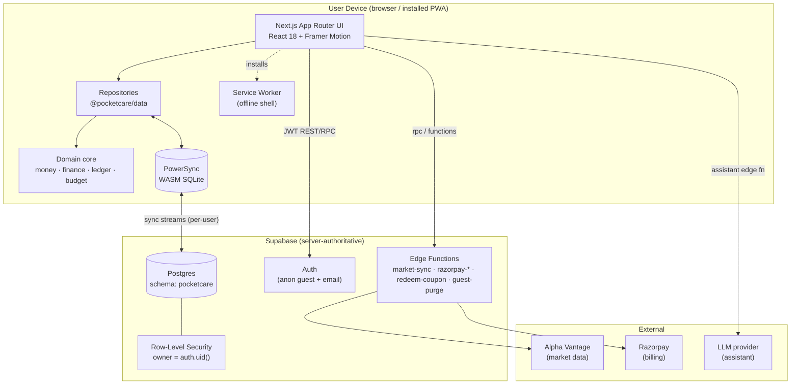
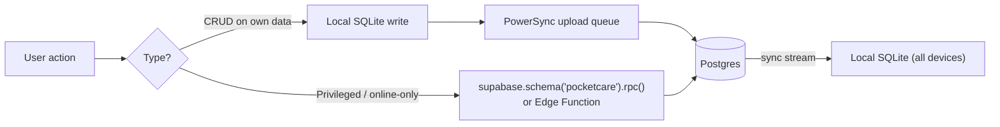
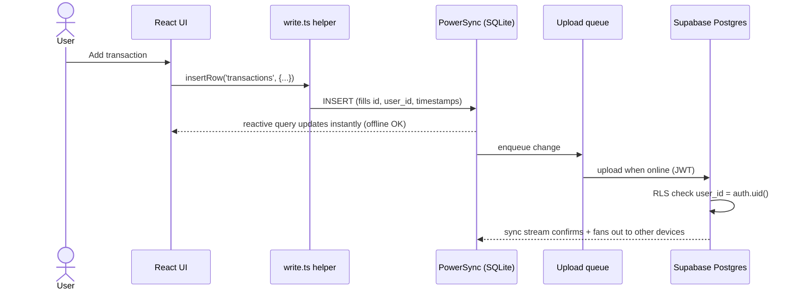

# 01 — System Overview

## What PocketCare is

An **offline-first personal finance manager**: multi-account, multi-currency expense tracking, budgets, goals, planned cashflow, investments, bill-splitting, and an AI assistant. It is delivered as an installable **Progressive Web App** and works fully offline; data syncs across devices when a connection is available.

## Golden rules (financial integrity — do not violate)

1. **Money is integer minor units**, never floats (`Money` type in `@pocketcare/money`).
2. **Balances are derived from an append-only ledger**, never mutated in place.
3. Initial-balance changes create new `opening_balance` / `adjustment` ledger entries.
4. **Server is authoritative**; the client is an offline cache that reconciles via sync.

## Tech stack (locked)

| Layer | Choice |
|---|---|
| Monorepo | Turborepo + pnpm workspaces |
| Client | Next.js 14 (App Router), React 18, TypeScript strict |
| Local DB | SQLite via **PowerSync** Web SDK (WASM), no SSR for synced data |
| Sync | PowerSync ↔ **Supabase** Postgres (server-authoritative) |
| Backend | Supabase: Auth, Postgres, RLS, Storage, Edge Functions |
| Charts / motion | Recharts, Framer Motion, three.js / react-three-fiber (card wallet) |
| i18n | i18next + react-i18next, `Intl` formatting, RTL support |
| Payments | Razorpay (subscriptions + credit packs) |
| Encryption | Zero-trust envelope encryption (WebCrypto), Shamir-split support key |

## Monorepo layout

```
apps/
  web/                     # Next.js App Router PWA (the only client; mobile deprecated)
    app/                   # routes (dashboard, accounts, transactions, cashflow, …)
    src/                   # client libs: powersync, write, hooks, ui/, dashboard/, splits/, …
packages/
  core/
    money/                 # Money type: arithmetic, FX convert, formatting
    finance/               # projections, recurring math, budget calc (pure, tested)
    entitlements/          # freemium gating
    ledger/                # balance derivation from entries
    budget/ guardrail/ reconcile/ crypto/   # domain engines
    i18n/                  # i18next bundles
  db/                      # PowerSync AppSchema + sync-streams.yaml
  data/                    # repositories (accounts, transactions, budgets, splits, …)
  types/                   # shared domain types / enums
  ui-tokens/               # earthy design tokens
supabase/
  migrations/              # SQL schema + RLS + triggers + RPCs (0001 … 0031)
  functions/               # edge functions: market-sync, guest purge, razorpay-*, redeem-coupon
```

**Reuse boundary:** everything in `packages/*` is presentation-agnostic domain logic; `apps/web` is the only presentation layer. ~90% of logic lives in shared packages.

## Runtime topology



## The two data paths

PocketCare deliberately uses **two distinct paths** to the backend:

1. **Sync path (the default):** the UI reads and writes **only local SQLite** via repositories. PowerSync streams changes up to Postgres and streams the user's rows back down. This is what makes the app instant and offline-capable. Covered in [03 — Sync & Offline](03-sync-and-offline.md).
2. **Imperative path (the exception):** a few operations bypass sync and call Postgres directly — **RPCs** (e.g. `delete_user_account`) and **Edge Functions** (billing, market data, AI assistant). These are online-only, server-authoritative actions.



> **Gotcha (historical bug):** every table and RPC lives in the **`pocketcare`** schema, not `public`. Direct calls must be schema-qualified (`supabase.schema('pocketcare').rpc(...)`) or PostgREST returns 404. See [04 — Security & Privacy](04-security-and-privacy.md#account-deletion).

## Request lifecycle (a typical write)



## Environments & deploy

- **Client:** Next.js on Vercel-style hosting; installable PWA (`manifest`, service worker).
- **Backend:** Supabase project; schema migrations in `supabase/migrations` applied via `supabase db push`.
- **Sync rules:** `packages/db/sync-streams.yaml` deployed to the PowerSync dashboard; **must be redeployed whenever a synced table is added** (mirrors the client `AppSchema`).
- See [`DEPLOY.md`](../../DEPLOY.md) for the full runbook.
