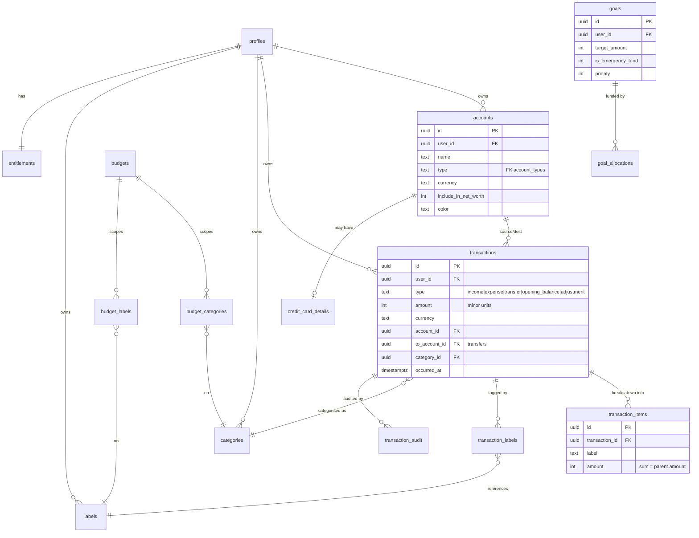
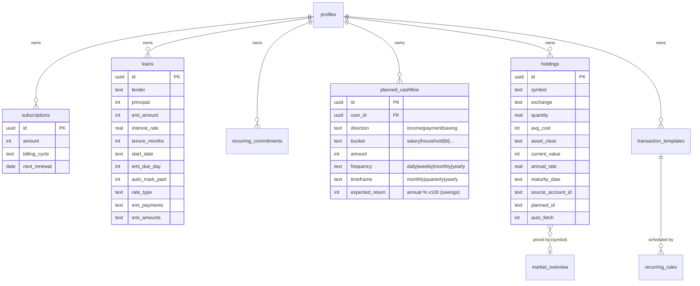
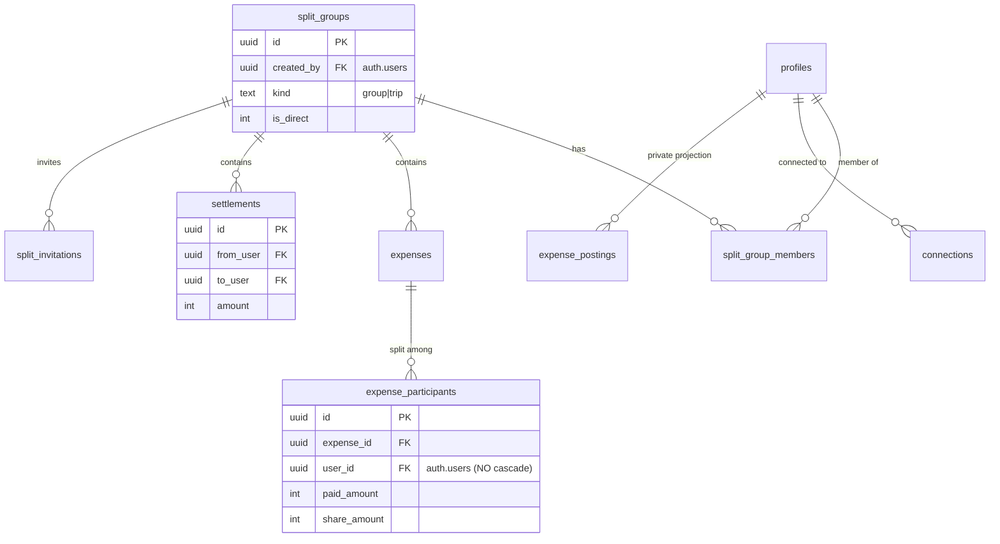
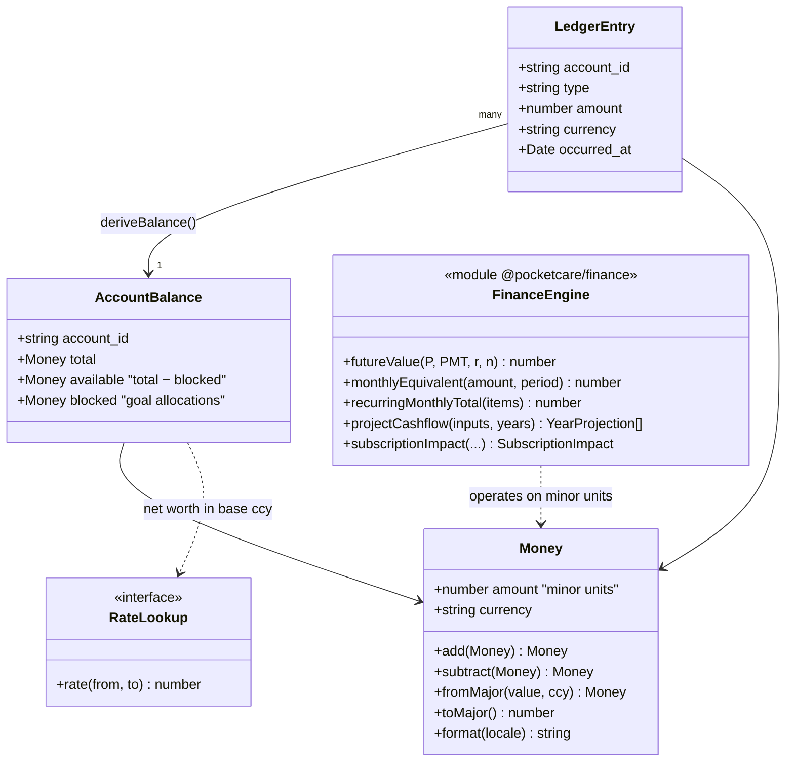
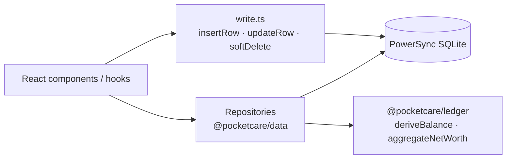

# 02 — Data Model

All persistent state lives in the **`pocketcare`** Postgres schema (mirrored locally as WASM SQLite via the PowerSync `AppSchema` in `packages/db/src/index.ts`). Money columns are **integer minor units**. Every owner-scoped table has `user_id`, `created_at`, `updated_at`, `deleted_at` (soft delete) and is protected by RLS (`user_id = auth.uid()`).

## Entity relationships (core financial ledger)

## Entity relationships (planning, growth, recurring)

> **Note:** subscriptions and loan EMIs are surfaced inside the **Planned Cashflow** hub, but keep their own tables (`subscriptions`, `loans`). `planned_cashflow` stores named incomes, household payments, and savings plans. See [features/planned-cashflow](../features/planned-cashflow.md).

## Entity relationships (multi-user splits ledger)

The shared ledger is the one place data is **not** strictly single-owner — rows are visible by group membership via a dedicated sync stream.

> ⚠️ **Deletion caveat:** `split_groups.created_by`, `expenses.created_by`, `expense_participants.user_id`, `settlements.{from_user,to_user,created_by}`, and `split_invitations.inviter` reference `auth.users` **without** `ON DELETE CASCADE`. Account deletion (`delete_user_account`, migration 0031) explicitly clears these before removing the user. See [04 — Security & Privacy](04-security-and-privacy.md#account-deletion).

## Reference / lookup tables

Enums are normalised into lookup tables synced read-only to every client (the `reference_data` stream): `account_types`, `transaction_types`, `category_kinds`, `periods`, `commitment_kinds`, `tiers`, `rate_modes`, `payment_methods`, `account_type_payment_methods`.

Global market data (read-only, populated by the `market-sync` edge function): `market_quotes`, `market_overview`, `market_dividends`. FX: `exchange_rates`.

## Domain class model (client core)

The money/ledger domain is pure TypeScript in `packages/core/*`, decoupled from persistence.

## Repositories (data access)

`packages/data` exposes typed repositories over the local SQLite DB. UI never writes SQL directly for domain entities — it goes through repositories or the generic `write.ts` helpers (`insertRow`, `updateRow`, `softDelete`) which auto-fill `id`, `user_id`, and timestamps.

## Conventions

- **Minor units everywhere.** Convert at the UI edge with `fromMajor` / `toMajor`.
- **Soft delete** via `deleted_at`; queries filter `WHERE deleted_at IS NULL`.
- **`updated_at` is always set** by the write helpers (required server-side for upload).
- **UUID primary keys** generated client-side (`crypto.randomUUID()`) so offline inserts have stable ids before sync.
