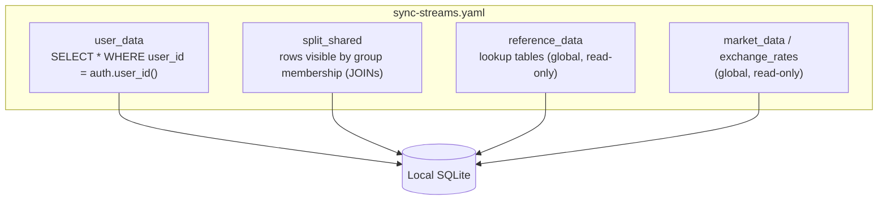
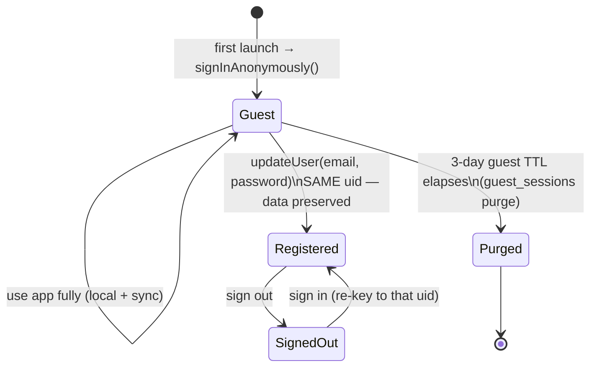
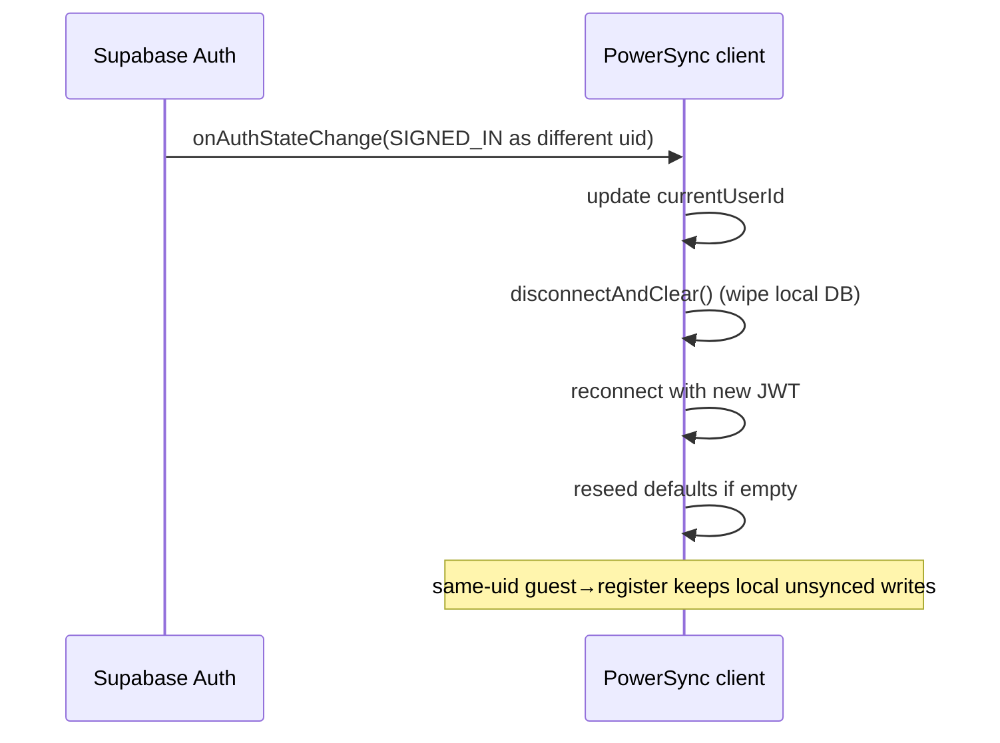

# 03 — Sync & Offline

PocketCare is **offline-first**: the UI only ever touches local SQLite, and PowerSync reconciles with Supabase in the background. This document explains how writes propagate, how the guest→user identity works, and how conflicts are handled.

## Components

- **Local DB** — WASM SQLite in the browser (`pocketcare-v2.db`), schema from `AppSchema` (`packages/db`).
- **PowerSync** — bidirectional sync engine. Downloads the user's rows into local SQLite and uploads local changes to Postgres.
- **Sync streams** — declarative queries in `packages/db/sync-streams.yaml` deciding which rows each user receives. **Must be redeployed to the PowerSync dashboard whenever a synced table is added.**
- **SupabaseConnector** — uploads queued local changes via schema-qualified PostgREST calls (`packages/db/src/connector.ts`).

## Sync streams (who gets which rows)



- `user_data` — one subscription covering **all owner-scoped tables** (accounts, transactions, budgets, goals, subscriptions, loans, `planned_cashflow`, holdings, templates, assistant, entitlements, encryption keys, feedback, …).
- `split_shared` — the shared ledger, resolved by JOINing `split_group_members` so each member sees exactly the groups/expenses/settlements they belong to (no duplicates).
- `reference_data`, `market_data`, `exchange_rates` — global read-only data everyone receives.

## Offline write & upload

```mermaid
sequenceDiagram
    actor User
    participant UI
    participant SQLite as Local SQLite
    participant Q as Upload queue
    participant Conn as SupabaseConnector
    participant PG as Supabase Postgres

    User->>UI: create / edit / delete
    UI->>SQLite: write (optimistic, instant)
    SQLite-->>UI: reactive query re-runs → UI updates
    Note over SQLite,Q: change recorded in the upload queue
    alt online
        Q->>Conn: flush queued ops
        Conn->>PG: schema('pocketcare').from(table).upsert/delete (JWT)
        PG->>PG: RLS enforces user_id = auth.uid()
        PG-->>SQLite: down-sync confirms + fans out to other devices
    else offline
        Note over Q: ops persist; retried automatically on reconnect
    end
```

Key properties:

- **Writes never block on the network.** The queue drains when connectivity returns.
- **Client-generated UUIDs** mean a row has a stable identity before it ever reaches the server.
- **Auto-post recurring** transactions are materialised once on app open (`runRecurring()` in the app shell) after sync settles.

## Identity: anonymous guest → registered user (same UID)

A brand-new visitor is signed in **anonymously** (a real Supabase user with `is_anonymous = true`). Registering **upgrades the same UID in place**, so no data is ever re-keyed or copied.



### Re-keying on identity change

`src/powersync.ts` subscribes to Supabase `onAuthStateChange`. When the identity changes (e.g. sign in on a second device, or sign out), it:



This fixed a real multi-device bug where a second device kept syncing the empty guest account instead of the real one.

## Conflict handling

- Rows are **last-write-wins** at the column level via `updated_at`; the write helpers always set `updated_at`.
- The **ledger is append-only** — balances are recomputed from entries rather than mutated, so concurrent edits converge without lost-update anomalies on balances.
- The **splits ledger** uses explicit, additive rows (expenses, participants, settlements) plus a reconciliation engine (`@pocketcare/reconcile`) to compute net balances deterministically.

## Edge functions (online-only server actions)

Some actions cannot be expressed as owner-scoped row writes and run server-side:

| Function | Purpose |
|---|---|
| `market-sync` | Fetch Alpha Vantage quotes/dividends/overview → `market_*` tables |
| `fx-sync` | Fetch daily FX rates → `exchange_rates` (drives base-currency conversion app-wide) |
| `razorpay-subscription` / `razorpay-credits` / `razorpay-webhook` | Billing: recurring subs, credit packs, HMAC-verified activation |
| `redeem-coupon` | Validate + apply earned coupons / shared promo codes |
| guest purge | Delete expired guest accounts after the 3-day TTL |
| assistant | LLM calls with per-user quota enforcement |

## Deploy checklist for a new synced table

1. Add the table to `AppSchema` (`packages/db/src/index.ts`).
2. Add a Supabase migration (`supabase/migrations/00xx_*.sql`) with RLS + grants.
3. Add the table to `sync-streams.yaml` under `user_data` (or the right stream).
4. `supabase db push` **and** redeploy sync rules to the PowerSync dashboard.

> Skipping step 3/4 is the classic "it saves locally but never syncs" bug.
