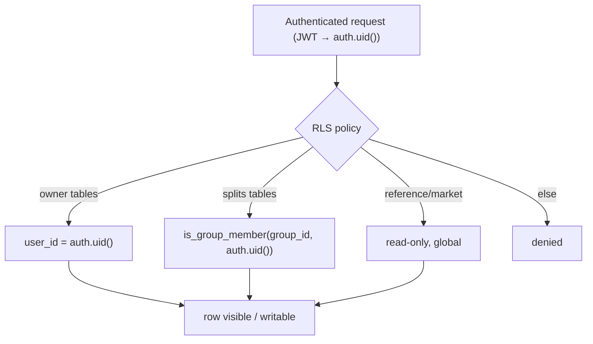
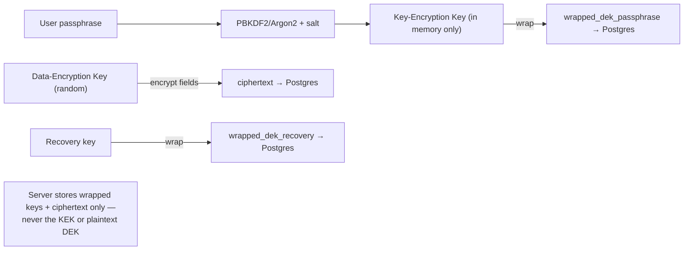
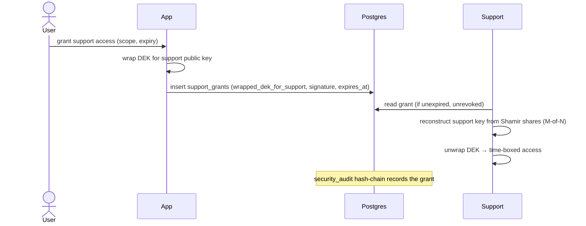
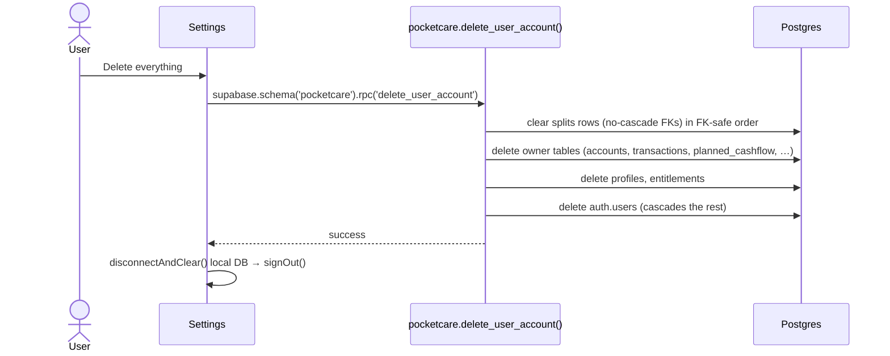

# 04 — Security & Privacy

PocketCare handles sensitive financial data. Security rests on four pillars: **authentication**, **row-level security**, **zero-trust encryption of sensitive fields**, and **auditable support access**. See also `SECURITY_AUDIT.md` and `SECURITY_ENCRYPTION_PLAN.md` at the repo root.

## Authentication

- Supabase Auth with **anonymous guest** identities and **email/password** registration.
- A guest is a real user (`is_anonymous = true`); registration upgrades the **same UID** (see [03 — Sync & Offline](03-sync-and-offline.md#identity-anonymous-guest--registered-user-same-uid)).
- JWTs authorise every PostgREST/RPC/Edge-Function call; PowerSync uses the same JWT for sync.

## Row-Level Security (RLS)

Every owner-scoped table enables RLS with an owner policy:

```sql
create policy <name>_owner on pocketcare.<table>
  using (user_id = auth.uid()) with check (user_id = auth.uid());
```

The **shared ledger** uses membership-based policies (helper functions `is_group_member`, `is_group_creator`, `is_connected`) so a member can read a group's expenses/settlements but only write their own rows.



## Zero-trust encryption (sensitive fields)

The server only ever holds **wrapped keys + ciphertext** — it cannot read protected values. Implemented with WebCrypto in `@pocketcare/crypto` and the `user_keys` table.



- `user_keys` holds: `salt`, `wrapped_dek_passphrase`, `wrapped_dek_recovery`, a signing keypair (`signing_public_jwk`, `wrapped_signing_private`).
- The **DEK never leaves the client in plaintext**; it is unwrapped in memory from the passphrase-derived KEK.
- A hash-chained `security_audit` table records privileged actions (tamper-evident via `prev_hash` → `row_hash`).

## Support access (Shamir-split custody)

Support can be granted **time-bound, consented** access to a user's DEK without any single party holding it. Support-key material is split (Shamir) and stored out-of-band (never committed; `support-key/` is git-ignored).



## Account deletion

Self-serve deletion removes the identity and **all** associated data and frees the email for re-registration.



**Two historical bugs, both fixed:**

1. **404 / silent no-op** — the RPC lives in the `pocketcare` schema but was called via `supabase.rpc()` (which targets `public`). Fixed by schema-qualifying the call **and** checking the returned `error` (migration `0030`, `apps/web/app/settings/page.tsx`).
2. **FK violation on `auth.users`** — the multi-user splits tables reference `auth.users` **without** `ON DELETE CASCADE`, so the final delete failed. Fixed by clearing splits rows first (migration `0031`). A full-schema scan confirmed those 7 columns are the only non-cascade FKs to `auth.users`.

## Threat-model highlights

- **Data at rest (server):** RLS + wrapped keys; a DB compromise yields ciphertext for protected fields, not plaintext.
- **Data in transit:** TLS; JWT-scoped access.
- **Offline device:** local SQLite is unencrypted at the SQLite layer today — mitigations tracked in `SECURITY_ENCRYPTION_PLAN.md` (device-level encryption + optional app lock).
- **Billing integrity:** Razorpay webhooks are **HMAC-verified and idempotent**; entitlement writes use `upsert(onConflict: user_id)` (a prior bug where `.update().eq()` silently no-opped for users without an entitlements row is fixed).
- **Auto-categorisation model** is loaded from a CDN at runtime and runs **on-device** (no transaction text leaves the client).
