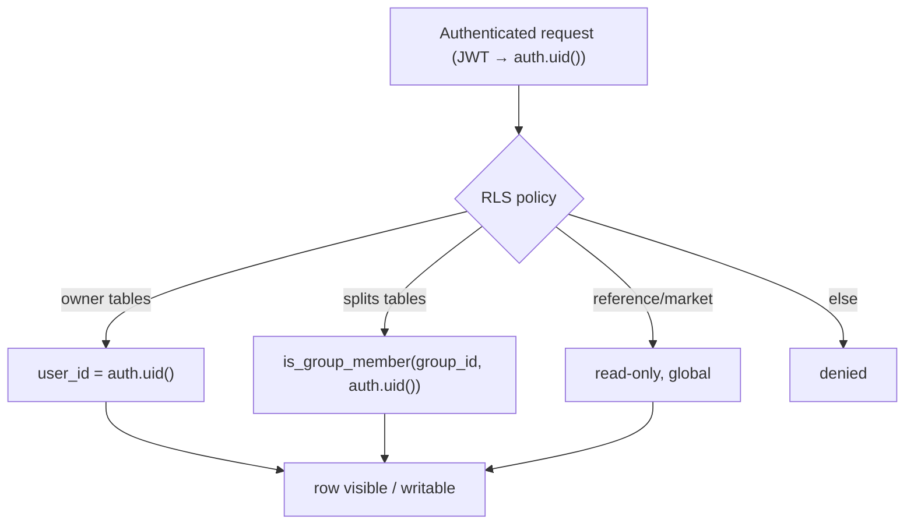
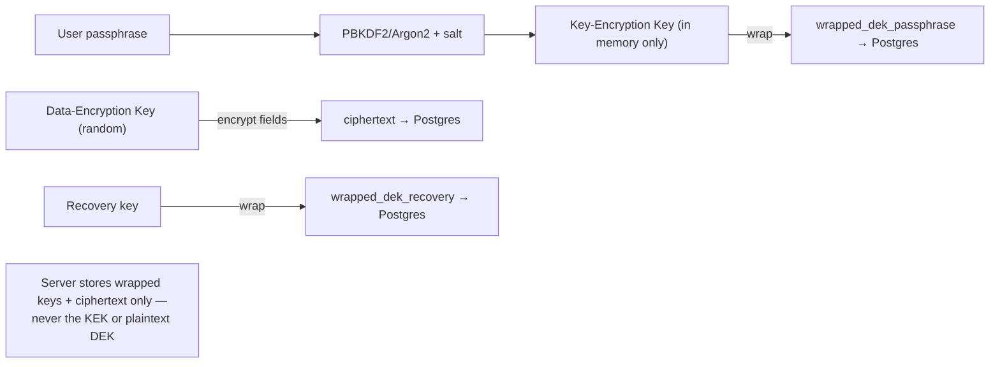
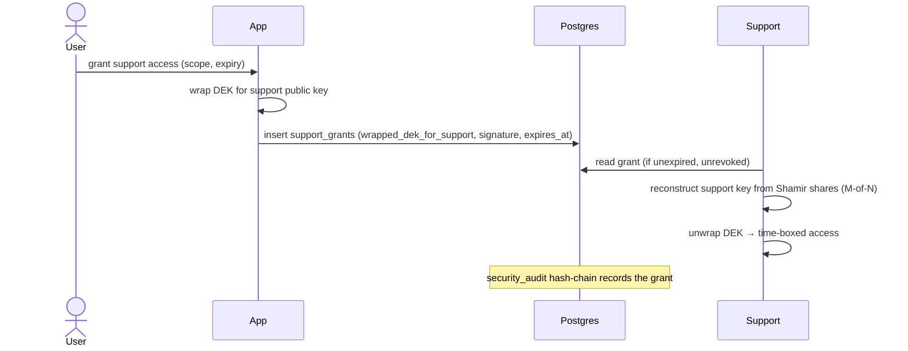
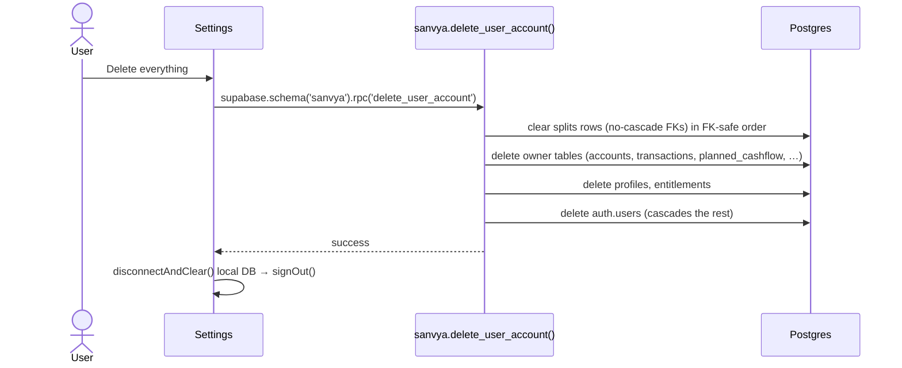

# 04 — Security & Privacy

Sanvya handles sensitive financial data. Security rests on four pillars: **authentication**, **row-level security**, **zero-trust encryption of sensitive fields**, and **auditable support access**. See also `SECURITY_AUDIT.md` and `SECURITY_ENCRYPTION_PLAN.md` at the repo root.

## Authentication

- Supabase Auth with **anonymous guest** identities and **email/password** registration.
- A guest is a real user (`is_anonymous = true`); registration upgrades the **same UID** (see [03 — Sync & Offline](03-sync-and-offline.md#identity-anonymous-guest--registered-user-same-uid)).
- JWTs authorise every PostgREST/RPC/Edge-Function call; PowerSync uses the same JWT for sync.

## Row-Level Security (RLS)

Every owner-scoped table enables RLS with an owner policy:

```sql
create policy <name>_owner on sanvya.<table>
  using (user_id = auth.uid()) with check (user_id = auth.uid());
```

The **shared ledger** uses membership-based policies (helper functions `is_group_member`, `is_group_creator`, `is_connected`) so a member can read a group's expenses/settlements but only write their own rows.


```mermaid
flowchart TB
    Req["Authenticated request (JWT → auth.uid())"] --> P{"RLS policy"}
    P -->|"owner tables"| O["user_id = auth.uid()"]
    P -->|"splits tables"| M["is_group_member(group_id, auth.uid())"]
    P -->|"reference/market"| G["read-only, global"]
    O --> Allow["row visible / writable"]
    M --> Allow
    G --> Allow
    P -->|"else"| Deny["denied"]
```

## Zero-trust encryption (sensitive fields)

The server only ever holds **wrapped keys + ciphertext** — it cannot read protected values. Implemented with WebCrypto in `@sanvya/crypto` and the `user_keys` table.


```mermaid
flowchart LR
    PW["User passphrase"] --> KDF["PBKDF2/Argon2 + salt"]
    KDF --> KEK["Key-Encryption Key (in memory only)"]
    DEK["Data-Encryption Key (random)"] -->|encrypt fields| CT["ciphertext → Postgres"]
    KEK -->|wrap| WDEK["wrapped_dek_passphrase → Postgres"]
    RK["Recovery key"] -->|wrap| WDEK2["wrapped_dek_recovery → Postgres"]
    Note["Server stores wrapped keys + ciphertext only —<br/>never the KEK or plaintext DEK"]
```

- `user_keys` holds: `salt`, `wrapped_dek_passphrase`, `wrapped_dek_recovery`, a signing keypair (`signing_public_jwk`, `wrapped_signing_private`).
- The **DEK never leaves the client in plaintext**; it is unwrapped in memory from the passphrase-derived KEK.
- A hash-chained `security_audit` table records privileged actions (tamper-evident via `prev_hash` → `row_hash`).

## Support access (Shamir-split custody)

Support can be granted **time-bound, consented** access to a user's DEK without any single party holding it. Support-key material is split (Shamir) and stored out-of-band (never committed; `support-key/` is git-ignored).


```mermaid
sequenceDiagram
    actor User
    participant App
    participant PG as Postgres
    participant Support
    User->>App: grant support access (scope, expiry)
    App->>App: wrap DEK for support public key
    App->>PG: insert support_grants (wrapped_dek_for_support, signature, expires_at)
    Support->>PG: read grant (if unexpired, unrevoked)
    Support->>Support: reconstruct support key from Shamir shares (M-of-N)
    Support->>Support: unwrap DEK → time-boxed access
    Note over PG: security_audit hash-chain records the grant
```

## Account deletion

Self-serve deletion removes the identity and **all** associated data and frees the email for re-registration.


```mermaid
sequenceDiagram
    actor User
    participant UI as Settings
    participant RPC as sanvya.delete_user_account()
    participant PG as Postgres
    User->>UI: Delete everything
    UI->>RPC: supabase.schema('sanvya').rpc('delete_user_account')
    RPC->>PG: clear splits rows (no-cascade FKs) in FK-safe order
    RPC->>PG: delete owner tables (accounts, transactions, planned_cashflow, …)
    RPC->>PG: delete profiles, entitlements
    RPC->>PG: delete auth.users (cascades the rest)
    RPC-->>UI: success
    UI->>UI: disconnectAndClear() local DB → signOut()
```

**Two historical bugs, both fixed:**

1. **404 / silent no-op** — the RPC lives in the `sanvya` schema but was called via `supabase.rpc()` (which targets `public`). Fixed by schema-qualifying the call **and** checking the returned `error` (migration `0030`, `apps/web/app/settings/page.tsx`).
2. **FK violation on `auth.users`** — the multi-user splits tables reference `auth.users` **without** `ON DELETE CASCADE`, so the final delete failed. Fixed by clearing splits rows first (migration `0031`). A full-schema scan confirmed those 7 columns are the only non-cascade FKs to `auth.users`.

## Threat-model highlights

- **Data at rest (server):** RLS + wrapped keys; a DB compromise yields ciphertext for protected fields, not plaintext.
- **Data in transit:** TLS; JWT-scoped access.
- **Offline device:** local SQLite is unencrypted at the SQLite layer today — mitigations tracked in `SECURITY_ENCRYPTION_PLAN.md` (device-level encryption + optional app lock).
- **Billing integrity:** Razorpay webhooks are **HMAC-verified and idempotent**; entitlement writes use `upsert(onConflict: user_id)` (a prior bug where `.update().eq()` silently no-opped for users without an entitlements row is fixed).
- **Auto-categorisation model** is loaded from a CDN at runtime and runs **on-device** (no transaction text leaves the client).

## Payment handles (UPI IDs) — a deliberately weaker tier

- **`payment_handles` is server-only.** It is in no sync stream and never reaches a device. The VPA is encrypted at rest with `pgp_sym_encrypt` under `PAYMENT_HANDLE_KEY`, held only in the edge function's secrets; plaintext exists solely inside the RPC bodies.
- **This is NOT zero-trust, and that is unavoidable.** The existing scheme wraps a DEK with a passphrase-derived KEK owned by one user, so a co-member could never decrypt it — but the whole purpose of a payment handle is to hand it to someone else. The server can therefore read these values. Passphrase-protected personal fields it still cannot. The settings UI states this plainly rather than implying uniform protection.
- **Disclosure gate.** Release requires a shared live group, existing financial activity between the two users, and a per-caller rate limit (20/hour). Without all three the endpoint is a UPI-ID directory. Every release writes a `payment_handle_disclosures` row the owner can read.
- **Guests cannot save a handle**, enforced by a trigger on `auth.users.is_anonymous` — checked there rather than via `guest_sessions`, because guest→registered is an in-place UID upgrade that leaves the guest row behind.
- **We never verify handle ownership.** That requires a penny-drop through a PSP, i.e. becoming a regulated payment entity. The payer's own UPI app resolves and shows the real account name before they confirm, which is the actual verification.
- **Sanvya never holds funds.** UPI Intent moves money bank-to-bank between two individuals; we are not a party to the transfer and cannot reverse, refund or recover a mistaken payment.

## Diagnostics and error reporting

- **Errors are uploaded automatically** (`client_errors`, 0044) so failures reach the admin panel without the user filing anything. This is deliberate and should be stated plainly rather than buried — see `docs/features/diagnostics.md`.
- **Everything is redacted on the device before it is sent.** Amounts (every notation, including bare minor units), descriptions, merchant names, labels, emails and UPI IDs are stripped; table names, operations, error codes, row UUIDs and routes are kept. A support log must never become a record of someone's spending.
- **Reports bypass PowerSync**, going straight to the `report_client_error` RPC over HTTP — the failure most worth capturing is the sync queue being stuck.
- **Rate limited** per fingerprint per session, 20 per session client-side, and 50 per hour per user in the RPC.
- **Scope is failures, not behaviour.** No performance or usage analytics; widening this into product analytics is a separate decision requiring a separate consent conversation.
- `client_errors.user_id` is `ON DELETE SET NULL` — deleting an account does not erase evidence of a bug it hit, and the rows carry no personal data.

## Receipt scanning

- **No receipt images are stored, anywhere.** The photo lives in browser memory for the duration of a scan and is dropped. It is not written to IndexedDB, not uploaded to Storage, and not persisted by the edge function. `receipt_scans.image_path` exists only as a forward-compatible seam and is always NULL.
- **OCR is on-device by default.** tesseract.js runs in the browser; nothing leaves the client on the default path.
- **The AI fallback is opt-in per scan.** The image is only sent when the user taps *Improve with AI* on a receipt that failed to reconcile — never automatically. The UI states what is sent before the tap.
- **Prompt injection via receipt text** is treated as a real vector: a bill can print "ignore your instructions". Defences are (1) a system prompt stating that image text is data and never an instruction, and (2) `tool_choice` forcing the model to answer through the `emit_receipt` schema, leaving injected text no channel to reach the user.
- Payload size is capped (~5 MB) and media types are allow-listed at the edge function.
- `receipt_scans.raw_text` is truncated to 8 000 characters before syncing.
- `expense_item_shares.user_id` uses `ON DELETE CASCADE`, unlike the 0011 splits tables — so itemized bills cannot block account deletion the way `expense_participants` did before 0031.
