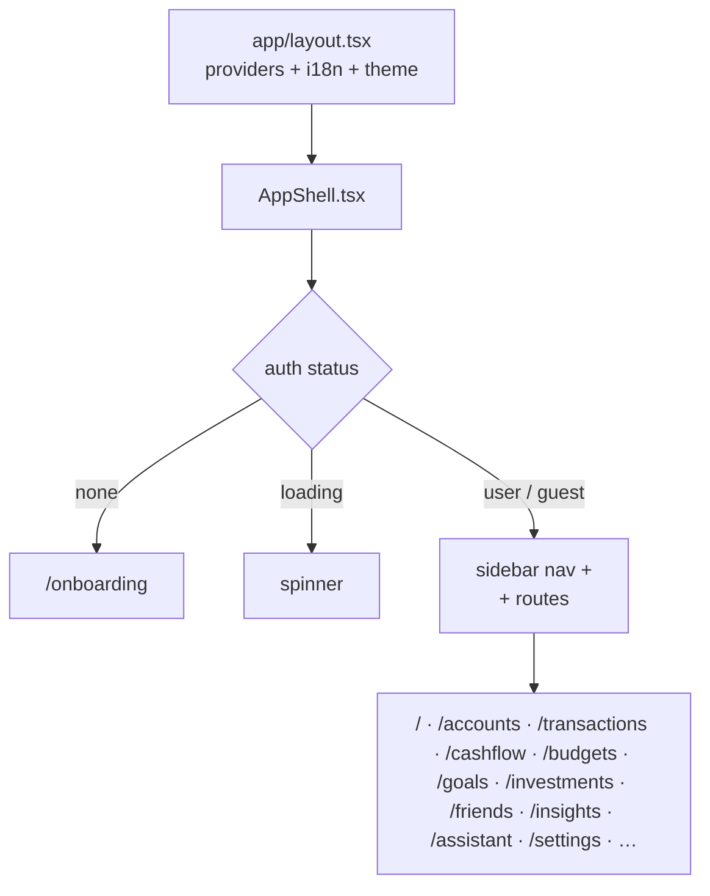
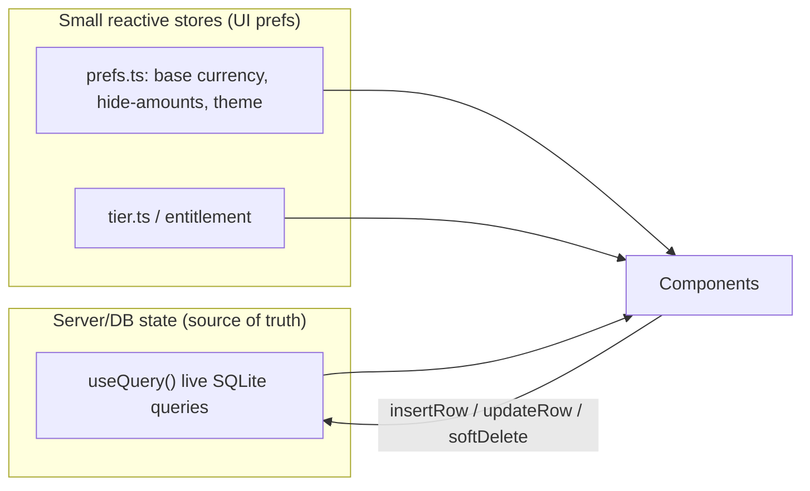
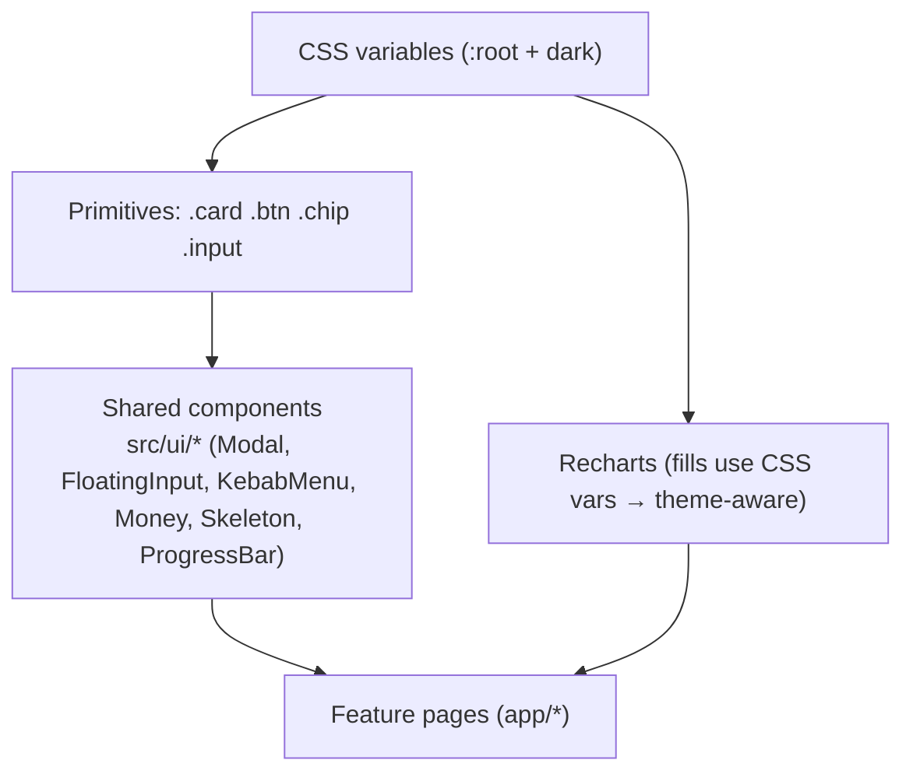

# 05 — Frontend & Design System

## App shell & routing

Next.js **App Router**. Synced data is client-only (PowerSync WASM has no SSR), so the authenticated app renders behind an `AppShell` that gates on session state.



Responsibilities of `AppShell`:

- Auth gating & redirect to `/onboarding`.
- Sidebar navigation (grouped: Money, Planning, Growth) + mobile drawer.
- One-time `runRecurring()` after sync settles.
- Per-route scroll restoration.
- Sync status banner, install prompt, feedback modal.

## State model

PocketCare has very little global UI state — **the database is the state**. Reactive queries (`useQuery` from `@powersync/react`) re-render components when local SQLite changes.



- **No Redux/Zustand for domain data.** Domain reads are live queries; writes go through `write.ts` or repositories and the UI updates reactively.
- **Preferences** (base currency default INR, amount masking, theme, language) live in tiny reactive stores in `src/prefs.ts`, persisted to `localStorage`.
- **Entitlement** (`useEntitlement`) is the single gating source (effective tier + trial + quota), works offline.

## Design system

Source of truth for tokens: `apps/web/app/globals.css` `:root`. Documented in [`DESIGN_SYSTEM.md`](../../DESIGN_SYSTEM.md).

- **Typeface:** Inter throughout (headings, body, figures).
- **Palette:** earthy/warm — `--bg #efe9df`, `--surface #fffdf9`, terracotta `--accent #b06a4f`, `--positive` (money in), `--negative` (money out), `--teal`, `--forest`, plus warning/amber. Full dark theme via `:root[data-theme="dark"]`.
- **Shape & elevation:** card radius 24px, pill 999px, soft layered shadows; hover-lift and press micro-interactions.
- **Core classes:** `.card`, `.btn` (+`.ghost`), `.chip`, `.input`, `.eyebrow`, `.muted`, `.list-grid` (responsive tiles), `.fade-up`/`.page-anim` (entrance), `.press`/`.lift` (micro-interactions), plus feature modules (`.pc-*` for Planned Cashflow, `.beta-badge`).



## Shared UI components (`src/ui/*`)

| Component | Role |
|---|---|
| `Modal` | Accessible dialog used across add/edit flows |
| `FloatingInput` | Labeled text input with floating label |
| `KebabMenu` | Per-row actions (⋮) |
| `Money` / `useMoneyFmt` | Renders money, respects the "hide amounts" privacy toggle |
| `ProgressBar` | Framer-motion animated bars (budgets/goals) |
| `Skeleton` / `ListSkeleton` | Loading placeholders |
| `Confirm` | Promise-based confirm dialog |

## Conventions for feature pages

- Read with `useQuery`, write with `write.ts` helpers (auto-fills id/user_id/timestamps).
- Format money via `useMoneyFmt()` so masking is consistent.
- Prefer design tokens over hardcoded hex; use `.list-grid` for lists so they tile responsively.
- Charts use CSS-variable fills so they follow light/dark themes.
- Gate premium features behind `useEntitlement`.

## Client library map (`apps/web/src`)

```
powersync.ts     # DB/Supabase init, getDb, getSupabase, re-key on auth change
write.ts         # insertRow / updateRow / softDelete
hooks.ts         # useBaseCurrency, useRates, useNetWorth, balances
prefs.ts         # reactive preferences (currency, masking, theme, lang)
entitlement.ts   # useEntitlement gating
dashboard/       # customizable tile system
cashflow/        # Planned Cashflow module (model, Charts, Projections)
splits/          # split hooks + write + reconcile glue
assistant/       # AI assistant (persona, summary, rich messages)
categorize/      # on-device semantic auto-categoriser
ui/              # shared components
```
