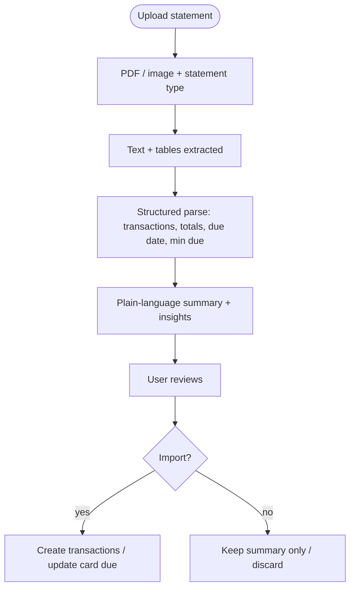
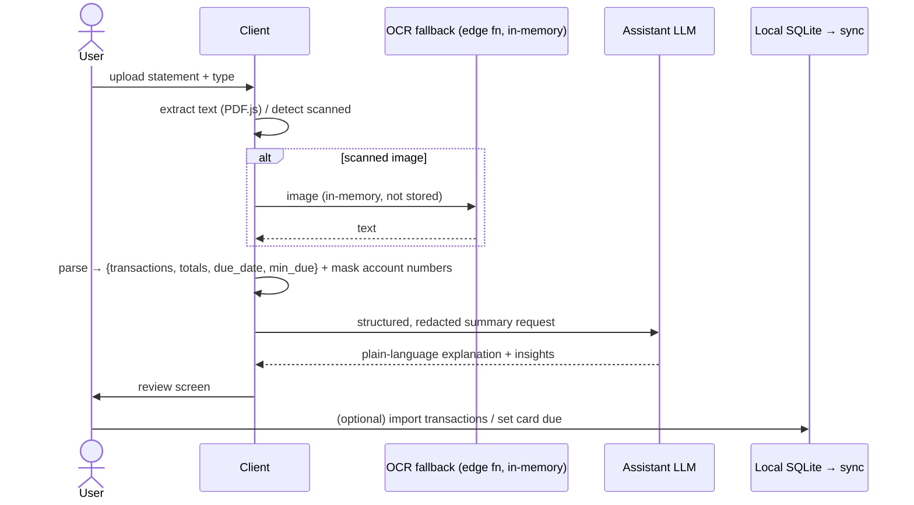

# Design — Statement Upload & OCR Insights (proposal)

> **Status: proposed / not built.** This documents the intended design for review. No code ships until this is approved, because it touches sensitive financial documents and the app's zero-trust privacy posture.

## Goal

Let a user upload a **bank, loan, or credit-card statement** (PDF or image). The app extracts the content, then explains it in plain language: what the amounts mean, spending patterns, and the **next due date** — without the user having to decode banking jargon.

## User flow

## Architecture options

| Approach | Extraction | Interpretation | Privacy | Notes |
|---|---|---|---|---|
| **A. On-device (max privacy)** | PDF.js text layer + Tesseract.js OCR (WASM) in the browser | On-device rules + the existing on-device model for categorisation | Nothing leaves the device | Weakest on scanned images / messy layouts; heavy WASM download |
| **B. Server edge function** | A statement-parsing service / OCR API in a Supabase Edge Function | LLM (the assistant provider) for plain-language summary | Document + text transit the server | Best accuracy; must handle sensitive data carefully |
| **C. Hybrid (recommended)** | On-device text extraction first; fall back to a server OCR only for scanned images the client can't read | LLM summary on **redacted, structured** data (amounts + labels), not the raw document | Raw document stays local when possible; only minimal structured fields sent for explanation | Balances accuracy and privacy |

**Recommendation: C (Hybrid).** Extract locally where we can; only send the *minimum structured data* needed for the plain-language explanation, and never persist the raw document server-side.

## Privacy & security (must-haves)

- **Raw statement is never stored on the server.** If a scanned image must be OCR'd server-side, it is processed in-memory and discarded (no Storage bucket retention).
- **Explanation runs on redacted, structured fields** (amounts, dates, merchant labels, due date) — not full account numbers. Mask PANs/account numbers before any network call.
- **User consent per upload**, with a clear notice of what is processed where.
- Any parsed transactions the user chooses to import follow the normal offline-first path (local write → PowerSync), and are subject to the same RLS as manual entries.
- Reuse the **zero-trust** model: if we ever persist parsed statement artifacts, they are envelope-encrypted like other sensitive fields (see [architecture/04-security-and-privacy](../architecture/04-security-and-privacy.md)).

## Data flow (hybrid)

## Parsing targets by statement type

- **Bank:** opening/closing balance, credits vs debits, top merchants, unusual/large transactions, recurring debits (candidate subscriptions/EMIs).
- **Credit card:** statement balance, **minimum due**, **due date**, spends by category, interest/finance charges, credit utilisation.
- **Loan:** outstanding principal, EMI, interest vs principal split, next due date, remaining tenure — can pre-fill a loan (links to the loan detail / amortization feature).

## Insights output (plain language)

- "Your statement balance is **₹X**, and the **minimum due is ₹Y by <date>** — paying only the minimum means interest of ~₹Z will be charged."
- "You spent most on **<category>** (₹A, N% of the statement)."
- "**M recurring charges** look like subscriptions — want to add them to Planned Cashflow?"
- Cross-links: set the card's due date, create a loan with its amortization schedule, or add detected subscriptions.

## Scope / phasing

1. **Phase 1** — PDF text extraction + credit-card statement parsing (balance, min due, due date) + plain-language summary. Highest value, most structured.
2. **Phase 2** — bank statement transaction extraction + import into the ledger (with review + de-dup against existing transactions).
3. **Phase 3** — scanned-image OCR fallback; loan statement → pre-filled loan.

## Open questions (for sign-off)

- Preferred OCR/parse provider (accuracy vs cost vs data-residency)?
- Is any server-side processing of scanned images acceptable, or must it be strictly on-device?
- Retention: confirm **zero** server retention of raw documents.
- Which statement type to pilot first (recommend credit card)?
