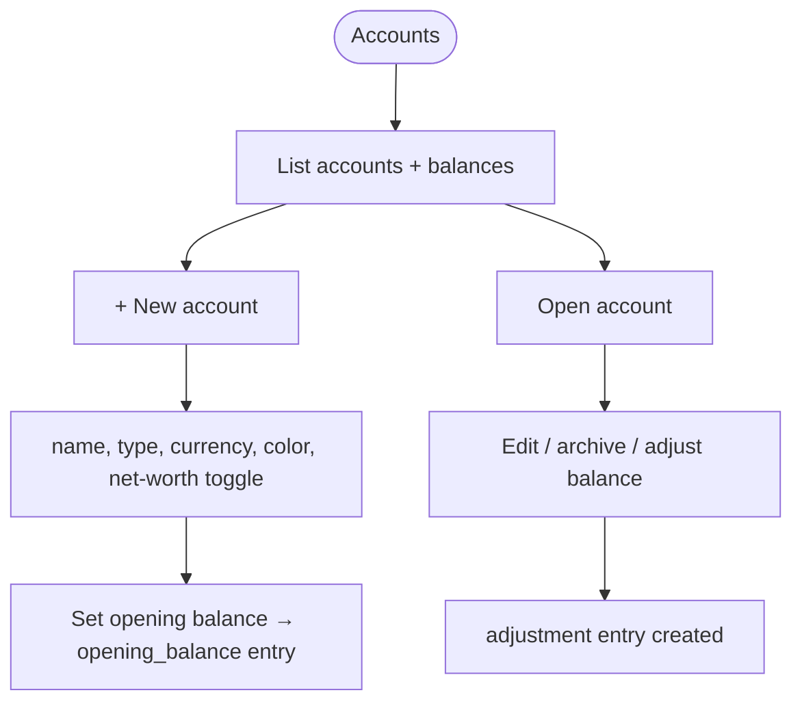
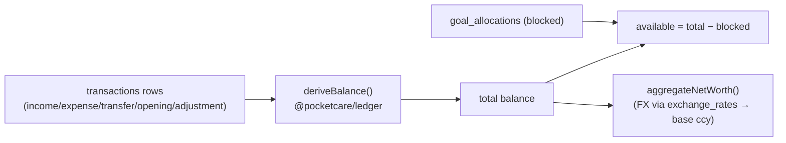

# Accounts & Ledger

## Overview
Users hold multiple **accounts** (6 types: cash, bank, credit card, wallet, stocks, mutual funds), each in its own currency. **Balances are derived from an append-only ledger**, never stored directly. Opening balances and corrections are themselves ledger entries (`opening_balance` / `adjustment`).

## User flow

## Technical flow — balance derivation

## Data touched
`accounts`, `transactions` (all entry types), `goal_allocations` (blocked amounts), `credit_card_details`, `exchange_rates` (net-worth conversion), `account_types` lookup.

## Key files
`app/accounts/`, `app/accounts/new`, `app/accounts/[id]`, `src/hooks.ts` (`useAccountBalances`, `useNetWorth`), `@pocketcare/ledger` (`deriveBalance`, `aggregateNetWorth`).

## Gating
Free (core ledger). Net-worth roll-up and per-account inclusion toggle are free.

## Edge cases
- **Available vs total:** goals block funds from savings (except emergency fund); toggle shows with/without blocked.
- **Multi-currency:** each account keeps its currency; net worth converts at display time to the base currency.
- Deleting an account can cascade its transactions or keep them (see `app/accounts/[id]/edit`).
- Archived accounts are hidden from pickers but retained for history.
