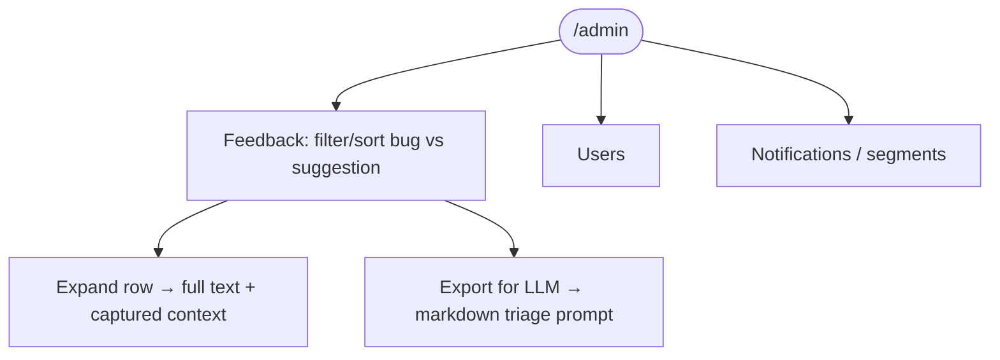
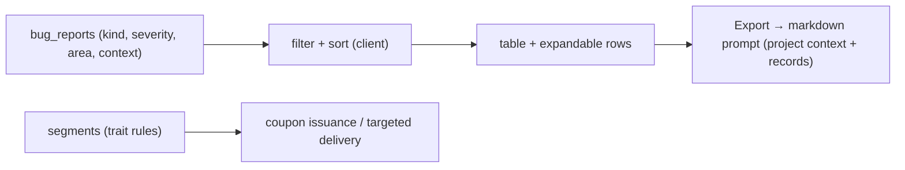

# Admin Console

## Overview
An internal console (`/admin/*`, full-screen, no app chrome) for reviewing **beta feedback**, managing **users**, and **notifications/segments**. Includes filters, sorting, expandable descriptions, and an "Export for LLM" action that builds a triage prompt from the current view.

## User flow

## Technical flow

## Data touched
`bug_reports`, `coupons`, `promo_codes`, `segments`, `profiles` (traits), users/entitlements (read).

## Key files
`app/admin/feedback`, `app/admin/users`, `app/admin/notifications`, `scripts/admin-coupons.ts`.

## Gating
Admin-only (not part of the consumer tiers).

## Edge cases
- Admin routes render bare (no sidebar) and are excluded from the normal auth gate flow.
- Feedback auto-captures route/version/platform/viewport/online at submit time.
