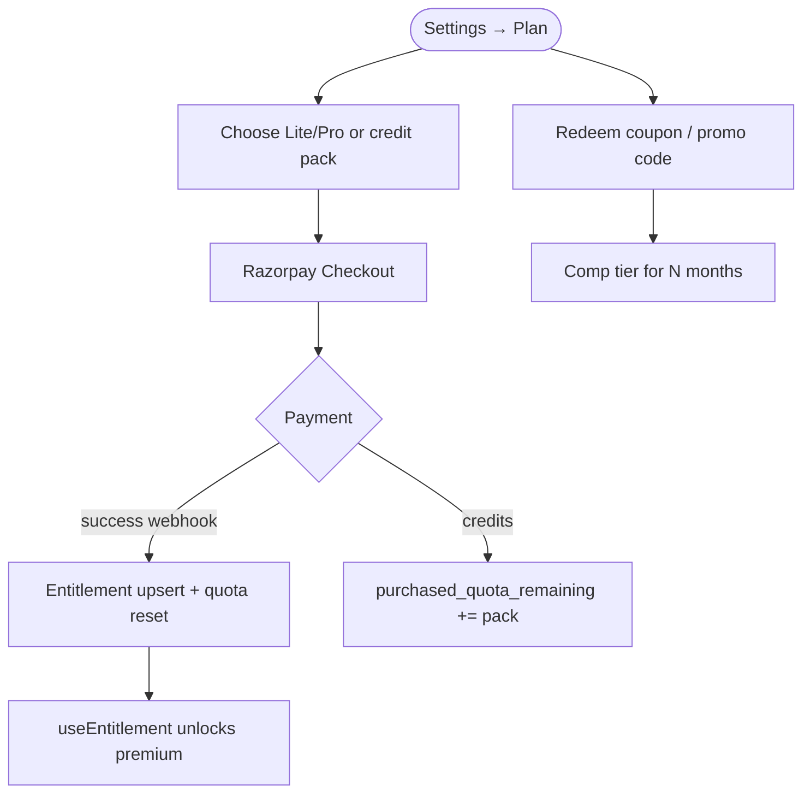
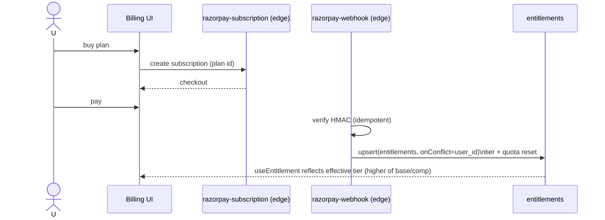

# Billing & Entitlements

## Overview
Freemium with three tiers (**Free / Lite / Pro**) plus one-time **AI credit packs**, via **Razorpay** (recurring subscriptions + one-time orders). Entitlements are **server-authoritative** and enforced offline through `useEntitlement`. A 14-day trial grants premium + prompts. Beta feedback earns **coupons**; shared **promo codes** grant time-boxed comp tiers.

## User flow

## Technical flow

## Data touched
`entitlements` (tier, trial, quota, comp tier/until, Razorpay ids), `payments` (audit + billing history), `coupons`, `promo_redemptions`.

## Key files
`src/billing/plans.ts`, `src/billing.ts`, `src/entitlement.ts` (`useEntitlement`), `src/ui/Billing.tsx`, `supabase/functions/razorpay-*`, `redeem-coupon`.

## Gating
This **is** the gating system. `isPaid`/effective tier drives insights, statements, multi-budget, projections, auto-fetch, assistant quota.

## Edge cases
- Entitlement writes use `upsert(onConflict: user_id)` — a prior `.update().eq()` bug silently no-opped for users without a row.
- Webhooks are HMAC-verified + idempotent.
- Client purchases **fail fast when offline** ("reconnect to change your plan").
- Auto-issue coupons: 1-month Lite at 5 bug reports, Pro at 25 (security-definer trigger).
