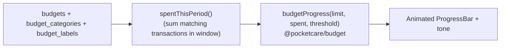

# Budgets

## Overview
Budgets cap spending over a period (daily/weekly/monthly/yearly) scoped by **category** and/or **label**, with a threshold that drives warnings. Progress bars animate spent-vs-limit.

## User flow
```mermaid
flowchart TD
    B([Budgets]) --> New[Create budget]
    New --> Scope[Name + period + scope (categories/labels) + limit + threshold]
    Scope --> Track[Live progress bar\nspent / limit]
    Track --> Warn{Over threshold?}
    Warn -->|yes| Amber[Amber/negative state + notify]
    Warn -->|no| OK[On track]
```

## Technical flow


## Data touched
`budgets`, `budget_categories`, `budget_labels`, `transactions` (spend within the period window), `categories`/`labels`, `periods` lookup.

## Key files
`app/budgets/`, `@pocketcare/budget` (`budgetProgress`), `src/ui/ProgressBar.tsx`.

## Gating
Free tier: a single simple budget. Premium: multiple budgets + threshold notifications.

## Edge cases
- Period windows compute the current interval (rolling for D/W/M/Y).
- A budget can scope by category, by label, or both.
- Lists tile responsively (`.list-grid`).
