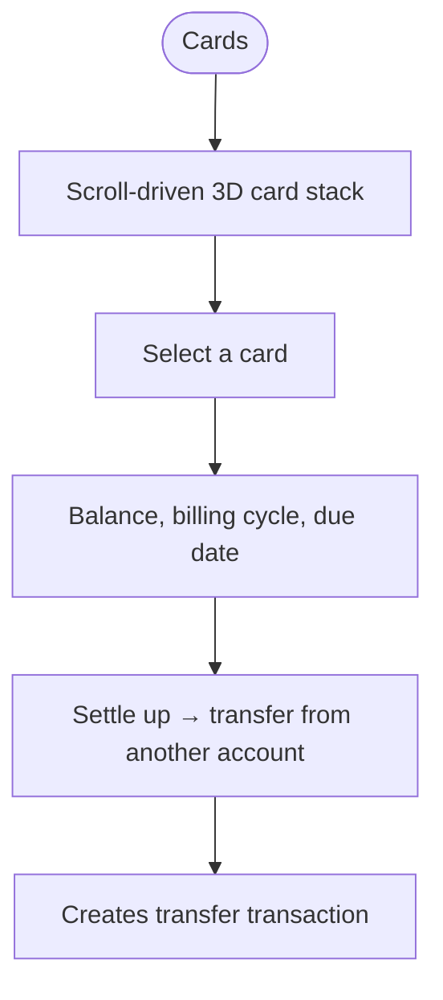
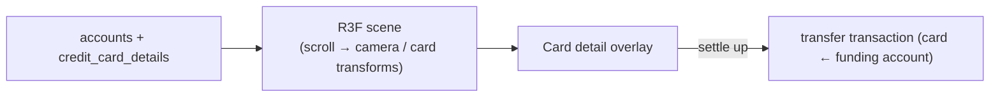
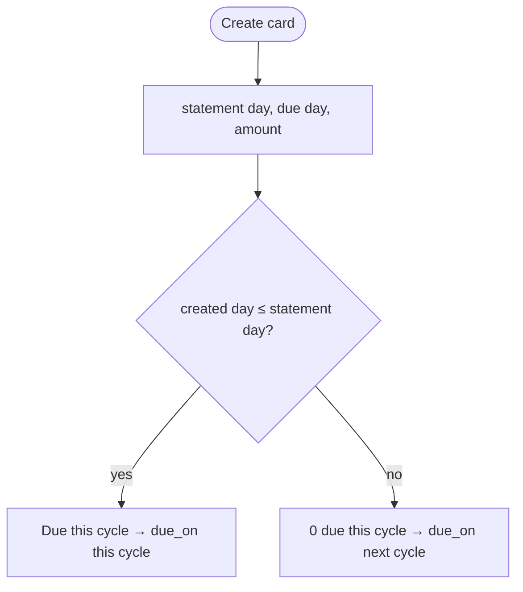

# Cards (3D Wallet)

## Overview
A **three.js / react-three-fiber** scroll-driven 3D wallet visualising the user's cards/accounts, with credit-card billing-cycle tracking and **settle-up** (pay a card off from another account via a transfer).

## User flow

## Technical flow

## Data touched
`accounts`, `credit_card_details` (billing cycle, limit, due), `transactions` (settle-up transfer).

## Key files
`app/cards/`, `src/cards/*`, three.js r128 via CDN.

## Gating
Free.

## Creation cycle logic
On `/accounts/new` a credit card collects **statement day**, **due day**, and **amount due**. If the account is created *after* this month's statement day, the current statement has already closed, so **0 is due this cycle** and the amount rolls to the next due date. Stored as `credit_card_details.pending_due` + `due_on`; a live preview explains which cycle applies.

## Edge cases
- Do **not** use geometries newer than three r128 (e.g. CapsuleGeometry).
- Cards page uses responsive layout; on mobile the 3D stack degrades gracefully.
- Settle-up creates a normal transfer so balances stay ledger-derived.
- A card created after its statement day shows 0 due now; `due_on` carries the next payable date.
