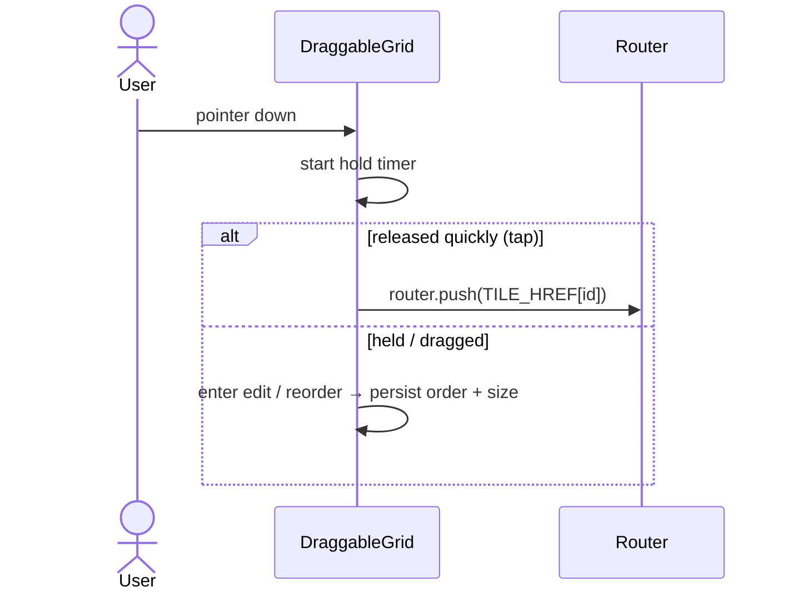

# Dashboard

## Overview
The home screen (`/`) shows net worth, accounts, and a **customizable grid of tiles** (recent activity, spending, budgets, goals, subscriptions, splits, cashflow, insight charts). Tiles can be reordered, resized, added, and removed. Every tile is **tap-to-navigate** to its detail page.

## User flow
```mermaid
flowchart TD
    Home([Dashboard]) --> View[See net worth + tiles]
    View --> Tap{Tap a tile}
    Tap -->|quick tap| Nav[Navigate to detail page\n(some deep-link to a section)]
    Tap -->|long press / Customize| Edit[Edit mode]
    Edit --> Reorder[Drag reorder / resize / remove]
    Edit --> Add[Add tile from catalog]
    Reorder --> Done[Persisted layout]
```

## Technical flow


- Tap vs drag is disambiguated by a press-hold timer; taps on inner controls (links/buttons) are ignored so they handle themselves.
- `TILE_HREF` maps each tile to a route; the **subscriptions** tile deep-links to `/cashflow#payments`.

## Data touched
Reads across `accounts`, `transactions`, `budgets`, `goals`, `subscriptions`, splits, holdings (per-tile live queries). Layout persisted via dashboard prefs (`src/dashboard.ts`).

## Key files
`app/page.tsx` (grid + drag + tap-nav), `src/dashboard/tiles.tsx` (`TILE_CATALOG`, `TILE_HREF`, tile components), `src/dashboard.ts` (sizes/order).

## Gating
Free tiles + premium-only insight tiles (cashflow, net trend, by category/label, month compare) gated by `useEntitlement`.

## Edge cases
- Tiles have fixed grid-row heights; content is capped (e.g. Budgets shows 4 + "+N more") so tiles never overflow.
- Touch devices reorder via ▲▼ buttons (drag is unreliable on coarse pointers).
- Layout is per-user and restored on load.
