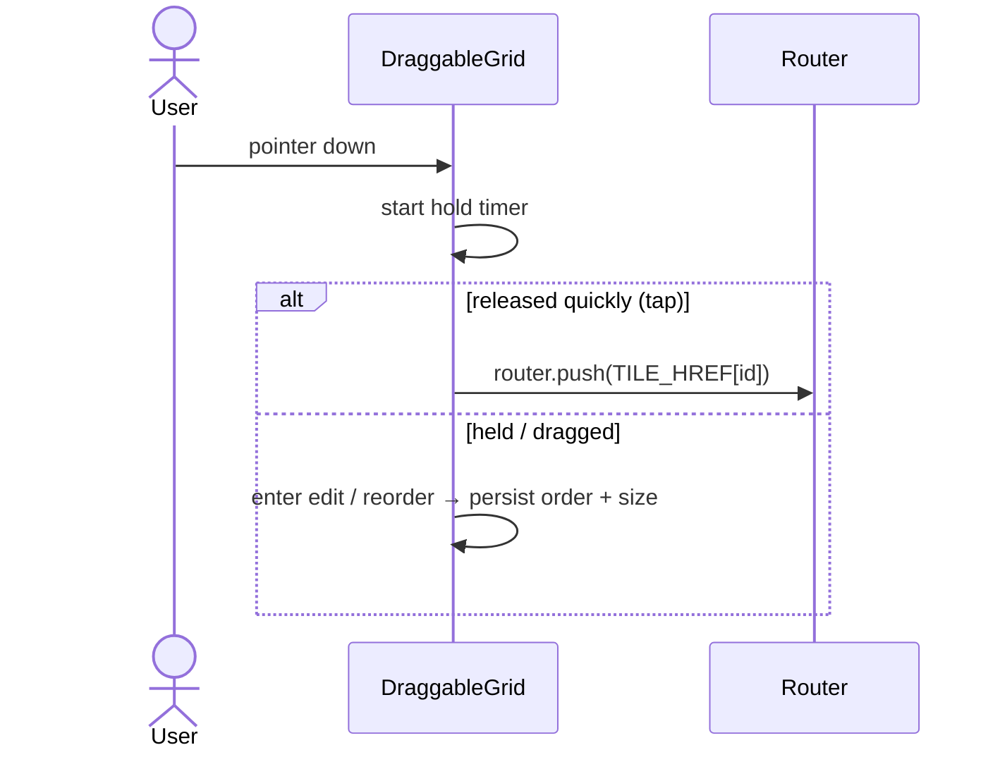

# Dashboard

## Overview
The home screen (`/`) shows net worth, accounts, and a **customizable grid of tiles** (recent activity, spending, upcoming payments, budgets, goals, subscriptions, splits, cashflow, insight charts). Tiles can be reordered, resized, added, and removed. Every tile is **tap-to-navigate** to its detail page.

The **Upcoming payments** tile aggregates every scheduled outflow across sources — subscriptions (`next_renewal`), loan EMIs (next unpaid EMI via `emiDueDate`), SIPs and planned payments like electricity/piped-gas/household (`planned_cashflow.next_due` rolled forward by frequency), and credit-card bills (`credit_card_details.pending_due`/`due_on`) — converts each to base currency, shows the total due in the next 30 days, and lists the soonest six by date (with "Today / Tomorrow / in N days / overdue" labels).

## User flow
```mermaid
flowchart TD
    Home([Dashboard]) --> View[See net worth + tiles]
    View --> Tap{Tap a tile}
    Tap -->|quick tap| Nav[Navigate to detail page\n(some deep-link to a section)]
    Tap -->|long press / Customize| Edit[Edit mode]
    Edit --> Reorder[Drag reorder / resize / remove]
    Edit --> Add[Add tile from catalog]
    Reorder --> Done[Persisted layout]
```

## Technical flow

```mermaid
sequenceDiagram
    actor U as User
    participant Grid as DraggableGrid
    participant R as Router
    U->>Grid: pointer down
    Grid->>Grid: start hold timer
    alt released quickly (tap)
        Grid->>R: router.push(TILE_HREF[id])
    else held / dragged
        Grid->>Grid: enter edit / reorder → persist order + size
    end
```

- Tap vs drag is disambiguated by a press-hold timer; taps on inner controls (links/buttons) are ignored so they handle themselves.
- `TILE_HREF` maps each tile to a route; the **subscriptions** tile deep-links to `/cashflow#payments`.

## Tiles clip, they never scroll (`useFitRows`)

`.dash-tile-body > section` used to be `overflow-y: auto; overscroll-behavior: contain`. `contain` **disables scroll chaining**, so a wheel or swipe that started inside a tile was consumed by the tile and never handed back to the page — the "I can't scroll the page from a tile" bug. It was not desktop-only: the `@media (max-width: 860px)` escape hatch left landscape phones, iPads and most Android tablets on the trapping path.

Tiles now **clip** (`overflow: hidden`) at every width, with no width-conditional behaviour, and the content is *designed to fit* instead of being hidden behind a scrollbar:

- The tile shell is a **flex column**. Exactly one child carries `.tile-flex` (`flex: 1; min-height: 0`) and absorbs the leftover height.
- `src/dashboard/useFitRows.ts` puts a `ResizeObserver` on that child and returns `floor((h + gap) / (rowH + gap))`. Lists render `items.slice(0, fit)` and put the remainder behind a **"+N more →"** link.
- Applied to: Recent activity, Budgets, Goals, Subscriptions, Splits balances, Upcoming payments, the category-pie legend, and the bar count in the two horizontal-bar tiles.
- Below 860px the grid is single-column with natural row heights, so the hook returns `max` and lists render in full. That is the *same* width condition the layout already uses, not a second divergent behaviour.
- Where a list sits under a divider, the border/padding live on an **outer** box: `useFitRows` measures `clientHeight`, which includes padding, so padding on the measured element would inflate the fit.

## Charts

Every chart is `<ResponsiveContainer height="100%">` inside a `.tile-flex` div — no fixed pixel heights. `HBarTile` in particular used to be `height={Math.max(180, data.length * 34)}`, which reached 272px inside a cell whose row unit is `clamp(80px, 10.5vh, 118px)`; that overflow is what made the scrollbar necessary. Recharts needs `min-height: 0 !important` on `.recharts-responsive-container, .recharts-wrapper` to shrink inside a flex/grid parent.

Formatting is shared so it can't drift:

- `chartMoney(hidden, base)` — the single money formatter for chart series (which are **major** units in this file). It respects `useAmountsHidden()`. The two bar tiles previously used `v.toLocaleString()` and ignored the hide-amounts toggle entirely, which leaked real figures straight through a **privacy** feature.
- `chartTooltip(fmt, cursor)` returns the `<Tooltip>` **element**. It is deliberately not a `<ChartTooltip>` wrapper component: recharts finds its tooltip by scanning children for that exact component type, so a wrapper is never detected.
- `maskedTick(hidden)` for compact, maskable Y-axis ticks; `ellipsisTick` so long category names are truncated with an ellipsis rather than clipped mid-word by a fixed `YAxis width`.
- `ANIM` gives bars and areas the same duration and easing.

## Data touched
Reads across `accounts`, `transactions`, `budgets`, `goals`, `subscriptions`, splits, holdings (per-tile live queries). Layout persisted via dashboard prefs (`src/dashboard.ts`).

## Key files
`app/page.tsx` (grid + drag + tap-nav), `src/dashboard/tiles.tsx` (`TILE_CATALOG`, `TILE_HREF`, tile components, shared chart formatters), `src/dashboard/useFitRows.ts` (how many rows fit), `src/dashboard.ts` (sizes/order), `app/globals.css` (`.dash-tile-body`, `.tile-flex`).

## Gating
Free tiles + premium-only insight tiles (cashflow, net trend, by category/label, month compare) gated by `useEntitlement`.

## Edge cases
- Tiles have fixed grid-row heights and **clip**; every list caps itself to `useFitRows` and shows "+N more →". Resizing a tile to its smallest span shrinks the list and the charts rather than overflowing.
- List tiles whose SQL carries a `LIMIT` (Budgets, Goals: 6) compute "+N more" from that capped set, so on a very tall tile the link can disappear while more rows exist on the detail page.
- Hide-amounts masks tooltips, `LabelList` values and axis ticks on every chart, bar charts included.
- Touch devices reorder via ▲▼ buttons (drag is unreliable on coarse pointers).
- Layout is per-user and restored on load.
