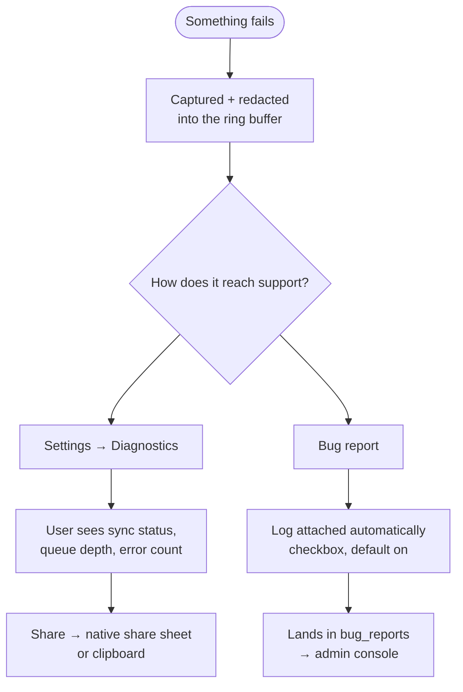

# Diagnostics (on-device support log)

## Overview
On a laptop you can ask someone to open the console. On a phone you can't — so when sync fails, the app prints a perfectly clear PostgREST error to a place nobody can reach, the user reports *"syncing isn't working"*, and that is genuinely all anyone knows.

This captures errors on the device, **scrubs them**, and gives two routes out: a **Share** button (opens WhatsApp/Mail via the native share sheet) and **automatic attachment to bug reports**, so the diagnosis arrives without the user doing anything.

## What it captures
| Source | Examples |
|---|---|
| `console.error` / `console.warn` | wrapped, not replaced — devtools still behaves normally |
| `window.onerror` | script errors, with filename and line |
| `unhandledrejection` | rejected promises anywhere in the app |
| network events | went offline / back online |
| **structured sync failures** | table, operation, row count, PostgREST code, message, hint |

Entries carry the **route** they happened on. The buffer is 150 entries, mirrored to `localStorage` so it survives a reload or a crash.

## Redaction — the part that must not be wrong
This is a personal finance app; a support log must never become a leak of someone's spending. The rule: **keep what diagnoses, drop what describes a person's life.**

| Kept | Removed |
|---|---|
| table names, operations, error codes | amounts (every notation, incl. bare minor units) |
| row UUIDs (how you find the row) | descriptions, merchants, names, labels |
| routes, HTTP status codes, row counts | emails, UPI IDs |
| message structure | bearer tokens, JWTs, API keys |

Three passes, chosen deliberately:

- **`redactSecrets`** — credentials and contact details only, *never touches numbers*. Used for values under keys we already know aren't money, because a PostgREST code like `23514` is indistinguishable from an amount by shape alone and is the most useful field in a sync failure.
- **`redactText`** — secrets **plus** anything money-shaped. Used for free-text messages, where there's no key to say what a number means, so we assume the worst.
- **`redactDetail`** — key-based. Sensitive keys (`amount`, `description`, `merchant`, `email`, …) have their values replaced wholesale; free-text keys (`message`, `error`, `stack`, …) get the full `redactText` treatment; everything else gets `redactSecrets`.

UUIDs are stashed before every pass and restored after, so the number scrubber can't mangle them.

**Worked example** — the real error that prompted this feature:

```
in:  expense_items for 693e8c6d-4214-4b70-8bbe-88708a2601bd sum to 20000
     but the expense total is 1258784
out: expense_items for 693e8c6d-4214-4b70-8bbe-88708a2601bd sum to [amount]
     but the expense total is [amount]
     + detail: { table: pocketcare.expense_items, op: PUT, rows: 1, code: 23514 }
```

Everything needed to diagnose it; nothing about what was bought.

## User flow


## The Diagnostics panel
Lives in Settings. Shows, at a glance and without reading a log:

- **Status** — connected / connecting / offline
- **Last synced** — the single most telling number when someone says "it's not updating"
- **Waiting to upload** — queue depth; non-zero and stuck is the signature of a rejected write
- **Errors logged** — count, highlighted when non-zero
- the raw sync error verbatim, when there is one
- the full log, expandable, newest first

## Key files
| Layer | File |
|---|---|
| Types + redaction (tested) | `packages/core/diagnostics/src/index.ts` |
| Capture + ring buffer | `apps/web/src/diagnostics/log.ts` |
| UI | `apps/web/src/diagnostics/DiagnosticsPanel.tsx` |
| Sync hook | `packages/db/src/connector.ts` — `setSyncDiagnosticSink` |
| Wiring | `apps/web/src/powersync.ts`, `apps/web/app/AppShell.tsx` |
| Report attachment | `apps/web/src/ui/BugReport.tsx` |

`packages/db` has **no dependency** on the app's diagnostics layer — it exposes a module-level sink and the app opts in at startup, so the connector neither knows nor cares whether anything is listening.

## Data touched
`bug_reports.diagnostics` (text, migration `0043`). Mirrored in `AppSchema` — a column added only to Postgres fails at runtime with `table bug_reports has no column named diagnostics`.

## Edge cases
| Case | Behaviour |
|---|---|
| localStorage full / private mode | The in-memory buffer still works for the session; persistence silently degrades. |
| Logging itself throws | Every entry point is wrapped — logging must never be what breaks the app. |
| A failure inside `console.error` | Entries starting `[diagnostics]` are skipped, so it can't loop. |
| `navigator.share` unavailable | Falls back to clipboard with a "Copied" confirmation. |
| Huge log on a bug report | Capped at 20 000 characters. |
| User declines to attach | Checkbox is opt-out, default on, and says why it matters. |

## Deliberate non-goals
- **No automatic telemetry.** Nothing is uploaded unless the user shares it or files a report. Auto-upload would need consent, rate limiting and a retention policy — a different feature with a different conversation.
- **No `console.log` capture.** A chatty log buries the signal and burns a 150-entry buffer in seconds.
- **No unredacted mode.** "Let the user review it first" sounds respectful but nobody reads 150 lines before tapping Send.
