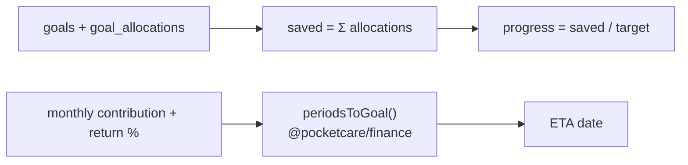

# Goals & Emergency Fund

## Overview
Savings goals with a **forced emergency-fund-first** rule. Funds are "blocked" from savings accounts via allocations (the emergency fund is tracked but not blocked). Premium adds **time-to-goal** projections using compounding math.

## User flow
```mermaid
flowchart TD
    G([Goals]) --> EF{Emergency fund exists?}
    EF -->|no| MakeEF[Prompt to create EF first]
    EF -->|yes| New[Create goal (target, currency, priority)]
    New --> Fund[Allocate from a savings account → blocked]
    Fund --> Track[Progress bar + ETA]
    Track --> ETA["Premium: time-to-goal with assumed return"]
```

## Technical flow


## Data touched
`goals` (`is_emergency_fund`, `priority`), `goal_allocations` (blocked amounts reduce **available** balance), savings `accounts`.

## Key files
`app/goals/`, `@pocketcare/finance` (`periodsToGoal`, `futureValue`), `src/ui/ProgressBar.tsx`.

## Gating
Free: create goals + track. Premium: compounding ETA projections.

## Edge cases
- Emergency fund is **not** blocked (stays available) but is prioritised first.
- Allocations reduce available balance but not total.
- `periodsToGoal` returns Infinity when a goal can never be reached (contribution ≤ 0 at 0% return) — UI shows "—".
