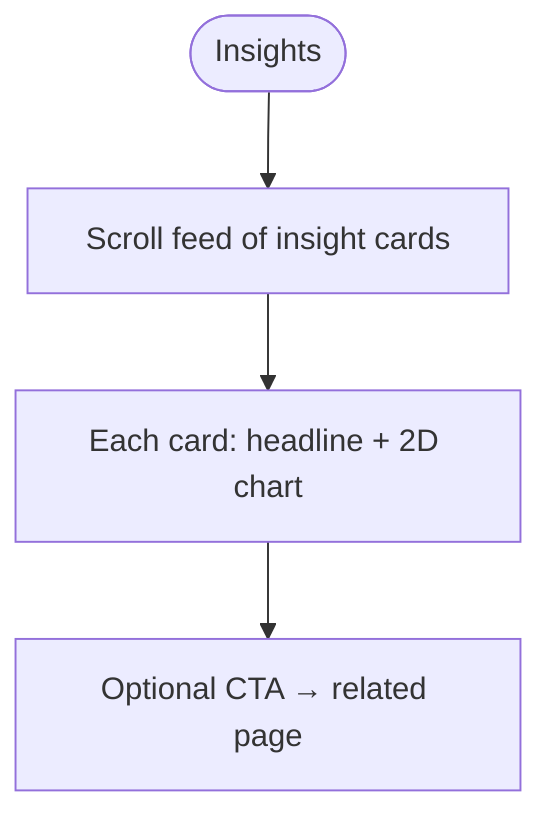
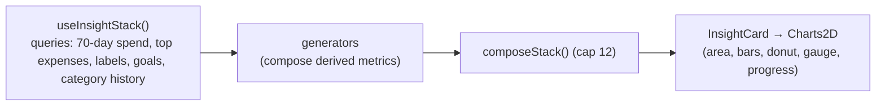

# Insights

## Overview
A premium **insight feed** of polished 2D charts and generated observations: cashflow, net trend, spending by category/label, month-over-month comparison, biggest expense, weekday patterns, no-spend days, category spikes, goal progress, and more (15+ generators).

## User flow

## Technical flow

## Data touched
Aggregated reads over `transactions`, `budgets`, `goals`, `goal_allocations`, `labels`, `categories`.

## Key files
`app/insights/`, `src/insights/generators.ts`, `src/insights/Charts2D.tsx`.

## Gating
**Premium.** Gated by `useEntitlement`.

## Edge cases
- Charts are 2D (react-three-fiber visuals were removed for performance).
- Unique gradient ids via `useId` to avoid SVG clashes.
- Charts stay unmasked even when "hide amounts" is on (opt-in analytics context).
