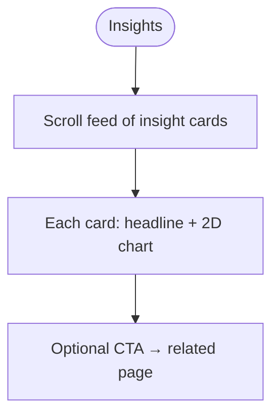
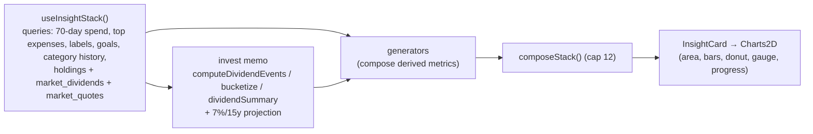

# Insights

## Overview
A premium **insight feed** of polished 2D charts and generated observations: cashflow, net trend, spending by category/label, month-over-month comparison, biggest expense, weekday patterns, no-spend days, category spikes, goal progress, dividend income, portfolio projection, and more (17 generators).

`/insights` is the feed and **nothing else** — no page title, no side panels. The page sets `document.body.dataset.fullbleed` so the shell drops its padding and width cap, and clears it on unmount. The premium gate stays: it is the entitlement boundary, not chrome.

### Dividends and projections

The `DividendPanel` and `ProjectionPanel` that used to sit above the feed are now **two insight cards** plus **two interactive panels on `/investments`**:

| | Card (`/insights`) | Panel (`/investments`) |
|---|---|---|
| `dividend_income` | monthly buckets, trailing-12 / next-12 / all-time | period chips (week…all), the same buckets |
| `portfolio_projection` | fixed assumptions: **7 %** growth, **15 y**, no contribution | sliders for growth, monthly contribution, horizon, reinvest toggle |

A card is a static visual, so converting `ProjectionPanel` verbatim would have lost its controls; the CTA on both cards points at `/investments`, where the holdings they describe already live. Both panels self-hide when the user has no holdings.

**Both generators return `[]` when `holdings === 0`.** The holdings count is carried *inside* the optional `DividendAgg` / `ProjectionAgg` payloads specifically so the guard can't be forgotten — otherwise every non-investor gets two empty cards in their stack. `useInsightStack` also short-circuits and passes `undefined` for both when there are no holding rows. The maths is reused wholesale from `src/market/dividends.ts` (`computeDividendEvents` / `bucketize` / `dividendSummary`) — no new arithmetic.

## User flow

```mermaid
flowchart TD
    In([Insights]) --> Feed[Scroll feed of insight cards]
    Feed --> Card[Each card: headline + 2D chart]
    Card --> Act[Optional CTA → related page]
```

## Technical flow

```mermaid
flowchart LR
    Q["useInsightStack()\nqueries: 70-day spend, top expenses, labels, goals, category history,\nholdings + market_dividends + market_quotes"] --> Inv["invest memo\ncomputeDividendEvents / bucketize / dividendSummary\n+ 7%/15y projection"]
    Q --> Gen
    Inv --> Gen["generators\n(compose derived metrics)"]
    Gen --> Stack["composeStack() (cap 12)"]
    Stack --> Cards["InsightCard → Charts2D\n(area, bars, donut, gauge, progress)"]
```

The investment aggregates sit in their **own** `useMemo` keyed on the holding/dividend/quote arrays, so the much larger card memo doesn't recompute every time `useRates()` hands back a fresh closure.

## Data touched
Aggregated reads over `transactions`, `budgets`, `goals`, `goal_allocations`, `labels`, `categories`, plus `holdings`, `market_dividends`, `market_quotes` and `exchange_rates` for the two investment cards.

## Key files
`app/insights/page.tsx`, `src/insights/{types,generators,useInsightStack}.ts`, `src/ui/feed/{InsightFeed,InsightCard,Charts2D}.tsx`, `src/market/{dividends.ts,DividendPanel.tsx,ProjectionPanel.tsx}`, `app/investments/page.tsx`.

## Gating
**Premium.** Gated by `useEntitlement`.

## Edge cases
- Charts are 2D (react-three-fiber visuals were removed for performance).
- Unique gradient ids via `useId` to avoid SVG clashes.
- Charts stay unmasked even when "hide amounts" is on (opt-in analytics context). Note this differs from the **dashboard** tiles, which do mask — the feed is an explicit, premium-gated analytics surface the user navigated to.
- `genDividends` also returns `[]` when the user holds shares but the market sync hasn't fetched any dividend history yet (`total <= 0`), and `genProjection` when `currentValue <= 0` — a zero portfolio has nothing to compound.
- The projection falls back to `avg_cost` per share when no quote exists for a symbol, so a freshly-added holding still projects.
- `src/insights` is app-local (`apps/web`), which has no test infrastructure, so the two new generators have **no unit tests**; the empty-holdings guards are the first statement of each function and are commented as such.
