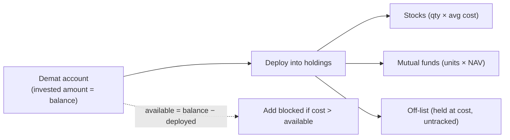
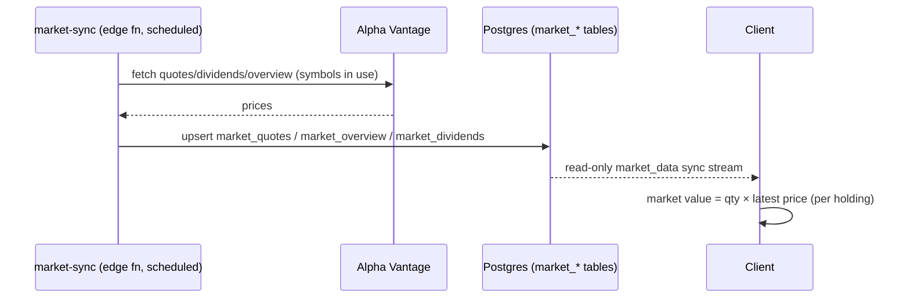

# Investments

## Overview
Track stock and mutual-fund **holdings** inside a **demat account** that holds an invested amount; holdings deploy from that amount (enforced: **sum of holdings cost ≤ demat account balance**). Mutual funds are tracked in **units** (NAV as cost). Off-catalog stocks/MFs can be added with an **untracked** disclaimer (held at cost until we can price them). Optional **daily auto-fetch** of prices from Alpha Vantage for listed holdings; net-worth inclusion is per-account.

## Demat model


## User flow
```mermaid
flowchart TD
    I([Investments]) --> Add[Add holding\n(account, symbol, exchange, qty, avg cost)]
    Add --> Fetch{Auto-fetch price?}
    Fetch -->|on| Live[Daily quote → market value]
    Fetch -->|off| Manual[Manual valuation]
    Live --> Wealth[Contributes to net worth (if enabled)]
    Manual --> Wealth
```

## Technical flow


## Data touched
`holdings` (`symbol`, `exchange`, `quantity`, `avg_cost`, `auto_fetch`), global `market_quotes` / `market_overview` / `market_dividends` (read-only), `exchange_rates` for base-currency roll-up.

## Key files
`app/investments/`, `src/market/*`, `src/instruments/*`, `supabase/functions/market-sync`.

## Gating
Free to record holdings; **auto-fetch is premium**.

## Edge cases
- Market tables use composite keys; sync synthesises a text `id`.
- Symbols only fetched if in use (cost control); see `MARKET_DATA_PLAN.md`.
- Net-worth inclusion is per-account/holding configurable.
