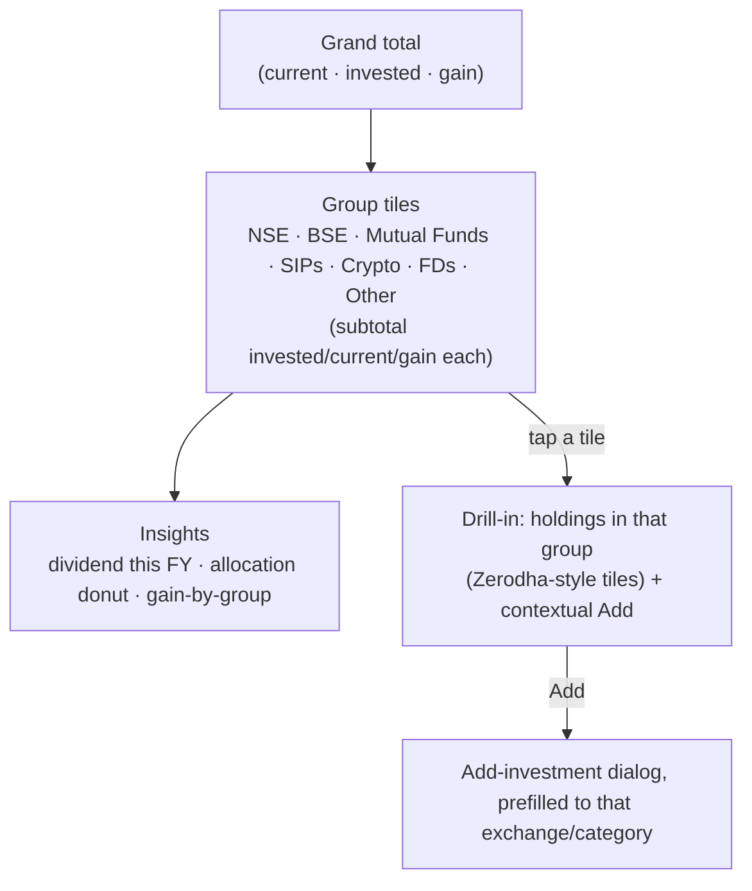
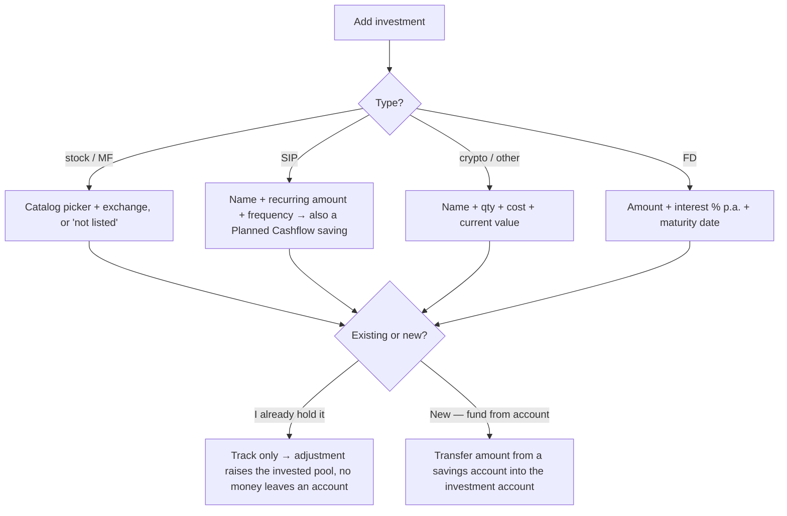

# Investments & savings

## Overview
A grouped, drill-in portfolio for every kind of investment: listed **stocks** and **mutual funds** (priced via the daily market feed), plus **SIPs**, **crypto**, **fixed deposits** and **other schemes** (valued from a user-entered current value, else cost). The page shows a **grand total** (current / invested / gain), **group tiles** (one per exchange for stocks, one per category for the rest) with their own subtotals, an **insights** row (dividend earned this financial year, allocation donut, gain-by-group bars — gradient charts), and a **drill-in** list of holdings under any tile with a **contextual add** button. Holdings still sit in an investment account (demat / stocks / mutual_funds); adding one either tracks an existing investment or funds a new one from a savings account. SIPs also surface under **Planned Cashflow → Savings**.

## Page structure

## Add flow (dialog)

## Valuation
- **Listed & priced** (stock/MF with a live quote) → quote × quantity.
- **Everything else** (crypto/FD/SIP/other, or off-list/unpriced stocks) → the user-entered **current_value**, falling back to cost.
- Gain = value − cost; group and grand totals convert each holding to **base currency** via `exchange_rates`.

## Grouping
`groupKeyOf` buckets **listed stocks by exchange** (`ex:NSE`, `ex:BSE`, …) and **everything else by asset class** (`cls:mf|crypto|fd|sip|other`). Tiles are sorted exchanges-first, then MF, SIP, crypto, FD, other. The contextual **Add** button prefills the dialog with the tile's exchange/class and account.

## Funding & money movement
Adding a holding keeps the account's "available to invest" coherent:
- **Existing (track only):** an `adjustment` entry raises the investment account's balance by the invested amount — the money was already in the market, nothing leaves a savings account.
- **New (funded):** a `transfer` moves the amount from the chosen savings/bank account into the investment account (net worth preserved). `holdings.source_account_id` records the funding account.

## Dividends (this financial year)
The insights card estimates dividends earned **Apr 1 → today** of the current Indian financial year: for each declared dividend (`market_dividends`), amount-per-share × current quantity held, converted to base (`computeDividendEvents`), filtered to the FY window. Estimate caveat: uses current share counts (historical lots aren't tracked).

## Data touched
`holdings` (`symbol`, `exchange`, `quantity`, `avg_cost`, `asset_class`, `current_value`, `annual_rate`, `maturity_date`, `source_account_id`, `planned_id`, `auto_fetch`, `off_list`), `transactions` (funding transfer / adjustment), `planned_cashflow` (linked SIP saving), global `market_quotes` / `market_overview` / `market_dividends` (read-only), `exchange_rates` for base-currency roll-up.

## Key files
`app/investments/page.tsx`, `src/investments/{model.ts, Charts.tsx, write.ts, AddDialog.tsx}`, `src/market/*`, `src/instruments/*`, `supabase/functions/market-sync`. Migration `0035` (holdings columns).

## Gating
Free to record and view; **auto-fetch of live prices is premium**.

## Edge cases
- Market tables use composite keys; sync synthesises a text `id`.
- Symbols only fetched if in use (cost control); see `MARKET_DATA_PLAN.md`.
- Unpriced schemes (crypto/FD/off-list) are held at their current value (else cost) until priced; edit to update the value.
- Market-cap (large/mid/small) distribution is intentionally **not** shown yet — no market-cap data feed exists.
- Legacy holdings backfill `asset_class` from the older `instrument_type`.
