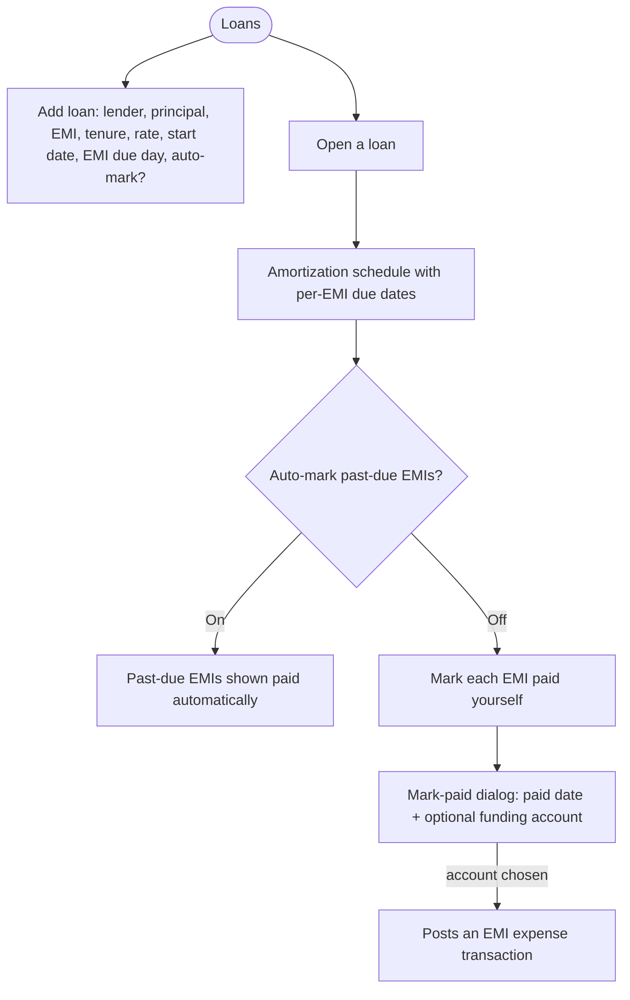
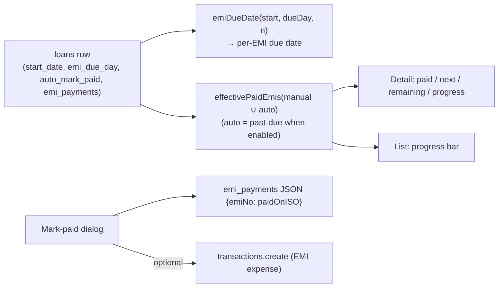

# Loans (EMI schedule & tracking)

## Overview
A dedicated `/loans` list + `/loans/[id]` detail page for tracking loans: principal, monthly EMI, tenure, interest rate, and a reducing-balance **amortization schedule** (principal vs interest per month via `amortizationSchedule()` in `@pocketcare/finance`). Each EMI has a **due date** derived from the loan's start date + a configurable **due day of the month**, and can be marked paid either **manually** or **automatically on the due date**.

## User flow

## Technical flow

## Data touched
`loans` (`principal`, `emi_amount`, `tenure_months`, `interest_rate`, `start_date`, `emi_due_day`, `auto_mark_paid`, `emi_payments`, `emis_paid`), `transactions` (optional EMI expense on mark-paid).

## Key files
`app/loans/page.tsx` (list + AddLoan), `app/loans/[id]/page.tsx` (detail, schedule, mark-paid dialog, edit), `@pocketcare/finance` (`amortizationSchedule`, `emiDueDate`, `isDuePassed`, `effectivePaidEmis`).

## Gating
Free.

## Due-date & auto-mark logic
`emi_due_day` (1–31) is the day of the month each EMI falls on; combined with `start_date` it derives every EMI's due date. The **first** EMI is the first occurrence of the due day on/after the start date; each subsequent EMI is one calendar month later, with the day **clamped** to the month length (a 31 due-day lands on Feb 28/29). If no due day is set, the start date's own day is used.

`auto_mark_paid` (0/1): when on, every EMI whose due date has passed is treated as paid. Auto-marked EMIs are **derived at read time, never written** — so turning the toggle off instantly reverts them. **Manual** marks (in `emi_payments`) always win and persist; they can be undone individually. This keeps the paid count, next-EMI date, remaining count, and progress bar consistent on both the list and detail pages.

## Edge cases
- Legacy loans (created before per-EMI tracking) fall back to the `emis_paid` count → first N EMIs marked.
- Marking an EMI paid can **optionally** post an expense from a funding account (defaults to not recording); only offered when an EMI amount is set.
- Auto-marked rows show an "Auto ✓" chip (non-interactive); to unmark, turn the policy off.
- Loans added from the Planned Cashflow hub redirect to `/loans`; the loan bucket is managed here.
