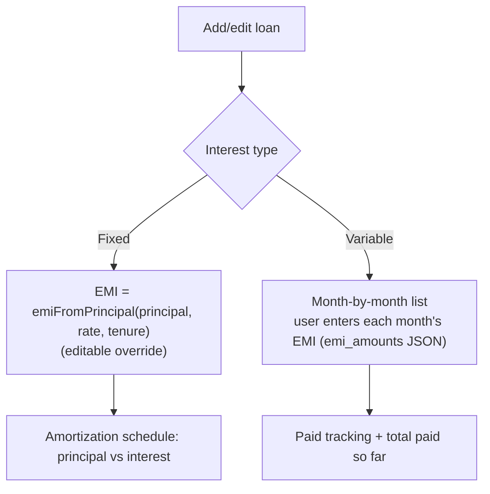
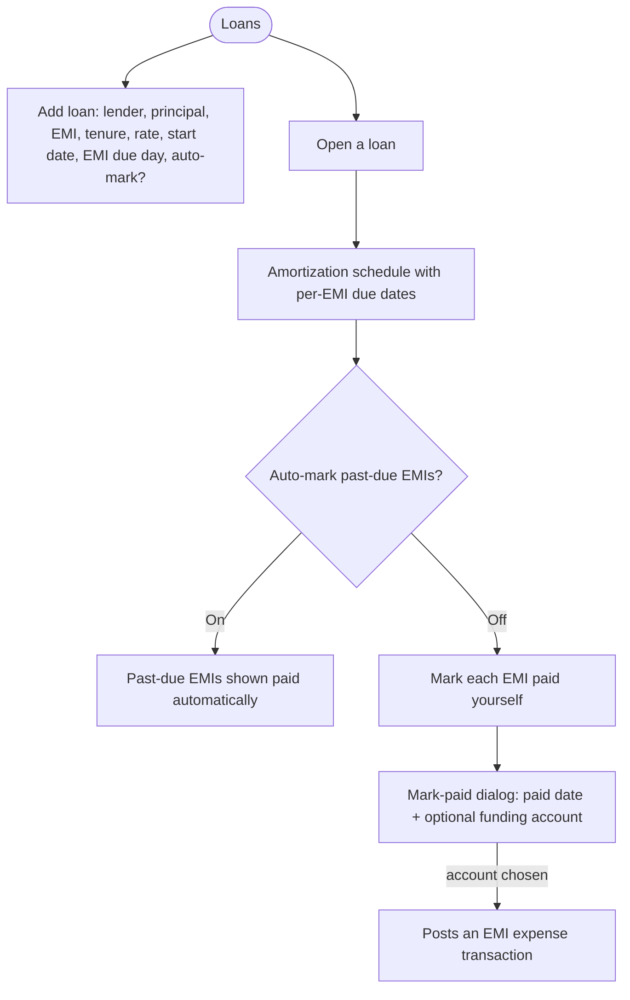
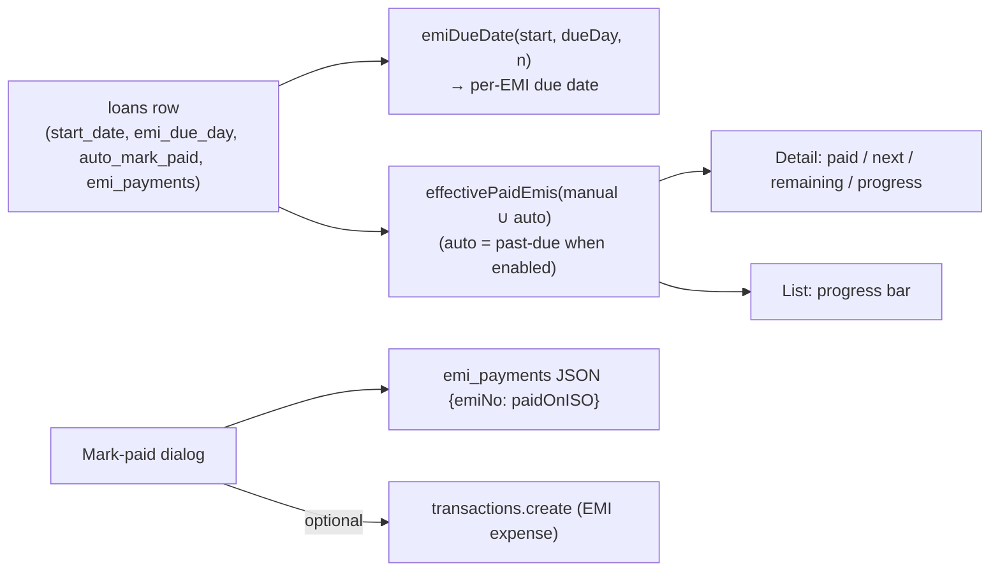

# Loans (EMI schedule & tracking)

## EMIs charged to a credit card (2026-07-29)
A loan can name the account its EMI is charged to — `loans.funding_account_id`,
migration **0047**. Asked when adding the loan, with "Not linked" as a
first-class choice (plenty of EMIs are a standing instruction on an account the
user doesn't track here, and guessing would put money where it doesn't belong).

**CHARGED and PAID are separate events**, and conflating them is what made the
earlier behaviour wrong:

| | When | Where |
|---|---|---|
| **Charged** | the EMI's due date passes | `src/loans/autoPost.ts` posts an expense on the linked account |
| **Paid** | you settle the bill containing it | `src/loans/settleEmis.ts`, on confirmation |

So a due EMI lands on the card exactly as a bank adds an instalment to your
statement, and therefore appears in the card's total due. `auto_mark_paid` does
NOT gate the charge — an instalment is owed whether or not you've told the app
you paid it.

**Settling the card asks before marking anything.** `findCoveredEmis` walks the
due, unmarked EMIs on that card oldest-first and stops when the settled amount
runs out; the Cards page shows them and the user confirms. This is inferred
money state — a partial payment must not silently clear an instalment. The
FIFO walk *stops* at an EMI too large for the remaining headroom rather than
skipping it, since clearing a later instalment while an older one stays open
would misrepresent the order things were paid.

**Never posts twice:** dedupe is a lookup in the synced ledger for the exact
`EMI #n — lender` description, so a second device running the same catch-up
finds the first device's row. `markEmisPaid` re-reads `emi_payments` before
writing, because it's a whole-column JSON blob and a stale copy would silently
drop another device's change.

**Why `funding_account_id` has no FK:** a loan row can reach the server before
the account row it references when both are created offline, and a 23503 there
would retry 3× and quarantine the loan — the head-of-line block 0040 caused and
0042 removed. A dangling id degrades to "not linked" instead.

**Deploy:** `supabase db push` + redeploy sync rules (`loans` is `SELECT *`, so
the column follows automatically).

## Overview
A dedicated `/loans` list + `/loans/[id]` detail page for tracking loans: principal, monthly EMI, tenure, interest rate, and a reducing-balance **amortization schedule** (principal vs interest per month via `amortizationSchedule()` in `@pocketcare/finance`). The **monthly EMI is auto-calculated** from principal + rate + tenure (`emiFromPrincipal()`), editable to override. Loans are **fixed** or **variable** rate: fixed loans get the computed EMI + amortization schedule; variable loans (which re-price over time and can't be modelled) instead show a **month-by-month list where the user enters each month's actual EMI**. Each EMI has a **due date** derived from the loan's start date + a configurable **due day of the month**, and can be marked paid either **manually** or **automatically on the due date**.

## Fixed vs variable

```mermaid
flowchart TD
    Add[Add/edit loan] --> Type{Interest type}
    Type -->|Fixed| Calc["EMI = emiFromPrincipal(principal, rate, tenure)\n(editable override)"]
    Calc --> Sched[Amortization schedule: principal vs interest]
    Type -->|Variable| Enter["Month-by-month list\nuser enters each month's EMI (emi_amounts JSON)"]
    Enter --> Track[Paid tracking + total paid so far]
```
`rate_type` = `fixed` | `variable`. Variable EMIs are stored in `emi_amounts` (JSON `{ emiNo: amountMinor }`), edited inline in the schedule (saved on blur). Variable loans show "Varies" for the monthly EMI and a "Paid so far" total instead of an amortization split.

## User flow

```mermaid
flowchart TD
    L([Loans]) --> Add[Add loan: lender, principal, EMI, tenure, rate, start date, EMI due day, auto-mark?]
    L --> Detail[Open a loan]
    Detail --> Sched[Amortization schedule with per-EMI due dates]
    Sched --> Toggle{Auto-mark past-due EMIs?}
    Toggle -->|On| Auto[Past-due EMIs shown paid automatically]
    Toggle -->|Off| Manual[Mark each EMI paid yourself]
    Manual --> Pay[Mark-paid dialog: paid date + optional funding account]
    Pay -->|account chosen| Txn[Posts an EMI expense transaction]
```

## Technical flow

```mermaid
flowchart LR
    Loan["loans row\n(start_date, emi_due_day, auto_mark_paid, emi_payments)"] --> Due["emiDueDate(start, dueDay, n)\n→ per-EMI due date"]
    Loan --> Eff["effectivePaidEmis(manual ∪ auto)\n(auto = past-due when enabled)"]
    Eff --> View["Detail: paid / next / remaining / progress"]
    Eff --> ListView["List: progress bar"]
    Manual["Mark-paid dialog"] --> Map["emi_payments JSON {emiNo: paidOnISO}"]
    Manual -->|optional| Repo["transactions.create (EMI expense)"]
```

## Data touched
`loans` (`principal`, `emi_amount`, `tenure_months`, `interest_rate`, `rate_type`, `start_date`, `emi_due_day`, `auto_mark_paid`, `emi_payments`, `emi_amounts`, `emis_paid`), `transactions` (optional EMI expense on mark-paid).

## Key files
`app/loans/page.tsx` (list + AddLoan), `app/loans/[id]/page.tsx` (detail, fixed schedule + variable EMI list, mark-paid dialog, edit), `@pocketcare/finance` (`emiFromPrincipal`, `amortizationSchedule`, `emiDueDate`, `isDuePassed`, `effectivePaidEmis`). Migrations `0034` (due-day/auto-mark) + `0036` (rate_type/emi_amounts).

## Gating
Free.

## Due-date & auto-mark logic
`emi_due_day` (1–31) is the day of the month each EMI falls on; combined with `start_date` it derives every EMI's due date. The **first** EMI is the first occurrence of the due day on/after the start date; each subsequent EMI is one calendar month later, with the day **clamped** to the month length (a 31 due-day lands on Feb 28/29). If no due day is set, the start date's own day is used.

`auto_mark_paid` (0/1): when on, every EMI whose due date has passed is treated as paid. Auto-marked EMIs are **derived at read time, never written** — so turning the toggle off instantly reverts them. **Manual** marks (in `emi_payments`) always win and persist; they can be undone individually. This keeps the paid count, next-EMI date, remaining count, and progress bar consistent on both the list and detail pages.

## Edge cases
- Legacy loans (created before per-EMI tracking) fall back to the `emis_paid` count → first N EMIs marked.
- Marking an EMI paid can **optionally** post an expense from a funding account (defaults to not recording); only offered when an EMI amount is set.
- Auto-marked rows show an "Auto ✓" chip (non-interactive); to unmark, turn the policy off.
- Loans added from the Planned Cashflow hub redirect to `/loans`; the loan bucket is managed here.
