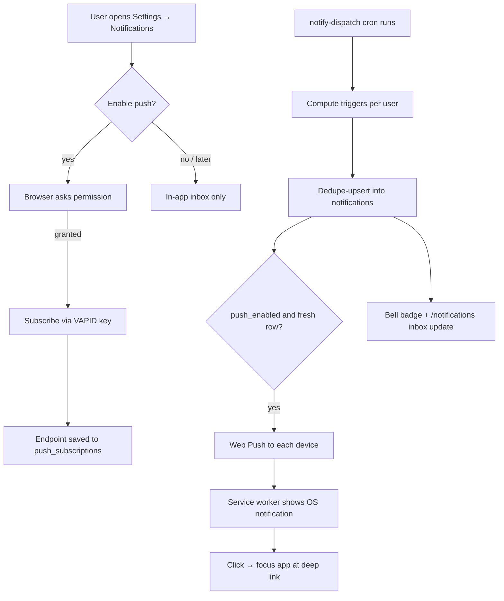
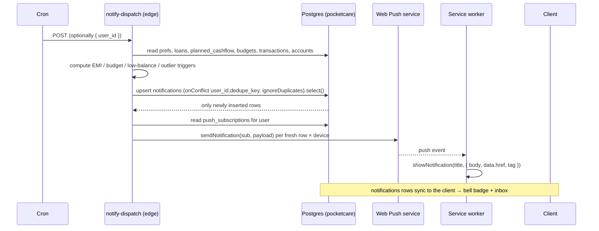

# Notifications (in-app inbox + Web Push)

Alerts users about money events — upcoming EMIs/bills, budget limits, low balances,
and unusual spend — through an in-app inbox **and** browser Web Push (so alerts
arrive even with the app closed, provided the browser is running in the
background). Everything is offline-first: inbox rows sync via PowerSync and the
bell badge works without a connection.

## User flow

## Technical / sequence

## Triggers (computed server-side)

| Kind | Rule | Dedupe key |
|------|------|-----------|
| `emi_due` | Active loan whose `emi_due_day` (this month) is within `emi_lead_days`; active `planned_cashflow` payments with `next_due` in window | `emi:<loanId>:<YYYY-M>` / `bill:<id>:<due>` |
| `budget` | Spend in a budget's categories ≥ `threshold_pct` (default 80%) or ≥ 100% of `limit_amount`, within the budget's active period | `budget:<id>:<from>:<near\|over>` |
| `low_balance` | Derived account balance ≤ `low_balance_threshold` (0 = alert when negative). Real, non-archived accounts only | `lowbal:<accountId>:<YYYY-MM-DD>` (daily) |
| `outlier` | Expense in the last 2 days ≥ max(4× 90-day median, floor); needs ≥12 rows of history | `outlier:<txnId>` |

Dedupe keys make dispatch idempotent — re-running the cron never double-alerts
the same event.

## Data touched

- **`notifications`** (synced) — inbox rows: `kind, title, body, severity, href, data, dedupe_key, read_at`. Unique `(user_id, dedupe_key)` where not deleted.
- **`notification_prefs`** (synced) — one row/user: `push_enabled` + per-trigger toggles + `low_balance_threshold` + `emi_lead_days`.
- **`push_subscriptions`** (server-only, **not** synced) — `endpoint` (unique), `p256dh`, `auth`, `user_agent`. Written directly by the client, read by the edge function; pruned on 404/410.

## Key files

- Migration: `supabase/migrations/0037_notifications.sql`
- Schema: `packages/db/src/index.ts` (`notifications`, `notification_prefs`), `packages/db/sync-streams.yaml`
- Client: `apps/web/src/notifications/{push.ts,hooks.ts,NotificationPanel.tsx}`, `apps/web/app/notifications/page.tsx`, bell in `apps/web/app/AppShell.tsx`
- Service worker: `apps/web/public/sw.js` (`push`, `notificationclick`)
- Server: `supabase/functions/notify-dispatch/index.ts`

## Gating / edge cases

- **Push needs HTTPS + a service worker + permission.** If unsupported or blocked, the in-app inbox still works.
- **"Lock the app in the background."** Web Push only fires while the browser process is alive; on desktop keep the browser running, on Android keep Chrome resident. Guide users to install the PWA and allow notifications.
- **Guests** get inbox rows too (they have a synced profile); push works once they grant permission.
- **Stale subscriptions** (browser reset / unsubscribe) return 404/410 on send and are deleted automatically.

## Setup / deploy

1. Generate VAPID keys once: `npx web-push generate-vapid-keys`.
2. Client env: `NEXT_PUBLIC_VAPID_PUBLIC_KEY=<public>`.
3. Function secrets: `supabase secrets set VAPID_PUBLIC_KEY=<public> VAPID_PRIVATE_KEY=<private> VAPID_SUBJECT=mailto:you@app`.
4. `supabase db push` and redeploy PowerSync sync rules (new synced tables).
5. `supabase functions deploy notify-dispatch --no-verify-jwt`.
6. Schedule it (hourly is plenty) via Supabase scheduled functions / pg_cron / external cron. Test one user with `POST { "user_id": "<uuid>" }`.
