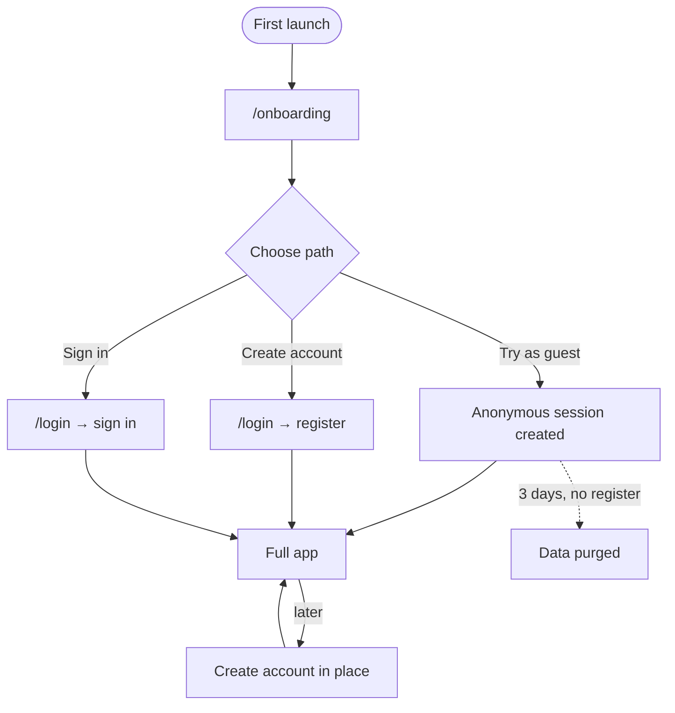
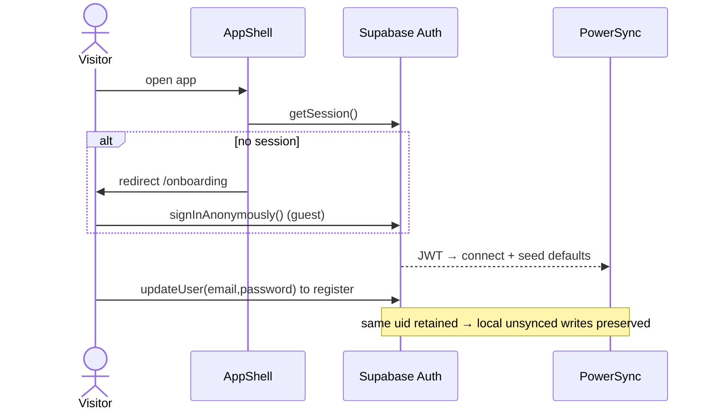

# Onboarding & Identity

## Overview
Every visitor can use the full app immediately as an anonymous **guest** (a real Supabase user with `is_anonymous = true`). Registering upgrades the **same UID** in place so no data is copied or re-keyed. Guests are purged after a 3-day TTL unless they register.

## User flow

## Technical flow

## Data touched
`auth.users` (anonymous → registered), `profiles`, `entitlements` (trial seeded), `guest_sessions` (TTL purge). Default categories/labels seeded client-side after first sync (`src/defaults.ts`).

## Key files
`app/onboarding/`, `app/login/`, `app/join/`, `src/account.ts`, `src/powersync.ts` (re-key on auth change), `packages/db/src/auth.ts`.

## Gating
Free. Guest has full functionality; registration removes the TTL.

## Edge cases
- Multi-device: signing in on a 2nd device triggers `disconnectAndClear()` + reconnect so the correct account downloads (fixed multi-device bug).
- Email confirmation / magic links complete via `detectSessionInUrl`.
- Guest→register keeps the UID so offline writes made as a guest survive.
