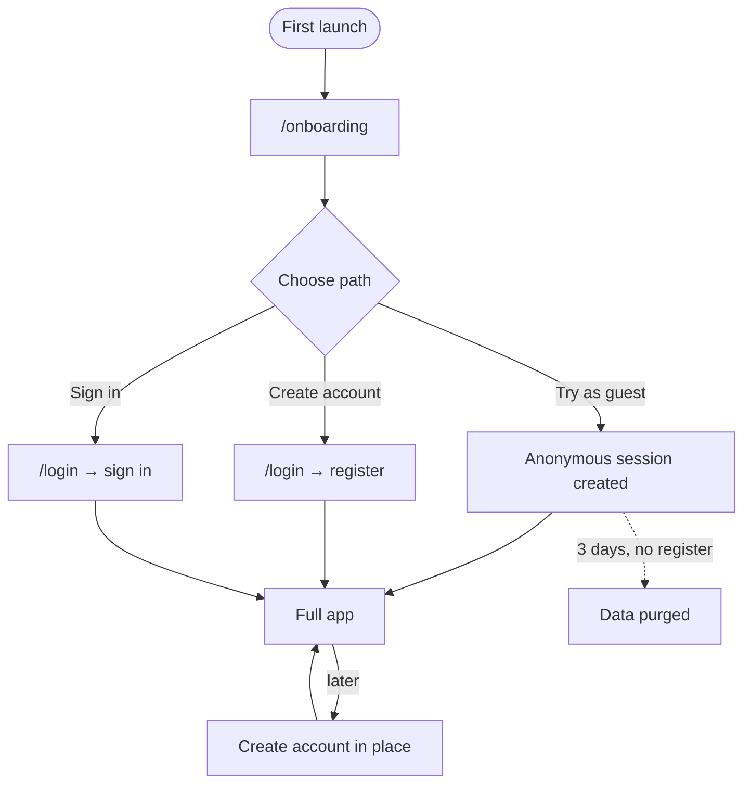
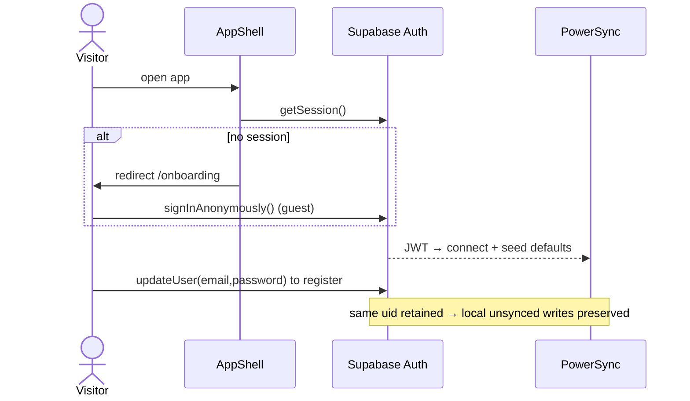

# Onboarding & Identity

## First-run walkthrough (2026-07-29)
A real 60+ user signed up, landed on the dashboard, didn't know what to do, and
believed "add an account" meant **linking their real bank**. They stopped there.

`src/onboarding/Walkthrough.tsx` replaces the `GettingStarted` checklist
(deleted). Plan and full copy: `docs/plans/first-run-walkthrough.md`.

**Three claims the copy must always make**, in plain words, early:
1. Sanvya is **not connected to your bank** — no bank login, card number or OTP.
2. **Nothing is tracked automatically.** You write things down.
3. That's **on purpose**, to build the habit of noticing where money goes.

Manual entry is framed as the product, not an apology. That reframing is the
whole design.

**Why the checklist failed**, since the replacement must not repeat it: it was a
card among cards, it used the exact scary word with no reassurance, it **linked
away** (so the explanation stayed behind while the user met a form headed "New
account" offering Savings/Current/Credit card), and it was permanently
dismissible.

**Structure.** Part A (steps 1–4) is setup, ending in a real *Finish*: what the
app is → add first account **inline** → record one spend **inline** → where to
look. Part B (5–7) is opt-in: Insights → Ask Sanvya → trial/plans. Making
onboarding *longer* would be the wrong answer to "I found this overwhelming".

**Step 2 asks two questions only** — a name and a rough balance — and defaults
type/currency/colour/net-worth. The full `/accounts/new` form is what reads as
bank onboarding, so a nervous first-timer never sees it. That form now carries a
permanent `noBankLink` reassurance line for everyone else.

**Trigger.** Signed in · first sync complete · zero accounts · not done before.
Skipping closes it for the session (`sessionStorage`); it returns next visit
until an account exists. Completing sets `sanvya:walkthroughDone`.

**Mounted in BOTH dashboard branches.** `app/page.tsx` returns early when
`balances.length === 0` — which is precisely the new user's state — so mounting
it only in the tiles branch would make it unreachable for the person it was
written for.

**It absorbs the trial welcome modal.** `TrialNotice` shows its own one-time
"your 14-day trial is live" dialog; the walkthrough sets the same
`trialWelcomeSeenKey` so they can't stack. The countdown banner stays.

**Guests** get a different step 7 (create a free account) — guests get no trial.

**Shared `Modal` gained real dialog semantics** as part of this: `role="dialog"`,
`aria-modal`, Escape-to-close, a focus trap, and focus restoration. Previously
keyboard users could tab out of any dialog into the dimmed page behind it.

## Overview
Every visitor can use the full app immediately as an anonymous **guest** (a real Supabase user with `is_anonymous = true`). Registering upgrades the **same UID** in place so no data is copied or re-keyed. Guests are purged after a 3-day TTL unless they register.

## User flow

```mermaid
flowchart TD
    Start([First launch]) --> OB["/onboarding"]
    OB --> Choice{Choose path}
    Choice -->|Try as guest| Guest[Anonymous session created]
    Choice -->|Create account| Reg["/login → register"]
    Choice -->|Sign in| SignIn["/login → sign in"]
    Guest --> App[Full app]
    App -->|later| Upgrade[Create account in place]
    Upgrade --> App
    Reg --> App
    SignIn --> App
    Guest -.3 days, no register.-> Purge[Data purged]
```

## Technical flow

```mermaid
sequenceDiagram
    actor U as Visitor
    participant Shell as AppShell
    participant Auth as Supabase Auth
    participant PS as PowerSync
    U->>Shell: open app
    Shell->>Auth: getSession()
    alt no session
        Shell->>U: redirect /onboarding
        U->>Auth: signInAnonymously() (guest)
    end
    Auth-->>PS: JWT → connect + seed defaults
    U->>Auth: updateUser(email,password) to register
    Note over Auth,PS: same uid retained → local unsynced writes preserved
```

## Data touched
`auth.users` (anonymous → registered), `profiles`, `entitlements` (trial seeded), `guest_sessions` (TTL purge). Default categories/labels seeded client-side after first sync (`src/defaults.ts`).

## Key files
`app/onboarding/`, `app/login/`, `app/join/`, `src/account.ts`, `src/powersync.ts` (re-key on auth change), `packages/db/src/auth.ts`.

## Gating
Free. Guest has full functionality; registration removes the TTL.

## Edge cases
- Multi-device: signing in on a 2nd device triggers `disconnectAndClear()` + reconnect so the correct account downloads (fixed multi-device bug).
- Email confirmation / magic links complete via `detectSessionInUrl`.
- Guest→register keeps the UID so offline writes made as a guest survive.
