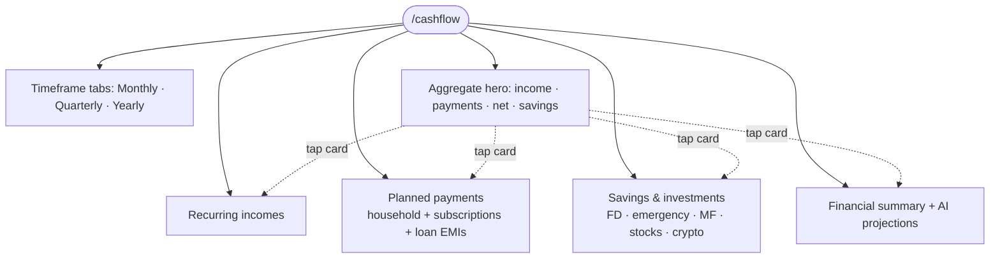
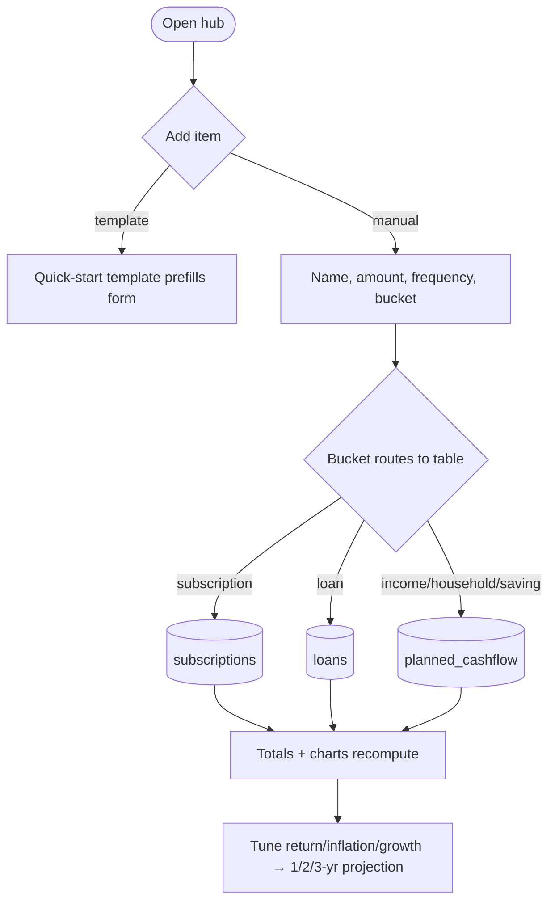
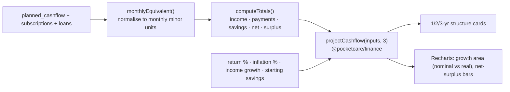

# Planned Cashflow (BETA)

## Overview
A consolidated hub for **recurring income, planned payments, and savings**, with **aggregate summaries** per timeframe and a **deterministic, inflation-aware AI projection engine** (1/2/3-year structure). It merges the former standalone Subscriptions and Loans pages: subscriptions and loan EMIs are surfaced here alongside household payments. Marked **BETA**.

## Structure

## User flow

## Technical flow — projection engine

`projectCashflow` models month-by-month compounding: income/payments step up annually (raises/inflation), savings compound at the blended return and receive the monthly contribution; outputs nominal + inflation-adjusted (real) balances. Pure and unit-tested (9 tests).

## Data touched
`planned_cashflow` (`direction` income|payment|saving, `bucket`, `amount`, `frequency`, `timeframe`, `expected_return`), plus read/write of `subscriptions` and `loans`. Synced via the `user_data` stream (migration `0029`, sync-rules updated).

**Savings ↔ Investments:** adding a **SIP** on the Investments page creates a linked `planned_cashflow` saving (bucket `sip`), so SIPs appear in the Savings section here too. The Savings section also shows a read-only **invested-portfolio summary** card (current value + invested, from `holdings`) that links to `/investments`. See [features/investments](investments.md).

## Key files
`app/cashflow/page.tsx`, `src/cashflow/model.ts` (buckets, templates, aggregation), `src/cashflow/Charts.tsx` (recharts, token colors), `src/cashflow/Projections.tsx` (sliders + engine), `@pocketcare/finance` (`projectCashflow`, `yearlyEquivalent`, `timeframeTotal`).

## Gating
Free basics; the AI projection engine runs fully client-side (offline, no API cost).

## Edge cases
- Timeframe tabs scale the aggregate hero (×1/×3/×12); items keep their own frequency.
- Deep-link `/cashflow#payments` (from the dashboard subscriptions tile) scrolls to the payments section with a retry while synced data loads.
- Old `/subscriptions` and `/loans` routes now redirect here.
- BETA badges appear on the page, AI panel, add-modal, and sidebar item.
