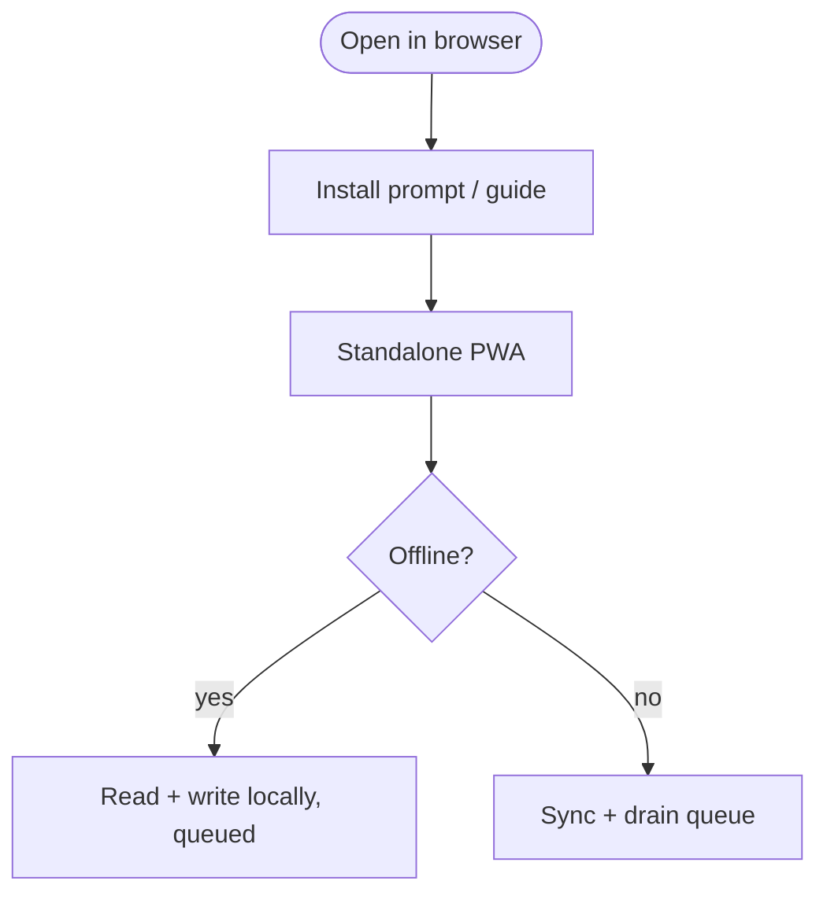
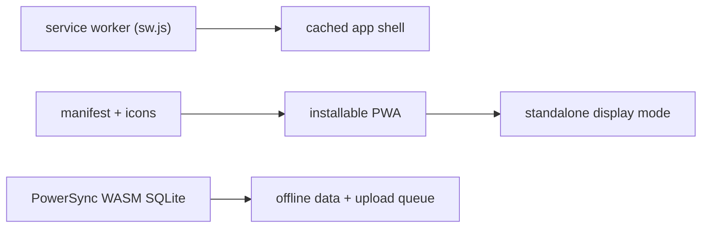

# PWA & Offline

## Overview
PocketCare installs as a **Progressive Web App** (home-screen icon, standalone window) and works fully offline. The service worker caches the app shell; PowerSync provides offline data (see [03 — Sync & Offline](../architecture/03-sync-and-offline.md)).

## User flow

## Technical flow

## Data touched
App-shell assets (SW cache); all domain data via PowerSync local DB.

## Key files
`public/sw.js`, `public/manifest`, `src/pwa.ts` (`useInstallPrompt`), `src/ui/InstallGuide.tsx`, service-worker registration in `AppShell`.

## Gating
Free.

## Edge cases
- Install affordance hidden when already `standalone`.
- No SSR for synced data (PowerSync WASM is client-only); onboarding/login/admin render bare.
- Scroll position restored per route.
