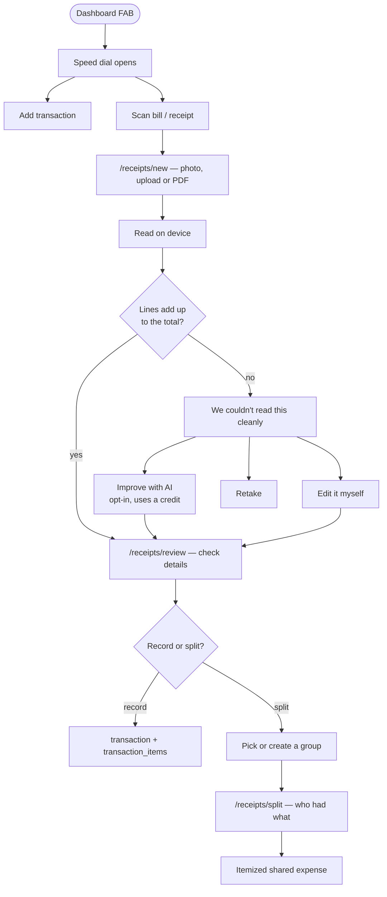
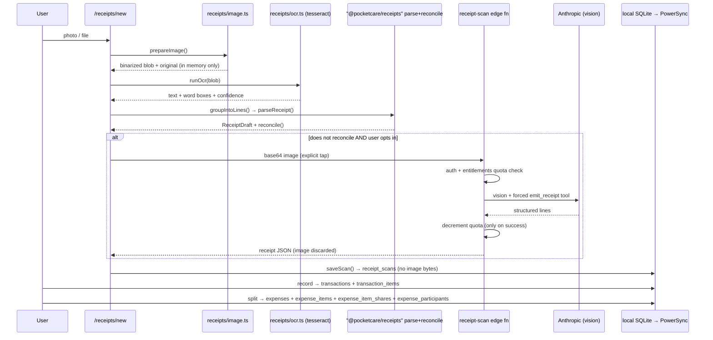

# Receipt & Bill Scanning (with itemized splitting)

## Overview
Photograph a restaurant bill or grocery receipt and PocketCare turns it into a transaction — **line by line**, with quantities, unit prices, tax, service charge, tip and discounts read separately. From there the bill can either be recorded as a normal expense (with a `transaction_items` breakdown) or **split per item** across a group, so each person pays for what they actually had.

Reading happens **on the device** by default. A photo only leaves the device if the user explicitly taps *Improve with AI* after an unclear scan, and **no receipt image is ever stored** — not locally, not in Supabase Storage, not by the edge function.

## User flow

## Technical flow

## The reconciliation gate
This is the quality mechanism for the whole feature. OCR is confidently wrong far more often than it is unsure, so **confidence alone is not trusted**: a draft only passes when `Σ lines === printed total`, exactly, to the minor unit.

- Balanced → straight to review, no friction.
- Not balanced → the user is told *why* (no items / no total / off by X) and offered the AI fallback, manual editing, or a retake.
- Review will not save until it balances, fixable in one tap from either direction: **add the difference as a line**, or **use the computed sum as the total**.

Deliberate consequence: a misread receipt fails loudly instead of quietly writing a wrong number into the ledger.

## Itemized splitting
Per-item shares are allocated, then **rolled up per person into `expense_participants`** — the same table `createSplitExpense` writes and every balance/settle-up query already reads. `expense_items` / `expense_item_shares` are the breakdown, not a second balance model.

**Nothing in `splits/hooks.ts`, `splits/math.ts`, `splits/collapse.ts` or the settle-up flow needed to change.**

Per-line modes:

| Mode | Weight meaning | Applies to |
|---|---|---|
| `equal` | — | items + charges |
| `quantity` | milli-units (1000 = 1) | items with a quantity |
| `percent` | percent × 100 | items + charges |
| `exact` | minor units | items + charges |
| `proportional` | derived from each person's item subtotal | **charges only** (DB constraint) |

Tax, service charge and tip default to `proportional` — allocated by what each person actually ate — but can be overridden per charge, because "the service charge was for the table, split it equally" is just as common.

All allocation goes through `splitByWeights` (largest remainder), so the parts always sum exactly back to the line, for positive and negative (discount) amounts alike.

## Data touched
| Table | Role |
|---|---|
| `receipt_scans` | Private per-user record of a scan: parsed draft, totals, confidence, engine, links to what it became. **No image bytes** — `image_path` exists as a forward-compatible seam and is always null. |
| `expense_items` | The lines of a shared bill (kind, description, quantity, unit, unit price, amount, split mode). |
| `expense_item_shares` | Who is on each line, with the resolved minor-unit share. |
| `expenses.has_items` | Flag so readers know a breakdown exists. |
| `transactions` + `transaction_items` | The non-split path. Quantity is folded into the item description (that table has no qty column). |
| `expenses`, `expense_participants`, `expense_postings` | Unchanged roles — the roll-up target and the private ledger projection. |
| `entitlements` | AI credit quota, shared with the assistant. |

Migration: `supabase/migrations/0040_receipts_and_expense_items.sql`. Integrity is enforced by a **deferred constraint trigger** (`expense_items_sum_check`) so the client can insert an expense and its items in any order within one transaction and only be judged at commit.

Sync: `receipt_scans` → `user_data`; `expense_items` + `expense_item_shares` → **`split_shared`** (every member must see every line, not just their own).

## Key files
| Layer | File |
|---|---|
| Pure logic (tested) | `packages/core/receipts/` — `types.ts`, `allocate.ts`, `reconcile.ts`, `money-text.ts`, `parse.ts`, `fixtures.ts` |
| Image preprocessing | `apps/web/src/receipts/image.ts` |
| On-device OCR | `apps/web/src/receipts/ocr.ts` |
| AI fallback client | `apps/web/src/receipts/aiParse.ts` |
| Orchestration + persistence | `apps/web/src/receipts/scan.ts` |
| Draft editing helpers | `apps/web/src/receipts/draft.ts` |
| Itemized write path | `apps/web/src/splits/writeItemized.ts` |
| Breakdown UI | `apps/web/src/splits/ItemBreakdown.tsx` |
| Speed dial | `apps/web/src/ui/AddSpeedDial.tsx` |
| Screens | `apps/web/app/receipts/{new,review,split}/page.tsx` |
| Edge function | `supabase/functions/receipt-scan/index.ts` |
| i18n | `packages/core/i18n/src/locales/receipts/{en,hi,nl}.json` |

## Parsing notes
Written down because these are the non-obvious decisions that make or break accuracy:

- **Word boxes, not flattened text.** Lines are rebuilt from OCR bounding boxes using the median glyph height as the grouping tolerance, so multi-column grocery layouts survive.
- **Arithmetic disambiguates quantity.** If a line ends with three numbers and the first two multiply to the third, they are unambiguously `qty × rate = amount`. This is what stops an item code being read as a quantity.
- **Payment footers are excluded.** A `CASH 500 / CHANGE 60` footer would silently add 560 to the bill.
- **Subtotals are recorded, never stored as a line** — including them double-counts.
- **Identifier guard.** A long digit run with no decimal separator is a PIN code, phone number or invoice reference, not money. Dropped, which makes reconciliation fail loudly.
- **Header-zone address suppression.** Address words are only suppressed in the first few lines, where the shop's own details print — they're plausible product names elsewhere.
- **Discounts are always stored negative**, regardless of how they print.
- **Dates are day-first** (primary market), flipped when the second field can only be a day, and **future dates are rejected** as misreads.
- **Localised labels** for en/hi/nl (`Subtotaal`, `Totaal`, `BTW`, `korting`, `fooi`, `servicekosten`).

`packages/core/receipts/src/fixtures.ts` holds anonymized transcriptions of the layouts this must survive. **Adding a fixture whenever a real receipt misparses is how this stays accurate — treat a failing fixture as a release blocker.**

## Gating
- **On-device OCR: free and unlimited.** It costs us nothing and it's the hook.
- **"Improve with AI": consumes the shared `entitlements` AI quota** (`monthly_quota_total − monthly_quota_used + purchased_quota_remaining`), the same pool as the assistant — one AI budget for the user to reason about, not one per feature. The button shows remaining credits and links to plans at zero.
- A credit is only charged when the model actually returns a usable result.

## Security & privacy
- Images are held in memory and dropped. Nothing is written to IndexedDB or Storage.
- The AI path is **opt-in per scan** — never automatic — and the copy says plainly what is sent.
- **Prompt injection via receipt text is a real vector** (a bill can literally print "ignore your instructions"). Two defences: the system prompt states that image text is data and never an instruction, and the model can only answer through the forced `emit_receipt` tool, so even a successful injection has no channel to reach the user.
- Payload is capped (~5 MB) and media types are allow-listed.
- `receipt_scans.raw_text` is capped at 8 000 characters.
- `expense_item_shares.user_id` cascades on delete — unlike `expense_participants` (0011), which had to be retrofitted in 0031 to make account deletion work.

## Edge cases
| Case | Behaviour |
|---|---|
| PDF with a text layer | Skips OCR entirely — the most accurate input the feature accepts. |
| Scanned-image PDF | Rejected with a suggestion to photograph the paper instead. |
| Password-protected PDF | Prompts for the password inline and retries. |
| HEIC / undecodable image | Friendly "try a JPEG or PNG" — most browsers can't decode HEIC. |
| Offline | OCR works (after first use, the library is browser-cached); the AI button is unavailable. |
| No total printed | Derived from a subtotal when the items agree with it; otherwise the user enters it. |
| Rounding across two allocation passes | Guaranteed exact — `allocateReceipt` asserts `Σ byUser === Σ lines` and throws rather than writing an unbalanced expense. |
| An unassigned line on the split screen | Hard error, not a silent loss. |
| Discount split exactly | Exact weights carry the line's sign, so negative lines can be split by amount too. |
| Refresh mid-flow | The draft is persisted to `receipt_scans` as soon as it exists, so review/split survive a reload. |

## Deployment checklist
1. `supabase db push` (migration 0040).
2. **Redeploy `packages/db/sync-streams.yaml` in the PowerSync dashboard.** Without this, group members silently see no line items.
3. `supabase functions deploy receipt-scan` (needs `ANTHROPIC_API_KEY`; optionally `RECEIPT_MODEL` to pin a newer vision model).
