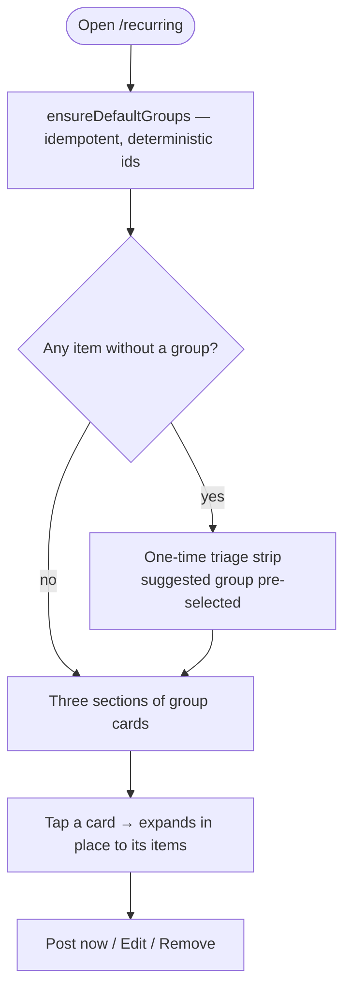

# Recurring payments & income

## Groups (2026-07-29)
Recurring items are grouped into buckets inside three sections — Income,
Expenses (payments), Savings — so the page reads as "Subscriptions ₹1,240 ·
4 items" rather than one flat list. Plan: `docs/plans/ui-redesign-2026-07.md` §3.



**Every recurring item belongs to a group.** The modal cannot save without one:
save is disabled until a group is chosen, and when a direction has no groups the
select is replaced by an inline create form, so there is no groupless state.
Items created outside the modal (the statement analyzer) go through
`resolveGroupForImport`, which seeds, guesses from the name, and falls back to
"Other".

**Deleting a group never strands items.** A non-empty group's dialog *requires* a
destination and moves the items in the same action; `deleteGroup()` throws if a
caller tries without one, so the rule can't be bypassed later. The last group in
a section can only be deleted once empty.

**Legacy items get one-time triage, not an "Ungrouped" bucket.** Items created
before this change have `group_id IS NULL`; a strip above the sections lists
them with a suggested group pre-selected and disappears permanently once cleared.

**Defaults come from the existing `BUCKETS` taxonomy** in
`src/cashflow/model.ts`, which Planned Cashflow and the dashboard's
upcoming-payments tile already use — inventing a second set of names for the same
idea would leave the screens quietly disagreeing.

### Why `group_id` is nullable with no foreign key
Creating an item in a brand-new group writes TWO rows, and PowerSync uploads them
in two SEPARATE transactions. A `NOT NULL` + `REFERENCES` template row arriving
before its group row raises `23503`, retries 3×, then quarantines — the exact
head-of-line block migration 0040 caused and 0042 had to remove. The invariant is
enforced client-side, where the whole set is known at once, and made observable
server-side by `pocketcare.audit_ungrouped_recurring()`.

### Seeding is safe on two devices at once
Default group ids are a deterministic UUID v5 of `(user_id, direction:slug)`, so
both devices produce identical rows and the connector's array upsert treats the
second as a no-op rather than a PK violation (which would be classified permanent
and quarantined).

### Key files
`app/recurring/page.tsx`, `src/recurring/groups.ts`,
`src/recurring/GroupSection.tsx`, `src/recurring/TriageStrip.tsx`,
`src/cashflow/RecurringModal.tsx`, migration `0046_recurring_groups.sql`.

### Deploy
`supabase db push`, then **deploy `sync-streams.yaml` (Sync Streams)** — `recurring_groups` is
a new stream entry; `transaction_templates` is already `SELECT *` so `group_id`
comes along automatically.

### Edge cases
- A group whose items were all moved away still exists (empty groups are valid).
- Deleting every default group is allowed; the modal then forces creating one.
- `planned_cashflow.bucket` is NOT migrated onto this table — documented follow-up.

## Overview
A dedicated page (`/recurring`) for regular money in and out — salary, rent, bills, EMIs, SIPs — modelled as **real recurring rules** (a `transaction_templates` row + a `recurring_rules` row) that post transactions via the recurring engine (auto-post on the due date, or ask-to-confirm). Grouped into **Incomes**, **Payments** and **Savings**, each with add/edit/remove and post-now, plus a "due now — confirm to record" tray.

## Where it's used
```mermaid
flowchart LR
    PC[Planned Cashflow] -- Add / quick-add / edit / convert --> R[/recurring]
    R -- creates template + rule --> Eng[Recurring engine]
    Eng -- posts --> Txn[transactions]
    R -- useRecurringItems --> PC
```
Adding a recurring item is centralised here. Planned Cashflow deep-links in via query params rather than opening its own dialog:
`?add=income|payment|saving` (optionally `&name=&amount=<minor>&freq=&convertFrom=<plannedId>`) or `?edit=<ruleId>`. On save, a `convertFrom` also soft-deletes the legacy standalone `planned_cashflow` row.

## Direction → template type
income → income template · payment → expense template · saving → transfer template into an investment account (`src/cashflow/recurring.ts` `createRecurring`/`updateRecurring`/`removeRecurring`, `RecurringModal`).

## Data touched
`transaction_templates`, `recurring_rules` (created/edited together), `transactions` (posted by the engine), `planned_cashflow` (only to remove a converted legacy row).

## Key files
`app/recurring/page.tsx`, `src/cashflow/recurring.ts`, `src/cashflow/RecurringModal.tsx`, `src/templates/write.ts` (engine: `postRuleOnce`/`skipRuleOnce`/`runRecurring`).

## Gating
Free.

## Notes
- The **Templates** page is now one-tap transaction templates only; recurring rules moved here.
- Due auto-post rules are materialised on app open (`runRecurring` in `AppShell`); confirm-rules appear in the due tray here.
