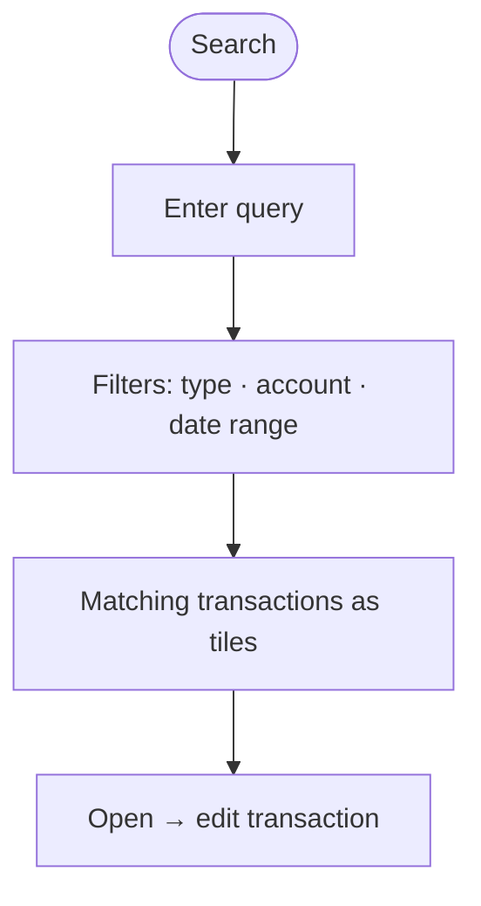
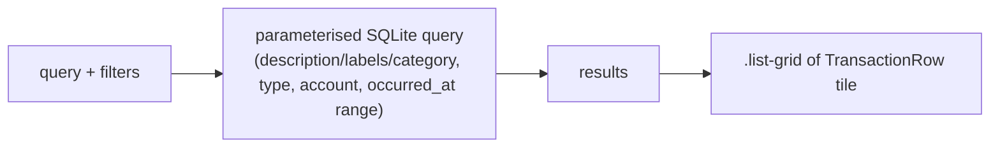

# Search

## Overview
Filter and find transactions by free text, type, account, and date range. Results render as responsive transaction tiles.

## User flow

## Technical flow

## Data touched
`transactions`, `accounts`, `categories`, `labels` (read-only queries).

## Key files
`app/search/page.tsx`, `src/ui/TransactionRow.tsx`.

## Gating
Free.

## Edge cases
- Empty/blank query shows a clear empty state (full-width card).
- Date-input min-width handled so the page never overflows horizontally.
