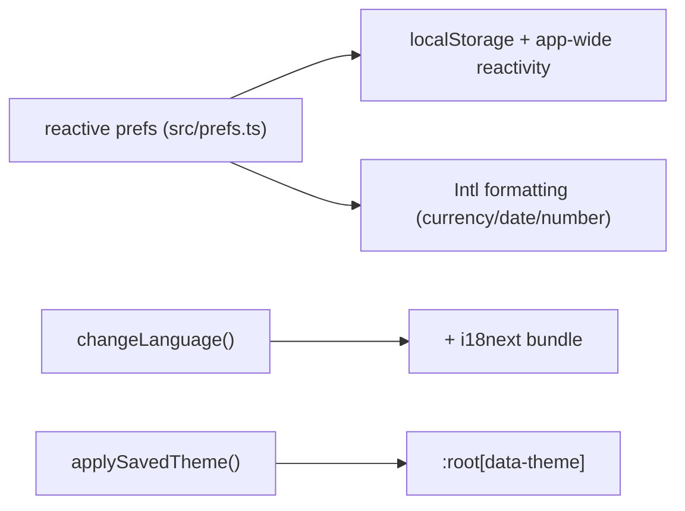

# Settings & Preferences

## Overview
Manage identity (username, account), **base currency**, **language** (i18n), **theme** (light/dark), **privacy** (hide amounts), categories & sub-categories, colored labels, plan/billing, and **account deletion**.

## User flow
```mermaid
flowchart TD
    S([Settings]) --> Acc[Account: username, sign out, delete]
    S --> Money[Base currency]
    S --> Intl[Language + theme]
    S --> Priv[Privacy: hide amounts]
    S --> Tax[Categories / sub-categories / labels]
    S --> Plan[Plan + billing + coupons]
    Acc --> Del[Delete account → RPC (see security doc)]
```

## Technical flow


## Data touched
`profiles` (username, locale, optional traits), `categories`, `labels`, `entitlements` (plan), plus deletion via `pocketcare.delete_user_account`.

## Key files
`app/settings/`, `app/settings/categories`, `app/settings/labels`, `src/prefs.ts`, `src/theme.ts`, `src/ui/Billing.tsx`.

## Gating
Free (preferences). Plan management surfaces premium purchase.

## Edge cases
- **Account deletion** must call the schema-qualified RPC and check errors — see [Security & Privacy](../architecture/04-security-and-privacy.md#account-deletion).
- Base currency default is INR; each account keeps its own currency.
- Language and currency are independent axes.
- **"About you" traits (gender/country)** are `profiles` columns and must be written to the **local** synced DB (`updateRow`/`db.execute`), not straight to Supabase. Writing directly to Postgres left the local row untouched, so the UI kept showing empty and re-prompting (fixed in `src/ui/ProfileTraits.tsx`). This is the general offline-first rule: **write local, let PowerSync upload.**
