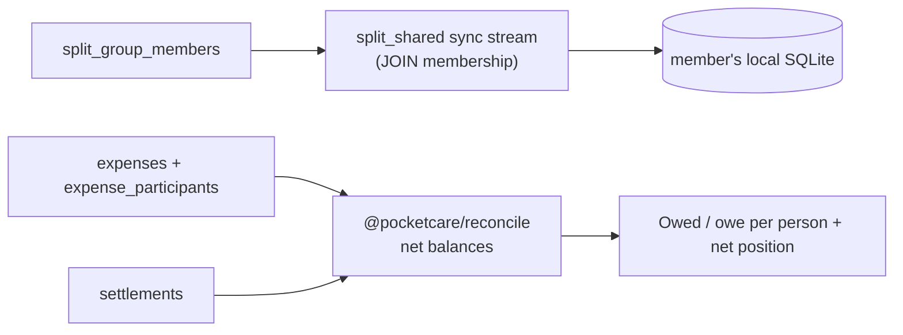

# Splits — Friends, Groups & Trips

## Overview
A **multi-user shared ledger** for splitting expenses. Users form **groups/trips**, add shared expenses split among members, settle up, and see net balances. Unlike the rest of the app, splits data is visible by **group membership**, not single ownership.

## User flow
```mermaid
flowchart TD
    F([Friends / Groups]) --> Grp[Create group or trip]
    Grp --> Invite[Invite people by email / connection]
    Invite --> Join[Invitee joins → split_group_members]
    Join --> Exp[Add shared expense\n(amount, split mode, participants)]
    Exp --> Bal[Net balances per person]
    Bal --> Settle[Settle up → settlement + optional transfer]
    Bal --> Remind[Remind (share/copy message)]
```

## Technical flow — visibility & reconciliation


## Data touched
`split_groups`, `split_group_members`, `expenses`, `expense_participants`, `settlements`, `split_invitations`, `connections`, `expense_postings` (private per-user projection into personal budget). Shared visibility via the `split_shared` stream + membership RLS.

## Key files
`app/friends/`, `app/groups/`, `app/groups/[id]`, `src/splits/hooks.ts` (`useSplitOverview`, `usePersonLedger`), `src/splits/write.ts` (`settleUp`), `@pocketcare/reconcile`.

## Splits screen (`app/friends`) layout
- **Compact header:** SPLITS eyebrow + "Your balance"; a small Net-position row (label left, coloured amount right) over a two-tone owe/owed bar.
- **Groups & trips:** EMI/loan-style tiles — overlapping avatars (small, tight) top-left, expand chevron top-right; group name + "N people · trip/group" bottom-left; your net bottom-right. Tapping expands the tile (full-row) to the per-member breakdown.
- **Who owes whom:** every 1:1 balance (group per-user edges + direct) aggregated into one net per person, split into **OWES YOU** and **YOU OWE** lists (`BalanceRow`).
- **Person sheet:** tapping anyone opens a modal with the **total at top**, the **itemised transactions** behind it (`usePersonLedger` — each shared expense's pairwise edge + settlements, newest first, signed), and **Settle up** / **Remind** actions.

## Gating
Free.

## Edge cases
- **Deletion:** splits FKs to `auth.users` are **not** all `ON DELETE CASCADE`; account deletion clears them explicitly first (migration `0031`).
- Direct 1:1 splits use an auto-created `is_direct` container group.
- `expense_postings` mirror a user's share into their personal budget without exposing it to the group.
- Friends/Groups lists tile responsively; an expanded group spans the full row.
