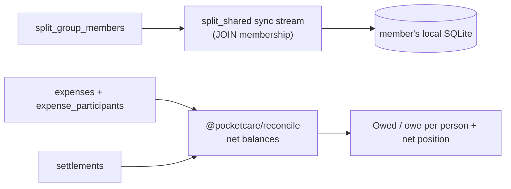

# Splits — Friends, Groups & Trips

## Overview
A **multi-user shared ledger** for splitting expenses. Users form **groups/trips**, add shared expenses split among members, settle up, and see net balances. Unlike the rest of the app, splits data is visible by **group membership**, not single ownership.

## User flow
```mermaid
flowchart TD
    F([Friends / Groups]) --> Grp[Create group or trip]
    Grp --> Invite[Invite people by email / connection]
    Invite --> Join[Invitee joins → split_group_members]
    Join --> Exp[Add shared expense\n(amount, split mode, participants)]
    Exp --> Bal[Net balances per person]
    Bal --> Settle[Settle up → settlement + optional transfer]
    Bal --> Remind[Remind (share/copy message)]
```

## Technical flow — visibility & reconciliation

```mermaid
flowchart LR
    Members["split_group_members"] --> Stream["split_shared sync stream\n(JOIN membership)"]
    Stream --> Local[("member's local SQLite")]
    Expenses["expenses + expense_participants"] --> Recon["@pocketcare/reconcile\nnet balances"]
    Settlements["settlements"] --> Recon
    Recon --> UI["Owed / owe per person + net position"]
```

## Data touched
`split_groups`, `split_group_members`, `expenses`, `expense_participants`, `settlements`, `split_invitations`, `connections`, `expense_postings` (private per-user projection into personal budget). Shared visibility via the `split_shared` stream + membership RLS.

**Settling via UPI (0041).** A balance can be settled by paying over UPI from inside the app — see [upi-settle-up](upi-settle-up.md). `settlements` gained a `status` (confirmed / pending / disputed); it defaults to `confirmed`, so the manual "mark settled" flow is unchanged. **Every settlements query must filter `status <> 'disputed'`** or balances go silently wrong.

**Itemized splits (0040).** A bill scanned from a receipt can be split **per line item** — see [receipt-scanning](receipt-scanning.md). `expense_items` + `expense_item_shares` hold the breakdown and `expenses.has_items` flags it, but per-item shares are **rolled up into `expense_participants`**, so everything on this page (balances, `pairwiseEdges`, settle-up, `collapse.ts`) works identically for itemized and flat expenses. `createSplitExpenseItemized` (`src/splits/writeItemized.ts`) mirrors `createSplitExpense`'s contract exactly and reuses the same `own_share` / `lend` / `borrow` projection roles.

## One screen, not two (2026-07-29)
Splits and "Groups & trips" showed one screen's worth of information across two
routes — `/friends` already listed the group tiles. They are now merged:
**`/friends` is the whole feature** and `/groups` redirects to it (the route is
kept so existing links, bookmarks and notification deep links don't break).
`/groups/[id]` is unchanged. The nav has a single **Splits & groups** entry, and
group creation moved into `src/splits/NewGroupModal.tsx`, which still uses the
`groups` i18n namespace so no copy was duplicated.

## Group detail: expenses AND settlements
The group page lists **Expenses** and, separately, **Settled up**
(`useGroupSettlements`). They're separate sections on purpose: a settlement
moves money between two members without adding to what the group spent, so
interleaving them would imply it counts toward the group total. The query
excludes `disputed`, like every other settlements read — missing that filter
silently corrupts a balance.

An expanded group tile on `/friends` offers **Add expense**
(`/transactions/new?split=<id>`) and **Open group**, so recording a shared
expense doesn't require navigating to the group first.

## Key files
`app/friends/` (the merged screen), `app/groups/` (redirect), `app/groups/[id]`,
`src/splits/hooks.ts` (`useSplitOverview`, `usePersonLedger`, `useFriendInsights`),
`src/splits/NewGroupModal.tsx`, `src/splits/write.ts` (`settleUp`),
`@pocketcare/reconcile`, `@pocketcare/splits-insights`.

## Friend insights (`@pocketcare/splits-insights`)
Behavioural patterns over the shared ledger: who covers the most, who owes the
most, who *always* ends up owing or owed, and who settles fastest / slowest.
Pure and unit-tested (18 tests); the app hook builds pairwise edges with the
existing `pairwiseEdges` (still the single implementation of the balance maths)
and hands plain records to the package.

**Settle speed is FIFO age-of-debt.** A friend's payments clear their oldest
debts first, and each cleared chunk contributes `days(debt → payment)` weighted
by its size — clearing ₹5 instantly and ₹5,000 after six months is not "three
months average" behaviour. Deliberate choices, all tested:
- never settling yields `null`, not `0` — it must not read as settling instantly;
- a payment made before any debt exists is ignored, not counted as negative age;
- ranking needs evidence — 2 groups for an "always" claim, 2 cleared debts for a
  settle-speed claim, and two *different* people before fastest/slowest is said
  at all. Thin ledgers produce **no** insights rather than confident nonsense.

Limits, stated in the UI: everything is computed from the groups **you** are in,
so "covers the most" means the most within your shared ledger.

## Splits screen (`app/friends`) layout
- **Compact header:** SPLITS eyebrow + "Your balance"; a small Net-position row (label left, coloured amount right) over a two-tone owe/owed bar.
- **Sections:** Groups & trips → who owes whom → **Friends** (everyone you share a group with, *including* people you're square with, which the owes/owed lists drop by construction) → **Patterns** (friend insights, hidden entirely when the ledger is too thin).
- **Groups & trips:** each tile now shows both directions — owed to you *and* what you owe *within that group* — because a single net figure hides being owed by two people while owing a third. EMI/loan-style tiles — overlapping avatars (small, tight) top-left, expand chevron top-right; group name + "N people · trip/group" bottom-left; your net bottom-right. Tapping expands the tile (full-row) to the per-member breakdown.
- **Who owes whom:** every 1:1 balance (group per-user edges + direct) aggregated into one net per person, split into **OWES YOU** and **YOU OWE** lists (`BalanceRow`).
- **Person sheet:** tapping anyone opens a modal with the **total at top**, the **itemised transactions** behind it (`usePersonLedger` — each shared expense's pairwise edge + settlements, newest first, signed), and **Settle up** / **Remind** actions.

## Gating
Free.

## Edge cases
- **Deletion:** splits FKs to `auth.users` are **not** all `ON DELETE CASCADE`; account deletion clears them explicitly first (migration `0031`).
- Direct 1:1 splits use an auto-created `is_direct` container group.
- `expense_postings` mirror a user's share into their personal budget without exposing it to the group.
- Friends/Groups lists tile responsively; an expanded group spans the full row.
