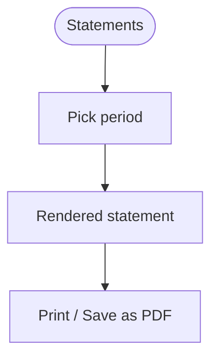
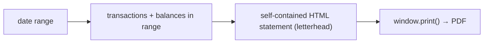

# Statements

## Overview
Generate a **printable / PDF statement** for a chosen period — a letterheaded summary of transactions and balances. Premium.

## User flow

## Technical flow

## Data touched
`transactions`, `accounts` (balances), profile/issuer details.

## Key files
`app/statements/`, related billing/invoice rendering (`src/billing/invoice.ts` shares the letterhead pattern).

## Gating
**Premium.**

## Edge cases
- Print stylesheet hides app chrome (`@media print`).
- Statement export stays unmasked regardless of the hide-amounts toggle.
