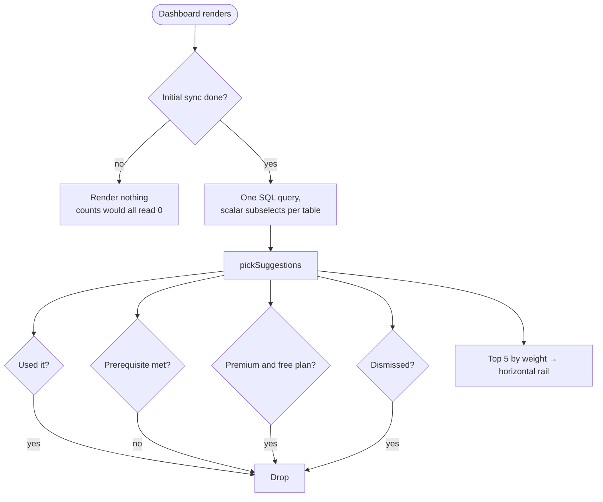

# Feature suggestions ("Worth a look")

## Overview
Most of the app is invisible from the dashboard. Someone can track spends for six months and never learn that loans, budgets, bill-splitting or receipt scanning exist — the nav is there, but nothing ever points at it in context.

A horizontal strip sits directly under the net-worth hero showing a handful of features this person hasn't tried yet.

## The thing this must not become
A permanent "here's what else we sell" rail is an ad, and in a finance app that costs trust. So **every rule in `@sanvya/suggestions` exists to remove cards, not add them**:

| Rule | Effect |
|---|---|
| Each feature has a **prerequisite** | Nothing appears until there's enough history for it to be an observation rather than a pitch |
| Credit cards need a **credit-card account** | Otherwise it's advertising a feature they can't use |
| Premium features need a **paid plan** | Suggesting something they'd have to pay to touch is an ad, not a tip |
| Dismissal is **permanent, per feature** | "Not interested" has to mean it |
| `MAX_VISIBLE` caps the list at 5 | A wall of cards reads as a demand |
| Nothing to say → **render nothing** | No empty state, no "you've explored everything!" badge |

A brand-new user with no accounts and no transactions gets **zero** suggestions — the first-run walkthrough owns that moment, and a strip on top of it is clutter.

## Flow

## Why it never renders mid-sync
A returning user's rows haven't arrived yet, so every count reads zero — the strip would tell someone with five budgets to create their first one. It waits on `useInitialSyncPending` and the query's own loading flag, the same guard the first-run walkthrough uses for the same reason.

## Catalogue
`subscriptions` · `budgets` · `recurring` · `creditCards` · `loans` · `goals` · `splits` · `receipts` · `investments` · `cashflow` (premium)

Ordering is by `weight`, roughly "how much difference does this make to someone not using it".

**`statements` was deliberately dropped.** Statement import has no synced table, so `used` could never become true and the card would nag forever — exactly the failure mode the prerequisites exist to prevent.

## Copy
Each card is an observation plus a benefit, never an imperative: *"Netflix, gym, insurance — see what they quietly cost you each year"* reads as help; *"Add your subscriptions!"* reads as a chore.

Copy is **English, inline** — the rest of the dashboard (tiles, hero, account chips) isn't internationalised either, and an i18n namespace for this one widget would make it the only translated thing on an English page. It moves with the dashboard if that's ever localised.

## Layout
Horizontal rail with `scroll-snap`, cards at `min(256px, 78vw)`. Negative margins plus matching padding let cards bleed to the screen edge on mobile, so a half-visible card signals scrollability rather than stopping dead at the container edge.

## Data touched
Read-only. One query with scalar subselects over `accounts`, `transactions`, `subscriptions`, `loans`, `budgets`, `goals`, `split_groups`, `receipt_scans`, `recurring_rules`, `holdings`, `credit_card_details`, `planned_cashflow` — one watcher rather than a dozen `useQuery` calls each watching the same tables for a single integer.

Dismissals live in `localStorage` under `sanvya:suggestionsDismissed`, filtered through `isFeatureId` on read so a stale or renamed id can't silently mute the wrong card. **Not synced** — dismissing on your phone doesn't dismiss on your laptop. That's a deliberate simplification, and the obvious follow-up if it grates.

## Key files
| What | File |
|---|---|
| Rules + ranking (pure, 14 tests) | `packages/core/suggestions/src/index.ts` |
| Widget, copy, layout | `apps/web/src/dashboard/Suggestions.tsx` |
| Mount point | `apps/web/app/page.tsx` — directly under `NetWorthHero` |

## Edge cases
- **Mid-sync** → renders nothing (see above).
- **`localStorage` unavailable** (private mode) → dismissals don't persist; the strip still works for the session.
- **All dismissed / all used** → renders nothing at all.
- **A count arrives as `NaN`** → treated as zero, never as usage; a `NaN` read as "truthy usage" would hide a suggestion forever.
