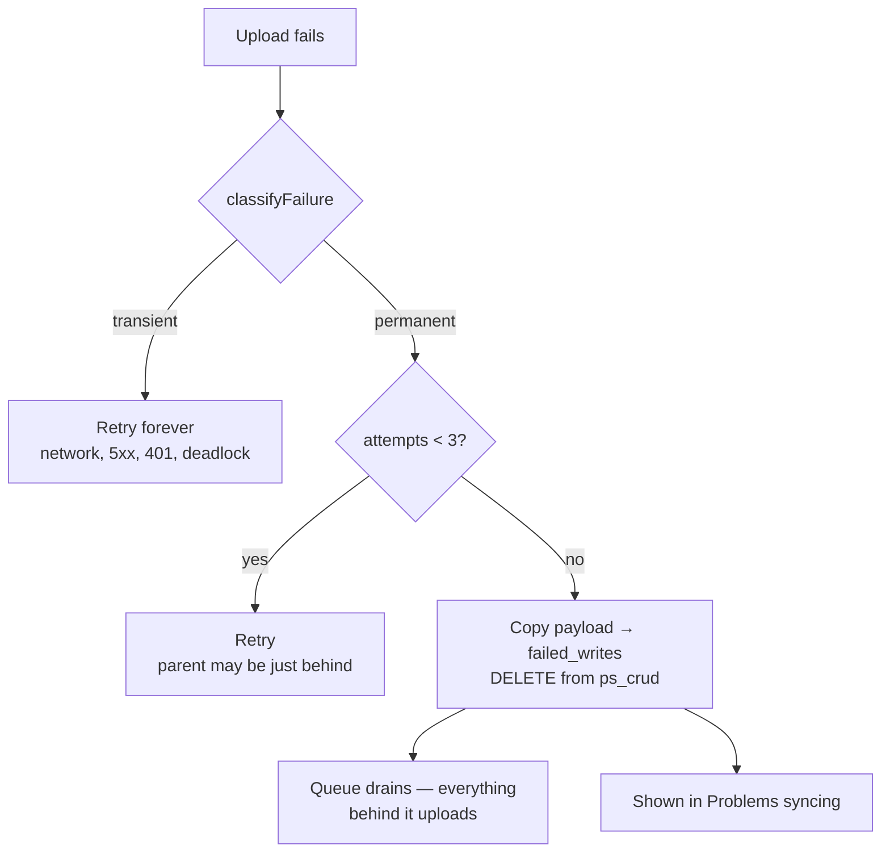
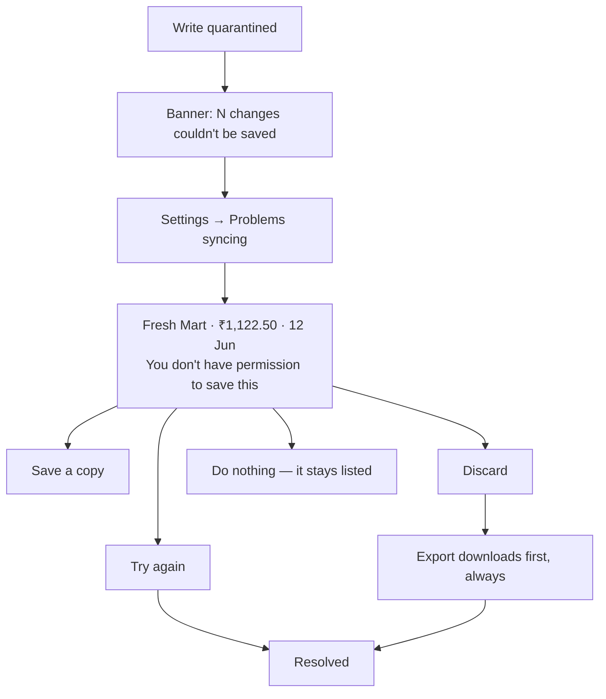

# Sync recovery (fault tolerance)

## Overview
PocketCare is offline-first: you write to local SQLite and PowerSync uploads later. That upload queue is **strictly ordered and retried forever**, which is exactly right when the network is down and exactly wrong when the server *refuses* a write. A rejected write can never succeed, so it retries forever — and everything queued behind it is frozen too. The app looks fine. Nothing saves.

That is not hypothetical; it happened, and recovering from it destroyed data.

This feature makes that failure **survivable, visible, and reversible**.

## The three failure modes, and what handles each

| What went wrong | Symptom | Handled by |
|---|---|---|
| Row exists locally, never uploaded | data "vanished" from other devices | **Layer 0** — Check for unsynced data |
| Server permanently refuses a write | everything stops syncing | **Layer 3** — dead-letter queue |
| User can't see or act on either | silent loss | **Layer 4** — Problems syncing |

## Layer 0 — Check for unsynced data
`insertRow` writes the **row** to local SQLite; PowerSync separately records an upload **instruction** in `ps_crud`. Discarding a queued op removes the instruction, *not the row* — so a user who cleared a stuck queue still has their data on the device with nothing scheduled to send it.

Settings → **Check for unsynced data** diffs local ids against the server and re-uploads what's missing, parents first. Rows are **described, not counted**; export is offered before any repair; upsert makes it re-runnable; uploads go one row at a time so a failure identifies *which* row.

## Layers 2 + 3 — Classify, then dead-letter

**The classifier defaults to transient.** An unrecognised failure keeps retrying, because that's the recoverable mistake — quarantining good data for a network blip is not. `401` is transient (a token refresh fixes it); `408`/`429` are transient despite being 4xx; a known SQLSTATE beats the HTTP status, because PostgREST reports several genuinely different conditions as `400`.

Permanent failures still get **3 attempts** — a foreign key can resolve if the parent is a little way behind in the same queue, and a deploy racing a migration produces a transient-looking `42P01`.

### Two decisions worth remembering
- **`failed_writes` and `sync_attempts` are `localOnly: true`.** A synced quarantine table would put its own rows into the queue it exists to unblock; failing to upload a quarantine record would quarantine it again.
- **No `ON CONFLICT`.** PowerSync exposes every table as a VIEW backed by INSTEAD OF triggers, and SQLite cannot UPSERT a view. Both writes read-then-branch or delete-then-insert.
- **Write, then delete.** The payload is saved before the queue entry is removed. Dying between the two means quarantining again (harmless); the reverse order loses the write.

## Layer 4 — Problems syncing

Written for a person, not a maintainer: the row is **named**, the cause is plain language, and the SQLSTATE lives behind a *Technical details* disclosure. Nobody should need to know what `42501` means to recover their own expenses.

- **Retry goes direct via Supabase**, not by re-queueing — re-queueing risks re-blocking the queue with the op we just freed it from. It runs **sequentially**, because a parent succeeding is often what makes a child's retry work.
- **Discard always exports first.** No opt-out. The previous Discard button deleted queued ops with no copy and no record, and a user lost expenses they could not identify or recover.
- **Resolved rows are marked, not deleted** — the record of what happened is how a support conversation reconstructs the story.
- **The panel renders nothing when there's nothing wrong.** A permanent "problems" box teaches people to ignore it. The banner exists because this failure is otherwise silent: the queue unblocks, everything else syncs, and the app looks healthy while a few expenses sit in limbo.

## Layer 5 — Fault injection (dev only)
Every bug in this area was one that reasoning missed and only execution would have caught. These paths are unreachable in normal use — you cannot casually produce an RLS denial — so they went untested until a user hit them.

Settings → **Fault injection** (gated on `NEXT_PUBLIC_ENABLE_FAULT_INJECTION` or localhost) forces uploads to a chosen table to fail with a chosen SQLSTATE. Presets are the real incidents, plus transient ones that **must not** quarantine. It also shows how the policy classifies the fault and what the user would be told.

## Data touched
| Table | Kind | Notes |
|---|---|---|
| `failed_writes` | **local-only** | Full payload of a quarantined write. Never synced — see above. |
| `sync_attempts` | **local-only** | Persisted retry counter, keyed `table\|op\|rowId`. |
| `ps_crud` | PowerSync internal | Read to inspect the queue; rows deleted only on quarantine or explicit discard. |

No migration — both tables are client-side only.

## Key files
| Layer | File |
|---|---|
| Classification (tested, 21 tests) | `packages/core/sync-policy/src/index.ts` |
| Quarantine | `packages/db/src/quarantine.ts` |
| Connector wiring | `packages/db/src/connector.ts` — `uploadData` |
| Local schema | `packages/db/src/index.ts` — `failed_writes`, `sync_attempts` |
| Stranded-row repair | `apps/web/src/sync/repair.ts`, `RepairPanel.tsx` |
| Dead-letter read/resolve | `apps/web/src/sync/deadletter.ts` |
| Recovery UI | `apps/web/src/sync/ProblemsPanel.tsx`, `AppShell.tsx` banner |
| Fault injection | `apps/web/src/diagnostics/FaultInjectionPanel.tsx` |

## Edge cases
- **Quarantine itself fails** → we retry rather than pretend it was handled. Dropping the write is worse than a stuck queue.
- **`sync_attempts` unavailable** (older local schema) → reports attempt 1, so nothing is quarantined on the strength of a broken counter.
- **Offline** → Layer 0's scan can't run ("is this row on the server" is unanswerable), and reports which tables it couldn't check rather than assuming they're clean.
- **Broken payload JSON** → still listed and still exportable. A row you can't parse is still a row the user might want back.

## Still to come
**Layer 1 — aggregate writes via server RPCs** (`create_split_group`, `create_split_expense`, `record_settlement`). The root fix: one logical action currently writes N ops across N transactions with no atomicity, so any subset can land and the remainder becomes permanently unsyncable. Everything above is damage control for that.
