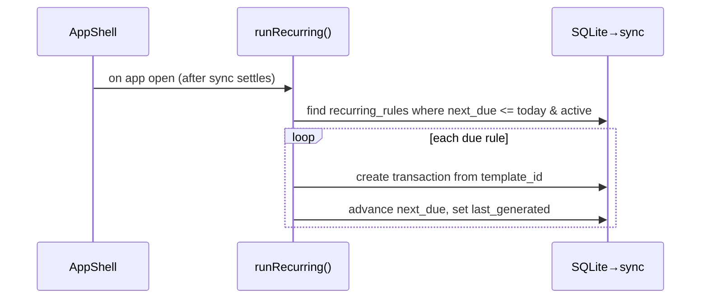

# Templates & Recurring

## Overview
**Templates** are saved transactions for fast entry (rent, salary, groceries). **Recurring rules** put a template on a schedule; due items are materialised on app open — either auto-posted or surfaced for confirmation.

## User flow
```mermaid
flowchart TD
    T([Templates]) --> Make[Create template\n(type, amount, account, category, labels, optional split)]
    Make --> Use[Use → prefilled new transaction]
    Make --> Rec[Turn into recurring rule\n(frequency, interval, next due, auto-post?)]
    Rec --> Open{App opened & due?}
    Open -->|auto-post| Posted[Transaction created silently]
    Open -->|confirm| Ask[Surface for confirmation]
```

## Technical flow


## Data touched
`transaction_templates`, `recurring_rules`, and the `transactions` they generate. Reorder via `sort`.

## Key files
`app/templates/`, `src/templates/write.ts` (`runRecurring`).

## Gating
Free.

## Edge cases
- Only materialised **once** per open (guarded ref) after a delay so sync settles first.
- Reorder arrows (▲▼) operate on `sort`; list tiles preserve logical order.
- A deleted template's rules are removed too (cascade).
