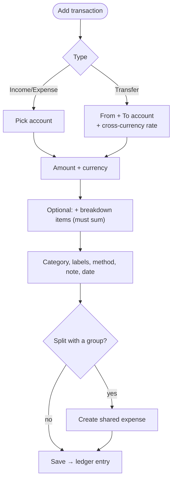
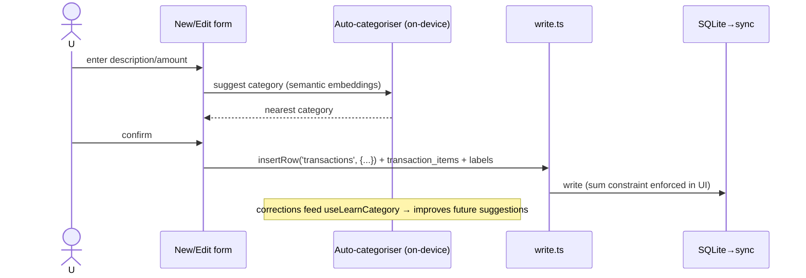

# Transactions

## Overview
The core of the ledger. Three types — **income, expense, transfer** — with category, labels, payment method, notes, and an optional **breakdown** into sub-items (a "+" calculator whose items must sum to the parent amount). Supports **cross-currency transfers**. Can also create a **split** in a group.

## User flow

## Technical flow

## Data touched
`transactions`, `transaction_items` (breakdown, sum = parent), `transaction_labels` ↔ `labels`, `categories`, `transaction_audit` (edit history), `payment_methods` lookup, `category_rules` (learned categorisation). Transfers write paired entries and may hit `exchange_rates`.

## Key files
`app/transactions/`, `app/transactions/new`, `app/transactions/[id]/edit`, `src/ui/TransactionRow.tsx` (list + `tile` variant), `src/categorize/*` (semantic auto-categoriser + keyword fallback).

## Gating
Free (income/expense/transfer + breakdown + search). Advanced analytics on this data is premium.

## Edge cases
- Breakdown items must sum to the parent; UI blocks save otherwise.
- Cross-currency transfer records the rate so both accounts reconcile.
- Auto-categorisation runs fully **on-device** (transformers.js MiniLM); falls back to the keyword engine if the model/CDN is unavailable. Premium-gated.
- Lists render as responsive tiles (`.list-grid` + `TransactionRow tile`).
