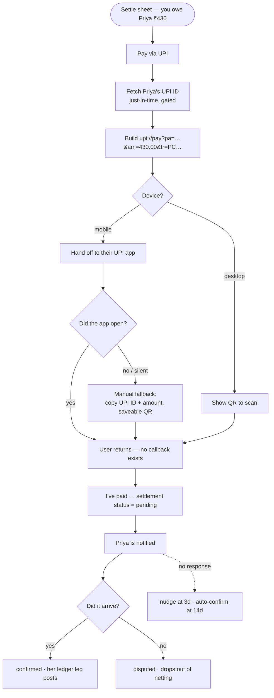
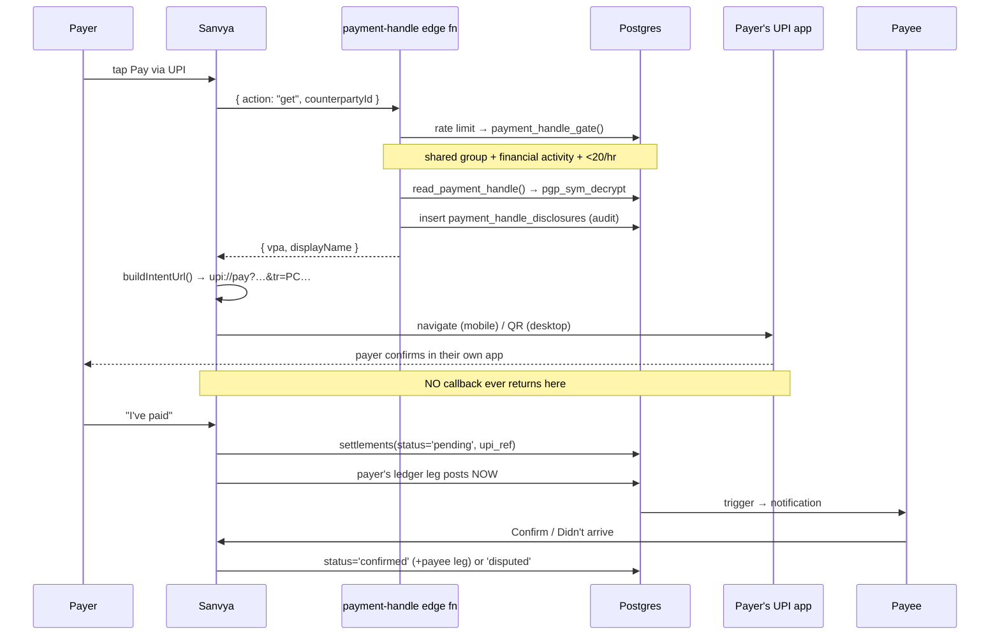

# Pay friends via UPI (settle-up)

## Pay anyone: typed UPI ID or scanned QR (2026-07-29)
Beyond settling a split, you can pay **any** UPI ID from Splits → "Pay someone"
(`src/payments/PayAnyone.tsx`). Same posture as settle-up: **no money touches
Sanvya** — we build a UPI Intent deep link and the payer's own app moves it.

**A scanned QR is attacker-controlled input**, and the design says so out loud.
A sticker on a shop counter can be swapped, and the code decides the payee, the
displayed name and the amount. So:
- the **VPA is always shown in full**, and the code's `pn` is labelled as what
  the *code claims* — the payer's own UPI app showing the real registered
  account name is the actual verification (we do not, and cannot, verify VPA
  ownership without a penny-drop through a PSP);
- a scanned amount is a **suggestion in an editable field**; nothing is ever
  auto-submitted, opening the UPI app is always a deliberate tap;
- **nothing is recorded as a transaction** — UPI Intent returns nothing to a web
  page, so we can't know it went through. Offering to log it afterwards is a
  reasonable follow-up; logging it silently is not.

Parsing lives in `@sanvya/upi` → `parseUpiTarget`, unit-tested against a
**duplicated `pa=` param** (an appended second payee must not win), hostile
amounts (`-5`, `1e9`, `10.999`, `0` — all dropped, payee still parsed),
non-UPI URLs (`https:`, `javascript:`, `mailto:`), and EMVCo/Bharat QR payloads
(detected by name so the user is told to use their UPI app, rather than shown
"invalid").

**Scanning** (`src/payments/scanQr.ts`) prefers the native `BarcodeDetector`
(Chrome/Android — where UPI actually happens) and lazily loads a vendored
`jsQR` only on Safari/iOS and Firefox. The camera is always released on unmount
or mode change.

## QR library is vendored, not CDN-loaded (2026-07-29)
The desktop QR **never rendered for anyone**. `src/payments/qr.ts` loaded
`cdn.jsdelivr.net/npm/qrcode@1.5.4/build/qrcode.min.js`, but `qrcode` stopped
publishing its `build/` directory in 1.5.x — `package.json` still lists `build`
under `files`, yet the directory isn't in the tarball, so the request 404'd and
`script.onerror` fired every time. Verify with
`npm pack qrcode@1.5.4 && tar -tzf qrcode-1.5.4.tgz | grep build/`.

Now vendored at `public/vendor/qrcode.min.js` (qrcode **1.4.4**, the last
release with the UMD browser bundle that sets `window.QRCode`; MIT). Self-hosted
rather than pinned-on-CDN because a payment QR is exactly what you need in a
restaurant with one bar of signal: the UPI payload is built locally, so with the
script precached by the service worker the flow works fully offline. QR encoding
is a frozen spec, so an older encoder isn't a liability. See
`public/vendor/README.md`.

## Overview
Settle a split balance by paying the other person over UPI, from inside Sanvya. **No money touches Sanvya's accounts** — we build a UPI Intent deep link, the payer's own UPI app moves the money bank-to-bank, and we record the outcome.

**No payment provider is involved.** Razorpay and every other Payment Aggregator settles to a *merchant* through escrow; routing a person-to-person settle-up through one would make Sanvya the merchant of record for money that isn't ours. UPI Intent needs no PSP, no escrow, no MDR, no reconciliation, and no licence.

## User flow

## Technical flow

## The two facts that must not be conflated
Money genuinely left the payer's bank the moment they completed the transfer. But we cannot know it arrived. These are modelled separately:

- **The payer's ledger leg posts immediately.** Their cash moved; that's true regardless of confirmation. Not posting it would misstate their balance.
- **Balance netting counts `pending` optimistically**, badged "awaiting". Excluding it would show the payer as still owing money they've already sent — which reads as a bug and drives duplicate payments.
- **Only `disputed` is excluded**, and disputing writes no reversal: per golden rules #2/#5 the ledger is append-only. The payer's transfer stands (their money really did leave); what changes is that it no longer settles the debt.

**Every `settlements` query must carry `AND status <> 'disputed'`.** There are five: four in `src/splits/hooks.ts` and one in `src/assistant/summary.ts`. Missing one produces a *silently wrong balance*.

## Deep links are not guaranteed — there is always a manual path
`upi://` handling varies by OS, browser and installed apps, and iOS/Safari can no-op **silently**. A payment must never dead-end because a URL scheme changed, so:

- **Failure is detected, not assumed to be impossible.** After navigating we start a 1.5s timer; if the page is *still visible* when it fires, nothing handled the scheme and the manual fallback opens itself. A `visibilitychange` listener cancels the timer when the app really did take over, so a successful hand-off never shows the fallback.
- **The fallback is always reachable**, not only after a failure — a "Didn't open? Pay another way" chip sits under the button.
- **On mobile the fallback is copy-first.** A QR on the same screen you'd scan with is useless, so the primary manual route is copy-the-UPI-ID and copy-the-amount, pasted into any UPI app by hand. The QR is still rendered, because every major UPI app supports *scan from gallery* — the user saves the image and picks it there, or scans it from a second device. The hint text says exactly that.
- **On desktop the QR is the primary path**, shown immediately; there is no app to hand off to.

The QR library is CDN-loaded only when the fallback becomes visible, so the mobile happy path never pays for it.

## No payment confirmation exists
This is structural, not a gap to close later. UPI Intent hands control to a third-party app and returns nothing to a web page — especially a PWA. Anyone describing automatic UPI reconciliation is describing a PSP integration, which is the regulated path this design exists to avoid.

Consequences we accept, deliberately:
- Confirmation is two-sided and human.
- Pending settlements are swept: nudge at 3 days, **auto-confirm at 14** (the payer's cash already moved; leaving the debt open forever is the worse error).
- The `tr=` reference is surfaced to the payee, because it's the one thread that ties a Sanvya settlement to a line on a bank statement.

## Handle storage — deliberately NOT zero-trust
The existing zero-trust scheme wraps a DEK with a **passphrase-derived KEK owned by one user**, so a co-member could never decrypt it. A shared payment handle must be readable by the payer, so it cannot use that scheme. Instead:

- `payment_handles` is **server-only** — in no sync stream, never on a device. (Same pattern as `push_subscriptions`.)
- The VPA is encrypted at rest with `pgp_sym_encrypt` under a key held only in the edge function's secrets. Plaintext exists only inside the RPC bodies.
- Release is **just-in-time** through `payment-handle`, behind three gates, with an audit row per release.
- `payment_handle_disclosures` **is** synced — it holds no secret and it's the user's own audit trail.

**The server can read these values.** Passphrase-protected personal fields it still cannot. This is stated in the settings copy, not buried.

### The disclosure gate
Without it, the endpoint is a UPI-ID directory. All three are required:

1. **Shared live group** between caller and owner.
2. **Financial activity** — a shared expense or settlement exists. *Note: this checks existence, not an exactly non-zero pairwise net. The precise net is allocated client-side (`pairwiseEdges`) and reimplementing it in SQL would risk the gate disagreeing with the balance on screen. It still blocks stranger-harvesting completely.*
3. **Rate limit** — 20 lookups/hour/caller.

Do not loosen these for convenience.

## Data touched
| Table | Role |
|---|---|
| `payment_handles` | Encrypted UPI ID. **Server-only, never synced.** Guests blocked by trigger. |
| `payment_handle_disclosures` | Who fetched whose handle. Synced (owner-readable). |
| `settlements` | `+ status` (confirmed/pending/disputed), `confirmed_at`, `confirmed_by`, `upi_ref`. `status` defaults to `confirmed` so all pre-existing rows and the manual flow are unchanged. |
| `notification_prefs` | `+ settlement_confirm` |

Migration: `0041_payment_handles.sql`.

## Key files
| Layer | File |
|---|---|
| Pure logic (tested) | `packages/core/upi/` — intent URL, VPA validation, masking, amounts, references |
| Handle client | `apps/web/src/payments/handles.ts` |
| Hooks | `apps/web/src/payments/hooks.ts` |
| Pay flow | `apps/web/src/payments/PayViaUpi.tsx` |
| Confirmation | `apps/web/src/payments/PendingSettlements.tsx` |
| Settings | `apps/web/src/payments/PaymentHandlePanel.tsx` |
| QR (CDN-loaded) | `apps/web/src/payments/qr.ts` |
| Writers | `apps/web/src/splits/write.ts` — `settleUp`, `confirmSettlement`, `disputeSettlement` |
| Edge function | `supabase/functions/payment-handle/index.ts` |
| Sweep | `sanvya.sweep_pending_settlements()`, called from `notify-dispatch` |

## Gating
- **Registered users only.** A UPI ID is a financial identifier tied to a real identity; a 3-day throwaway guest is the wrong place for one. Enforced by a DB trigger on `auth.users.is_anonymous` — *not* by the presence of a `guest_sessions` row, since guest→registered is an in-place UID upgrade that leaves that row behind.
- **INR only.** The pay button is absent for any other base currency.
- **Payer side only.** You can pay someone you owe; you can't pull money from someone who owes you (UPI Collect was sunset 28 Feb 2026, and pull-payments are a fraud vector regardless).

## Deliberate non-goals
- **We do not verify VPA ownership.** That needs a ₹1 penny-drop through a PSP — the regulated path we're avoiding. Mitigations: the payer's own UPI app resolves and displays the real account name before they confirm (that *is* the verification), and every disclosure is audited. `verified_at` is reserved if this changes.
- **Wrong-amount or wrong-person payments are unrecoverable by us.** We never hold the funds. Support copy must say so plainly.
- Not in v1: requesting money, non-UPI/international methods, partial settlements, recurring payments.

## Edge cases
| Case | Behaviour |
|---|---|
| Counterparty has no handle | Friendly "hasn't added a UPI ID yet"; no lookup is even attempted twice. |
| Guest tries to save | Blocked in the UI and by a DB trigger (the edge function runs as service_role and would otherwise bypass a client check). |
| Offline | Pay is unavailable — you need a connection to pay anyway. |
| Desktop | QR of the identical payload; one code path, so a bug can't affect only one surface. |
| Deep link silently fails (iOS/Safari) | Detected via a 1.5s visibility check; the manual fallback (copy UPI ID + amount, saveable QR) opens automatically. |
| User is on mobile with one device | QR can't be self-scanned — copy-to-clipboard is the primary manual route, with "scan from gallery" as the QR path. |
| Payee never responds | Nudge at 3 days, auto-confirm at 14. |
| Note contains `&` or `=` | Stripped before encoding — an injected note cannot forge `am=` or `pa=` (covered by tests). |
| Non-INR balance | Pay button hidden; `buildIntentUrl` throws if called anyway. |

## Deployment
1. `supabase db push` (migration 0041).
2. **Redeploy `sync-streams.yaml`** — `settlements` gained columns and `payment_handle_disclosures` is new.
3. `supabase secrets set PAYMENT_HANDLE_KEY=<long random string>` — **losing this key makes every stored handle unreadable.** Back it up.
4. `supabase functions deploy payment-handle`
5. `supabase functions deploy notify-dispatch` (now runs the pending-settlement sweep).

## Regulatory note
UPI **Collect** (pulling money by entering a VPA) was sunset **28 Feb 2026**; **Intent** is the mandated flow. We only ever push via Intent, which is the surviving path. This is a recent rule change read from secondary sources — **confirm the position for non-merchant P2P intent links with a lawyer or your PSP before launch.**
