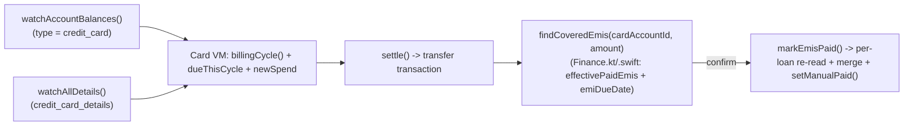

# Credit Cards — mobile screen spec (task #29)

Source-verified against `apps/web/app/cards/page.tsx` (306 lines), `src/cards/CreditCard.tsx`,
`src/loans/settleEmis.ts`, `packages/core/budget/src/index.ts`'s `billingCycle()`, and
`packages/data/src/{index.ts,powersync-repositories.ts}`'s `CreditCardRepository`.

**`docs/features/cards.md` is stale** — it describes a three.js/react-three-fiber scroll-driven 3D
wallet that no longer exists in the real source. The actual `page.tsx` is a plain CSS card list with a
framer-motion staggered entrance (no 3D anything). This spec follows the real source, not the doc; the
doc should be corrected in a follow-up (flagged, not fixed here — out of scope for the mobile port).

## Current mobile state (before this pass)
Both platforms have a REAL `CreditCardRepository` (`getDetails`/`upsertDetails`/`settle`, all correct,
built in Phase 2/P2.5) but a FAKE `CreditCardsViewModel` on top of it: hardcoded `"Bank • Visa"`
network label, a fake `"Day N"` due string instead of real billing-cycle math, a fake alternating
gradient instead of the account's own color, no settle-up flow at all, no covered-EMI confirm, no
editable statement/due-day/limit/last4 form. Android has **no consuming screen at all**
(`CreditCardsScreen.kt` does not exist — `CreditCardsViewModel.kt` is dead code, same broken shape
every other Android screen started this engagement in). iOS's `CreditCardsView.swift` is live-wired
into `MainTabView.swift` but its "Pay Bill" button is a literal no-op `Button(action: {})`.

## Billing cycle (already ported, reused as-is)
`billingCycle(statementDay, dueDay, asOf) -> { cycleStart, statementDate, dueDate }` already exists as
`domain/budget/Budget.kt`'s `billingCycle()` and `Domain/Sources/Domain/Budget.swift`'s `billingCycle()`
(ported during Budgets, P3.4) — reused directly, not re-ported.

## Due-this-cycle derivation (page.tsx's inline IIFE, ported as-is)
```
dueOn = detail.due_on ?? cycle.dueDate
rolledToNext = detail.pending_due != null && dueOn > cycle.dueDate   // user's typed amount belongs to a LATER cycle than the currently-open one
dueThisCycle = detail.pending_due == null ? null : (rolledToNext ? 0 : detail.pending_due)
```
`pending_due`/`due_on` are the user's own typed "amount due this statement" + its due date — set by
`saveCycle()`, not derived from transactions. A card created after its statement day rolls to 0 due
this cycle (the statement already closed before the user told the app about it).

## New spend this cycle (separate line, deliberately not folded into `dueThisCycle`)
`SUM(amount) FROM transactions WHERE account_id=? AND deleted_at IS NULL AND type='expense' AND occurred_at >= cycleStart`.
A charge posted today lands on the *next* statement on a real card; showing it as its own "+₹X new
spend" line (only when >0) avoids overstating what's actually payable by the due date. Live query on
web (`useQuery`) → `watchCycleSpend()` on mobile.

## Settle-up + covered-EMI confirm (`settleEmis.ts`, not ported to mobile before now)
`settle()` records a `transfer` transaction (`fromAccountId → cardAccountId`, note "Credit card
settlement") via the existing `CreditCardRepository.settle()` — unchanged. **New:** after settling,
`findCoveredEmis(cardAccountId, amountMinor)` looks at every loan whose `funding_account_id` is this
card, computes which EMIs are due-and-unpaid (`effectivePaidEmis([], total, autoMark:true, ...)` +
`emiDueDate()` — both already exist in `Finance.kt`/`.swift`, reused not re-ported), sorts oldest-first,
and walks them FIFO until the settled amount runs out (an EMI too big for the remaining headroom
**stops** the walk, never skips — clearing a later EMI while an older one stays open would misrepresent
payment order). If any are covered, the UI **asks** ("Mark N EMI(s) paid?") — never auto-marks, since a
partial payment silently clearing an instalment the user hasn't actually cleared would corrupt loan
state. Confirming calls `markEmisPaid()`, which re-reads each loan's `emi_payments` (not a stale
in-memory copy — another device may have marked one already) before merging in the newly-covered EMI
numbers and writing back via the existing `setManualPaid()`.

This is orchestration (DB reads + the pure Finance.kt/.swift math), not new domain math — lives directly
on `LoansRepository`, matching web's own `settleEmis.ts` living in `src/loans/` (app-local), not
`packages/core`.

## Card face (`CreditCard.tsx`, ported as static values not a component)
Gradient built FROM the account's own color (`account.color`, falling back to a fixed 5-color palette
by index — not a random/fake gradient): a two-stop `linear-gradient` of the base color shaded -18%/-34%.
Network label is the **account's own name** (`b.account.name`), not a hardcoded "Bank • Visa" — there is
no real "card network" concept in this schema. Card holder name is the session username, falling back
to a translated "Card holder" placeholder — mobile has no i18n, so a plain `"Card holder"` fallback is
used. Chip, masked `•••• •••• •••• 1234` digits (or all-dots if no last4 set), currency in the bottom
corner.

## User flow
```mermaid
flowchart TD
    C([Cards]) --> List[List of credit-card accounts as card faces]
    List --> Expand[Tap to expand: owed, due-this-cycle, pay-by, available credit]
    Expand --> Edit[Edit statement day / due day / limit / due amount / last4]
    Expand --> Settle[Settle from another account]
    Settle --> Ask{Payment covers due EMIs on this card?}
    Ask -->|yes| Confirm[Mark N EMI(s) paid? -- confirm or skip]
    Ask -->|no| Done[Done]
```

## Technical flow


## Data touched
`accounts` (type=credit_card, color, name), `credit_card_details` (statement_day, due_day,
credit_limit, card_last4, pending_due, due_on), `transactions` (cycle spend query + settle-up
transfer), `loans` (funding_account_id, emi_payments, emis_paid — read+write via `LoansRepository`,
not a new table).

## Key files
Android: `data/repository/CreditCardRepository.kt` (extended), `data/repository/LoansRepository.kt`
(extended: `loansByFundingAccount`/`findCoveredEmis`/`markEmisPaid`), `ui/creditcards/
CreditCardsViewModel.kt` (rewritten), `ui/creditcards/CreditCardsScreen.kt` (new).
iOS: `Data/Sources/Data/CreditCardRepository.swift` (extended), `Data/Sources/Data/LoansRepository.swift`
(extended, same 3 additions), `App/ViewModels/CreditCardsViewModel.swift` (rewritten),
`App/CreditCardsView.swift` (rewritten).

## Gating
Free.

## Edge cases
- No credit-card accounts → empty state with a CTA to add one (`/accounts/new` on web; native routes
  to the Accounts screen's own add-account entry point instead, since mobile has no dedicated
  credit-card creation form yet — account type + initial statement/due-day is set from `AddAccountView`/
  `AddAccountScreen`, unchanged by this pass).
- `detail == null` (card created but cycle never configured) → no billing-cycle numbers shown, edit
  form is the primary state (matches web's `!cycle || editing` branch).
- `sources.isEmpty()` (no other accounts to settle from) → settle button disabled, matches web.
- Settling an amount that doesn't fully cover the next EMI in the FIFO order → 0 EMIs covered, no
  confirm dialog shown (matches `covered.length > 0` guard).
- Statement/due day are clamped 1–28 on save (web: `Math.min(28, Math.max(1, ...))`) — no 29/30/31 to
  dodge the `billingCycle()` month-length clamp entirely at the input layer.
