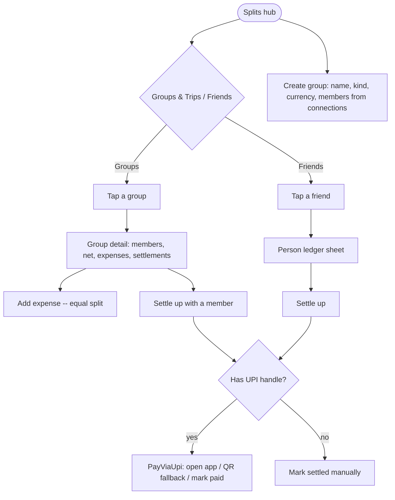
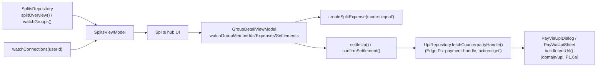

# Splits — mobile screen spec (task #30)

Source-verified against `apps/web/app/friends/page.tsx` (the real Splits hub — `/groups` is a
redirect shim to it), `apps/web/app/groups/[id]/page.tsx`, `apps/web/src/splits/{hooks,write}.ts`,
`apps/web/src/payments/{PayViaUpi.tsx,handles.ts}`, and `packages/core/upi/src/index.ts` (already
ported as `domain/upi/Upi.kt` / `Domain/Sources/Domain/Upi.swift`, P1.6a).

## Current mobile state (before this pass)

Both platforms already had a REAL, fully-featured `SplitsRepository` (Android 718 lines, iOS 826
lines, P2.5) — reads (`splitOverview`, `friendInsights`, `personLedger`, reactive `watchGroups`/
`watchGroupBalances`) and writes (`createGroup`, `getOrCreateDirectGroup`, `createSplitExpense`,
`settleUp`, `confirmSettlement`, `disputeSettlement`) all real, all matching `hooks.ts`/`write.ts`
exactly. What was missing/broken:

- **Android**: `SplitsViewModel.kt` existed but was orphaned dead code (not wired into
  `SanvyaNavHost.kt`; the drawer's "Splits & groups" item routed to `comingSoonRoute`). No
  `SplitsScreen.kt` existed at all. The ViewModel's own comment: `"Friend" // Placeholder` — never
  joined `connections` for real names. No `PayViaUpiDialog.kt` exists anywhere.
- **iOS**: `SplitsView.swift` + `SplitsViewModel.swift` were wired into `MainTabView.swift` and
  real-ish, but had the same `"Friend" // Placeholder` name bug, AND `PayViaUpiSheet` was invoked
  with a **hardcoded `amountMinor: 120000`** — every settle-up showed ₹1200 regardless of the
  actual balance owed. `PayViaUpiSheet.swift` itself was real and correct.

Both repositories' own header comments already document two deliberate exclusions from P2.5:
itemized-bill writes (`writeItemized.ts` — `expense_items`/`expense_item_shares`, receipt-scan
driven) and `createInvite`/`acceptInvite` (Edge Functions, "networking/auth-adjacent... belongs
with P2.4 or a future networking layer"). Both stayed excluded this pass too — see Deferred below.

## Scope decision (this pass)

Web's "Add expense" is **not** a form on the group/friends page at all — it's a link to
`/transactions/new?split={groupId}`, i.e. split-expense creation lives in the ordinary transaction
form with a split toggle. `CreateTransactionViewModel`'s own comment already documents that
split-expense-in-the-transaction-form was explicitly deferred when Transactions was built. Rather
than leave groups permanently empty until that form gets a split mode, this pass adds a **minimal,
equal-split-only "Add expense" sheet scoped to a single group** (description, amount, date, payer,
participant checkboxes) that calls the repository's existing `createSplitExpense(mode="equal")`
directly — real money movement, real balances, just not the percent/exact/itemized modes web's
form supports. Those richer modes are exactly what the upcoming receipt-scan itemized-split work
(tasks #62/#64) needs anyway, so building them twice (once generically now, once receipt-shaped
later) would be wasted motion.

Built this pass, both platforms:

- **Splits hub** — segmented Groups & Trips / Friends, matching `friends/page.tsx`'s two lists.
  Real names via a `connections` join (fixes the `"Friend"` placeholder bug). Net position header.
- **Group detail** — members with per-person net (resolved names), expenses list, settlements
  history, "Add expense" (equal-split sheet described above), per-member "Settle up".
- **Create group** — name, kind (trip/group), currency, member picker sourced from `connections`.
- **Friend / direct balance** — settle-up entry point from the Friends tab.
- **Person ledger sheet** — `personLedger()`'s itemized history with one friend, running total.
- **Settle-up, for real** — `UpiRepository` extended with `fetchCounterpartyHandle()`, a straight
  port of `handles.ts`'s `fetchCounterpartyHandle` (calls the real `payment-handle` Edge Function,
  `{action:"get", counterpartyId}` → `{vpa, displayName}` or a `{error,code}` failure with
  `no_handle`/`no_group`/`no_balance`/`rate_limited` — handles are **never synced or cached to
  disk**, matching web's own "online-only by design" doc comment). Manual "mark as settled" (no
  UPI) stays available too, matching `confirmSettle(status)`'s two paths on web.
  - **Android**: new `PayViaUpiDialog.kt`, mirroring the already-real `PayViaUpiSheet.swift`
    (open UPI app via `Intent(ACTION_VIEW, Uri.parse(intent.url))`, manual copy fallback, "I've
    paid — tell them").
  - **iOS**: `PayViaUpiSheet.swift` unchanged; the caller now passes the real fetched `vpa` +
    `amountMinor` instead of the hardcoded `120000`.

## Explicitly deferred (not built this pass)

- **Invite / share-link flow** (`createInvite`/`acceptInvite`, Edge Functions `split-invite`/
  `split-invite-accept`) — both repositories already deferred this at P2.5 as
  "networking/auth-adjacent... belongs with P2.4 or a future networking layer," and it stays
  deferred here too. Group membership this pass is seeded entirely from `connections` (people
  already connected via some other means) at group-creation time; there's no in-app way to invite
  someone new yet. This will very likely be superseded by (or coexist with) the BLE
  proximity-detection "enable detection for split" feature being built next (tasks #62-64), which
  is a different, non-link-based way of getting someone into a split — so building the classic
  invite-link flow now, only to have a second "add people" mechanism land days later, would be
  redundant. Flagged for a decision once BLE detection ships: keep both, or drop the link flow
  entirely in favor of proximity join.
- **Itemized splitting** (`expense_items`/`expense_item_shares`, percent/exact modes, receipt-scan
  linkage) — `createSplitExpense` supports `mode` beyond `"equal"` already (the math is ported and
  tested), but no UI offers it this pass. This is exactly the surface the receipt-scan → itemized
  split feature needs, so it's being built there instead of twice.
- **Pay Anyone** (`PayAnyone.tsx` — pay an arbitrary VPA not tied to a friend/balance) — standalone
  utility, not core to the split flow itself.
- **Friend insights** (`FriendInsights` — "you're generous with X", frequency patterns) — the data
  layer (`friendInsights()`, `computeFriendStats`/`pickFriendInsights`) already exists and is fully
  ported; this pass just doesn't render it. Cheap follow-up whenever there's a slot for it.
- **Group edit/delete, settlement dispute** — `disputeSettlement()` exists in the repository but no
  UI calls it; editing/archiving a group (`editOpen`/`deleteGroup` on web) isn't built either.
  Kept out to bound this pass's scope; nothing about the data model blocks adding either later.

## User flow

## Technical flow

## API notes worth flagging

- `fetchCounterpartyHandle` is genuinely new mobile networking surface (nothing under
  `apps/android`/`apps/ios` called `client.functions.invoke` before this pass). Verified against
  real SDK source before writing code:
  - Android: `client.functions.invoke(function = "payment-handle", body = buildJsonObject { put("action","get"); put("counterpartyId", id) })` → response `.body<T>()` (supabase-kt `functions-invoke` reference).
  - iOS: `client.functions.invoke("payment-handle", options: FunctionInvokeOptions(body: ["action":"get","counterpartyId":id]))` returning a `Decodable` response type, or use the `decode:` closure overload for manual JSON handling of the `{error,code}` failure shape (real `FunctionsClient.swift`/`Types.swift` source).
  - Both throw/return a generic HTTP error on non-2xx — the `{error, code}` body (e.g.
    `no_handle`) has to be decoded from the error response's data, mirroring web's own
    `edgeFnMessage()` unwrapping since supabase-js/kt/swift all collapse non-2xx into an opaque
    top-level error and hide the real JSON body.
- `payment_handles` is server-only, never synced to local SQLite (confirmed already in Settings'
  spec) — this is the first mobile feature that reads it, via the Edge Function, matching web
  exactly. Never cached to disk on mobile either (in-memory only for the duration of one
  settle-up sheet), same as web's explicit "never cached" doc comment.

## Data touched
`split_groups`, `split_group_members`, `expenses`, `expense_participants`, `settlements`,
`connections` (read-only join for names) — all already-synced local tables, all existing writes
reused from `SplitsRepository`/`LedgerRepository` unchanged. `payment_handles` — read-only, via
Edge Function only, never local SQLite.

## Key files
- Android: `data/repository/UpiRepository.kt` (extended: `fetchCounterpartyHandle`), `data/di/DataModule.kt` (extended: `UpiRepository` now takes `SupabaseClient`), `ui/splits/SplitsViewModel.kt` (rewritten), `ui/splits/SplitsScreen.kt` (new), `ui/splits/GroupDetailViewModel.kt` (new), `ui/splits/GroupDetailScreen.kt` (new), `ui/splits/PayViaUpiDialog.kt` (new), `ui/SanvyaNavHost.kt` + `ui/NavDrawer.kt` (wired).
- iOS: `Data/Sources/Data/UpiRepository.swift` (new — mirrors Android's, didn't exist as a separate file before; the intent-building lived only in `domain/upi/Upi.kt`/`Upi.swift`), `App/ViewModels/SplitsViewModel.swift` (rewritten), `App/SplitsView.swift` (rewritten), `App/GroupDetailView.swift` (new), `App/ViewModels/GroupDetailViewModel.swift` (new), `App/PayViaUpiSheet.swift` (unchanged — caller-side fix only), `App/DI/DataModule.swift` (extended).

## Gating
Free tier — Splits itself isn't gated (matches web).

## Edge cases
- No UPI handle saved by the counterparty → `fetchCounterpartyHandle` throws `no_handle`; UI falls
  back to "ask them to add a UPI ID" + manual "mark settled" path, matching web's
  `errorCode === "no_handle"` branch.
- Offline → Edge Function call fails outright (no cached fallback, by design, matching web); manual
  settle-up (no UPI) still works fully offline since it's a local PowerSync write.
  Group/expense/balance reads all work offline (local SQLite).
- Settling more than the outstanding balance, or a zero/negative amount → rejected client-side
  before calling `settleUp` (matches web's `minor <= 0` guard).
- A group with no `split_group_members` rows beyond the creator → `peopleCount` falls back to
  `others.size + 1` per the repository's existing comment; UI shows just the creator, no crash.
- Direct (1:1) groups are never shown as a "group" tile — folded into the Friends tab's aggregate
  per-person balance, matching `splitOverview()`'s existing `isDirect` handling exactly.
