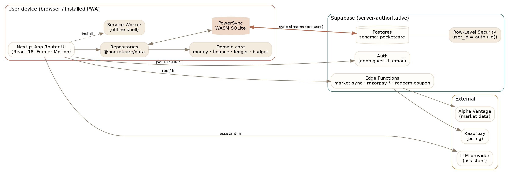
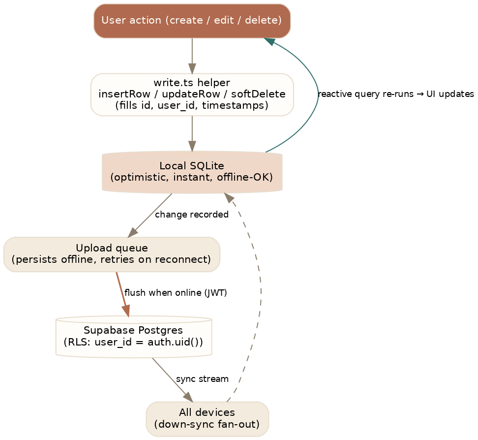
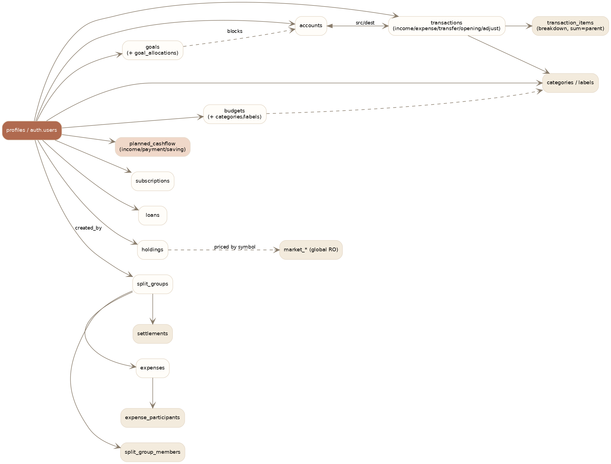

\newpage

# 1. What PocketCare is

PocketCare is an **offline-first, multi-currency personal expense & wealth manager**, delivered as an installable **Progressive Web App** (Next.js). It combines day-to-day tracking, forward planning (the *Planned Cashflow* hub), and a deterministic, inflation-aware projection engine — all working fully offline and syncing across devices.

**Golden rules (financial integrity):**

1. Money is stored as **integer minor units**, never floats.
2. Balances are **derived from an append-only ledger**, never mutated in place.
3. The **server is authoritative**; the client is an offline cache reconciled via sync.
4. All tables and RPCs live in the **`pocketcare`** Postgres schema — direct calls must be schema-qualified.

# 2. Technology stack

| Layer | Choice |
|---|---|
| Monorepo | Turborepo + pnpm workspaces |
| Client | Next.js 14 (App Router), React 18, TypeScript (strict) |
| Local DB | SQLite via PowerSync Web SDK (WASM); no SSR for synced data |
| Sync | PowerSync to Supabase Postgres (server-authoritative) |
| Backend | Supabase: Auth, Postgres, RLS, Storage, Edge Functions |
| Charts / motion | Recharts, Framer Motion, three.js (3D card wallet) |
| i18n | i18next + Intl formatting, RTL support |
| Payments | Razorpay (subscriptions + credit packs) |
| Encryption | Zero-trust envelope encryption (WebCrypto); Shamir-split support key |

The reuse boundary is strict: everything in `packages/*` (money, finance, ledger, budget, entitlements, data repositories, types, tokens, db schema) is presentation-agnostic domain logic; `apps/web` is the only presentation layer.

# 3. System architecture

The client reads and writes **only local SQLite**; PowerSync reconciles with Postgres in the background. A small number of privileged, online-only actions (RPCs, Edge Functions) bypass sync.

**Two data paths:**

- **Sync path (default):** UI to local SQLite to PowerSync upload queue to Postgres, then streamed back to every device. Instant and offline-capable.
- **Imperative path (exception):** schema-qualified RPCs (e.g. `delete_user_account`) and Edge Functions (billing, market data, AI assistant) — online-only, server-authoritative.

# 4. Sync & offline model

Writes never block on the network. Rows carry client-generated UUIDs so they have a stable identity before reaching the server. The upload queue drains automatically on reconnect.

**Identity:** a new visitor is signed in **anonymously** (a real user with `is_anonymous = true`); registering upgrades the **same UID** in place, so no data is ever copied or re-keyed. On identity change the client re-keys: `disconnectAndClear()` then reconnect with the new JWT.

**Sync streams** (`packages/db/sync-streams.yaml`) decide which rows each user receives: `user_data` (all owner-scoped tables), `split_shared` (the shared ledger, resolved by group membership), and read-only `reference_data` / `market_data` / `exchange_rates`.

> Adding a synced table requires four steps or it will not sync: (1) `AppSchema`, (2) a migration with RLS + grants, (3) the sync stream, (4) `supabase db push` **and** redeploy sync rules.

# 5. Data model

All state lives in the `pocketcare` schema, mirrored locally as WASM SQLite. Money columns are integer minor units; every owner-scoped table has `user_id`, timestamps, and a soft-delete `deleted_at`, protected by RLS.

The multi-user **splits ledger** (`split_groups`, `expenses`, `expense_participants`, `settlements`, …) is the one area where rows are visible by **group membership** rather than single ownership. Several of its columns reference `auth.users` **without** `ON DELETE CASCADE`, which the account-deletion routine handles explicitly (see §7).

The domain **class model** is pure TypeScript in `packages/core/*`: a currency-aware `Money` type, a `ledger` module that derives `AccountBalance` (total / available / blocked) from entries, and a `finance` module (`futureValue`, `monthlyEquivalent`, `projectCashflow`, `subscriptionImpact`) — all deterministic and unit-tested.

# 6. Frontend architecture

Next.js App Router with an `AppShell` that gates on session state and hosts the sidebar navigation. **The database is the state**: components read via live PowerSync queries (`useQuery`) and write via `write.ts` helpers; the UI re-renders reactively. Only small UI preferences (base currency, amount masking, theme, language) live in tiny reactive stores.

The **design system** (Inter typeface, earthy terracotta palette, token-driven `globals.css`) provides primitives (`.card`, `.btn`, `.chip`, `.list-grid`) and shared components (`Modal`, `FloatingInput`, `Money`, `ProgressBar`). Charts use CSS-variable fills so they follow light/dark themes.

# 7. Security & privacy

- **Auth:** Supabase (anonymous guest + email); JWT authorises every request and the sync connection.
- **RLS:** owner policies (`user_id = auth.uid()`) on personal tables; membership-based policies for the shared ledger.
- **Zero-trust encryption:** sensitive fields are envelope-encrypted with WebCrypto. The server holds only ciphertext + wrapped keys (`user_keys`); the data key is unwrapped in memory from a passphrase-derived key and never leaves the client in plaintext. A hash-chained `security_audit` table makes privileged actions tamper-evident.
- **Support access:** time-bound, consented, Shamir-split custody — no single party holds the key.
- **Account deletion:** `pocketcare.delete_user_account` clears splits rows (non-cascade FKs) in FK-safe order, deletes owner tables, then removes `auth.users` (cascading the rest) and frees the email. Two historical bugs are fixed: a schema-mismatch 404 (call must be schema-qualified and the error checked) and an `auth.users` FK violation from the splits tables.
- **Billing integrity:** Razorpay webhooks are HMAC-verified and idempotent; entitlement writes use `upsert(onConflict: user_id)`.

# 8. Feature surface

| Area | Highlights |
|---|---|
| Accounts & ledger | 6 account types, ledger-derived balances, multi-currency net worth |
| Transactions | income/expense/transfer, breakdown items, on-device auto-categorisation |
| Budgets & goals | period budgets + thresholds; emergency-fund-first goals with ETA projections |
| Planned Cashflow (BETA) | recurring income/payments/savings + 1/2/3-year AI projections |
| Splits | groups & trips, shared ledger, settle-up, reconciliation |
| Investments | holdings + daily market data (Alpha Vantage) |
| Ask PocketCare | AI assistant with visual, confirm-gated, actionable responses |
| Insights & statements | 15+ insight charts; printable/PDF statements (premium) |
| Billing | freemium (Free / Lite / Pro) + AI credit packs, offline-aware gating |

Full per-feature documentation — each with user-flow and technical diagrams — lives in `docs/features/` in the repository.

# 9. Engineering conventions

- Read with `useQuery`; write with `write.ts` helpers (auto-fill id/user_id/timestamps).
- Soft-delete via `deleted_at`; filter `WHERE deleted_at IS NULL`.
- Format money via `useMoneyFmt()` (respects the hide-amounts privacy toggle).
- Gate premium behind `useEntitlement` (offline-capable).
- Verify with `pnpm --filter @pocketcare/web typecheck` and the core test suite.

*This PDF is a generated snapshot. The living source — with interactive Mermaid diagrams and a doc per feature — is maintained in `docs/` and updated with every feature per the documentation-maintenance rule in `CLAUDE.md`.*
